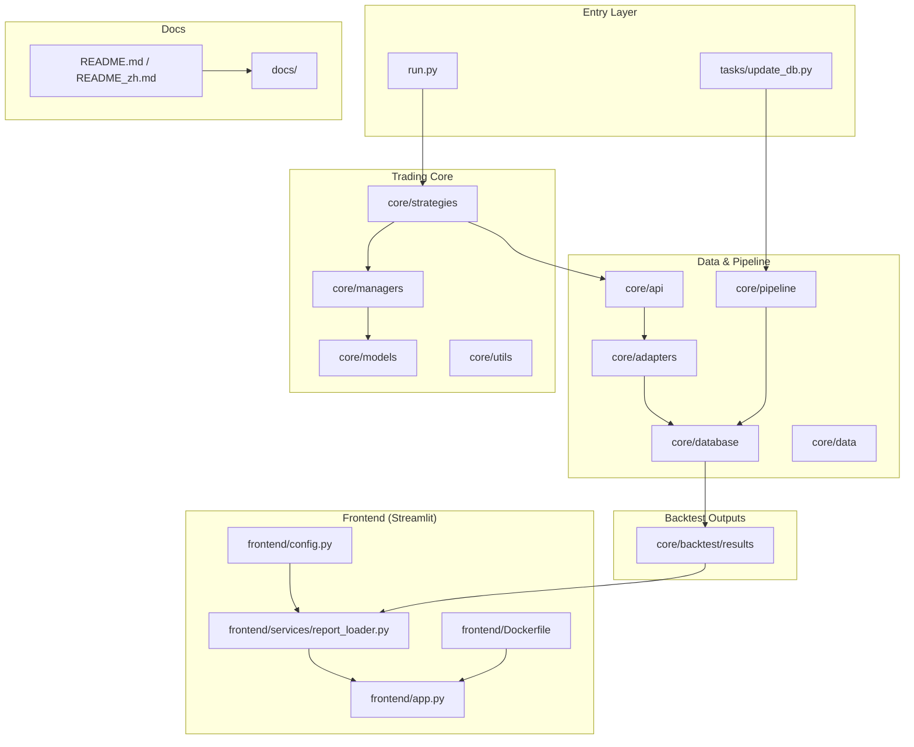

[English](#) | [Chinese (中文版)](README_zh.md)

# AlphaEdge

AlphaEdge is a strategy research and trading framework focused on Taiwan market workflows (backtest + reporting + data update pipeline + Streamlit result viewer).

## Architecture Overview



## Module Guide

| Module                   | Description                                                                                    |
| ------------------------ | ---------------------------------------------------------------------------------------------- |
| `core/`                | Core trading domain code (strategies, managers, models, adapters, API, data, backtest outputs) |
| `frontend/`              | Streamlit Docker image for viewing backtest results                                            |
| `tasks/`                 | Data maintenance and database update scripts                                                   |
| `tests/`                 | Unit/integration tests for crawlers, updaters, and DB workflows                                |
| `docs/`                  | Project docs (setup, deployment, data coverage)                                                |
| `ARCHITECTURE_REVIEW.md` | Additional architecture analysis notes                                                         |

---

## Documentation

| Document                                                  | Description                                                   |
| --------------------------------------------------------- | ------------------------------------------------------------- |
| [Dev Setup](docs/setup/dev-setup.md)                      | Python environment, dependencies, formatting, env vars        |
| [Dev Deployment](docs/deployment/dev-deployment.md)       | Local service startup flow, collector run commands, dashboard |
| [Prod Deployment](docs/deployment/prod-deployment.md)     | Docker Compose deployment, monitoring, multi-node strategy    |
| [Data Coverage](docs/exchanges/data_coverage.md)          | Data source and API coverage in current platform              |
| [Command Usage](docs/commands/command-usage.md)           | Full `update_db` target reference and runnable examples       |
| [Strategy Development Guide](core/strategies/README.md) | How to implement strategies in this project                   |

---

## Environment Setup

### Option 1: Local venv + requirements.txt

```bash
# create virtualenv
python3 -m venv .venv
# activate virtualenv
source .venv/bin/activate

# install dependencies (use -m pip so installs target this venv’s Python)
python -m pip install --upgrade pip
python -m pip install -r requirements.txt
```

To exit the virtualenv in the current shell:

```bash
deactivate
```

If you switch to **Option 2 (Docker)** for this project, you do not need a local venv: the container image already provides an isolated Python environment.

### Run Trader + Frontend Together (Local)

After installing dependencies above, open two terminal tabs at project root:

**Tab 1 (Trader: run backtest)**

```bash
source .venv/bin/activate
python run.py --strategy <StrategyClassName>
```

**Tab 2 (Frontend: view results)**

```bash
source .venv/bin/activate
streamlit run frontend/app.py
```

Then open: `http://localhost:8501`

### Option 2: Docker Container

#### Trader Container

```bash
# build image
docker build -f core/Dockerfile -t alphaedge-trader .

# run container and show CLI help
docker run --rm alphaedge-trader --help
```

#### Frontend Container

```bash
# build image
docker build -f frontend/Dockerfile -t alphaedge-frontend .

# run container
docker run --rm -p 8501:8501 alphaedge-frontend
```

### Option 3: Docker Compose (Trader + Frontend)

#### Build and Start

```bash
# Build all services
docker compose build

# Start trader and frontend together
docker compose up
```

#### Run in Background / Stop

```bash
# Start in detached mode
docker compose up -d

# Stop and remove containers
docker compose down
```

## Command Usage

### Update database

For full target reference and single/multi-target examples, see [Command Usage](docs/commands/command-usage.md).

```bash
python -m tasks.update_db --target no_tick
```

### Run backtest

Replace `<StrategyClassName>` with your strategy class name. More command scenarios are documented in [Command Usage](docs/commands/command-usage.md).

```bash
python run.py --strategy <StrategyClassName>
```

## Project Structure

```text
AlphaEdge/
├── core/                    # trading domain modules
│   ├── strategies/            # strategy implementations
│   ├── api/                   # data access APIs
│   ├── adapters/              # data adapters / integrations
│   ├── managers/              # account / order / flow managers
│   ├── models/                # domain models
│   ├── pipeline/              # ETL/update pipeline
│   ├── database/              # sqlite database files
│   ├── backtest/              # backtest engine and outputs
│   └── data/                  # downloaded/raw data
├── frontend/                  # Streamlit docker image
│   ├── app.py                 # Streamlit entrypoint
│   ├── config.py              # frontend configuration
│   ├── services/              # data loading services
│   │   └── report_loader.py   # load backtest report files
│   ├── Dockerfile             # frontend container image
│   ├── README.md              # frontend usage notes
│   └── __init__.py
├── tasks/                     # data update scripts
├── tests/                     # test suites
├── docs/                      # project docs
│   ├── setup/
│   ├── deployment/
│   ├── exchanges/
│   └── commands/
├── run.py
├── ARCHITECTURE_REVIEW.md
├── README.md
└── README_zh.md
```
