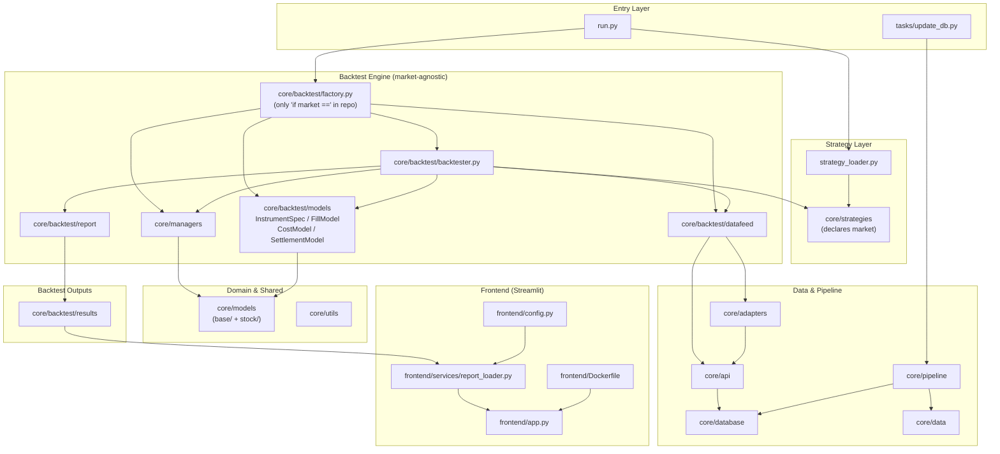

[English](#) | [Chinese (中文版)](README_zh.md)

# AlphaEdge

AlphaEdge is a strategy research and trading framework focused on Taiwan market workflows (backtest + reporting + data update pipeline + Streamlit result viewer).

## Architecture Overview


```mermaid
graph TB
    subgraph entry ["Entry Layer"]
        RunPy["run.py"]
        Tasks["tasks/update_db.py"]
    end

    subgraph strategy_layer ["Strategy Layer"]
        Strategies["core/strategies<br/>(declares market)"]
        Loader["strategy_loader.py"]
    end

    subgraph engine_layer ["Backtest Engine (market-agnostic)"]
        Factory["core/backtest/factory.py<br/>(only 'if market ==' in repo)"]
        Backtester["core/backtest/backtester.py"]
        BTModels["core/backtest/models<br/>InstrumentSpec / FillModel<br/>CostModel / SettlementModel"]
        Feed["core/backtest/datafeed"]
        Managers["core/managers"]
        Report["core/backtest/report"]
    end

    subgraph domain_layer ["Domain & Shared"]
        Models["core/models<br/>(base/ + stock/)"]
        Utils["core/utils"]
    end

    subgraph data_layer ["Data & Pipeline"]
        API["core/api"]
        Adapters["core/adapters"]
        Pipeline["core/pipeline"]
        DB["core/database"]
        Data["core/data"]
    end

    subgraph output_layer ["Backtest Outputs"]
        Results["core/backtest/results"]
    end

    subgraph frontend_layer ["Frontend (Streamlit)"]
        FrontendApp["frontend/app.py"]
        FrontendService["frontend/services/report_loader.py"]
        FrontendConfig["frontend/config.py"]
        FrontendDocker["frontend/Dockerfile"]
    end

    RunPy --> Loader
    Loader --> Strategies
    RunPy --> Factory
    Factory --> Backtester
    Factory --> BTModels
    Factory --> Feed
    Factory --> Managers
    Backtester --> Strategies
    Backtester --> BTModels
    Backtester --> Feed
    Backtester --> Managers
    Backtester --> Report
    Managers --> Models
    BTModels --> Models
    Feed --> API
    Feed --> Adapters
    API --> DB
    Adapters --> API
    Tasks --> Pipeline
    Pipeline --> DB
    Pipeline --> Data
    Report --> Results
    Results --> FrontendService
    FrontendConfig --> FrontendService
    FrontendService --> FrontendApp
    FrontendDocker --> FrontendApp
```

`Backtester` is the **only** backtest engine: market-agnostic, no subclasses. All market-specific behavior is injected as five pluggable models (`InstrumentSpec`, `FillModel`, `CostModel`, `SettlementModel`, `DataFeed`) assembled by `factory.py` from the `market` a strategy declares. Adding a market does not require changing `backtester.py`. See [Multi-Market Engine](docs/backtest/multi-market-engine.md) and [Module Map](docs/backtest/module-map.md).


## Module Guide


| Module          | Description                                                                                                                     |
| --------------- | ------------------------------------------------------------------------------------------------------------------------------- |
| `core/`         | Core trading domain code (strategies, managers, models, adapters, API, data, backtest outputs)                                  |
| `frontend/`     | Streamlit Docker image for viewing backtest results                                                                             |
| `tasks/`        | Data maintenance and database update scripts                                                                                    |
| `tests/`        | Unit/integration tests for crawlers, updaters, and DB workflows                                                                 |
| `docs/`         | Project docs (setup, deployment, data coverage)                                                                                 |
| `strategy_lab/` | Research workspace organized by concept (`strategies/`, `data_analysis/`, `notebooks/`, `ideas/`); see `strategy_lab/README.md` |
| `dev/`          | Optional dev tooling (conda env YAMLs, helper scripts)                                                                          |
| `backlog/`      | Internal notes and future work items                                                                                            |


---

## Documentation


| Document                                                | Description                                                   |
| ------------------------------------------------------- | ------------------------------------------------------------- |
| [Dev Setup](docs/setup/dev-setup.md)                    | Python environment, dependencies, formatting, env vars        |
| [Dev Deployment](docs/deployment/dev-deployment.md)     | Local service startup flow, collector run commands, dashboard |
| [Prod Deployment](docs/deployment/prod-deployment.md)   | Docker Compose deployment, monitoring, multi-node strategy    |
| [Data Coverage](docs/exchanges/data_coverage.md)        | Data source and API coverage in current platform              |
| [Command Usage](docs/commands/command-usage.md)         | Full `update_db` target reference and runnable examples       |
| [Strategy Development Guide](core/strategies/README.md) | How to implement strategies in this project                   |
| [Multi-Market Engine](docs/backtest/multi-market-engine.md) | Backtest engine architecture: one engine, five pluggable models |
| [Module Map](docs/backtest/module-map.md)               | Who calls whom on the backtest path, per-file responsibilities |
| [Short-Selling Framework](docs/backtest/short-selling-framework.md) | Direction-driven accounting, costs, margin call, forced cover |
| [Code Quality Baseline](docs/dev/code-quality.md)       | Tooling (pyproject / ruff / CI / pre-commit), lint ignore rationale, coverage baseline |
| [ETL Ingestion](docs/pipeline/etl-ingestion.md)         | Batching, idempotency and failure semantics of the data-load stage; per-updater checklist |
| [Broker Trading NO_DATA](docs/pipeline/broker-trading-no-data.md) | Metadata semantics for empty API responses (decision record) |


---

## Environment Setup

### Option 1: Local venv + requirements.txt

**macOS / Linux**

```bash
# create virtualenv
python3 -m venv .venv
# activate virtualenv
source .venv/bin/activate

# install dependencies (use -m pip so installs target this venv’s Python)
python -m pip install --upgrade pip
python -m pip install -r requirements.txt
```

**Windows (PowerShell or CMD)**

```powershell
# create virtualenv
python -m venv .venv
# activate virtualenv
.venv\Scripts\activate

# install dependencies (use -m pip so installs target this venv’s Python)
python -m pip install --upgrade pip
python -m pip install -r requirements.txt
```

To exit the virtualenv in the current shell:

```bash
deactivate
```

`requirements.txt` holds fully pinned versions plus a trailing `-e .`, so that single
command installs both the dependencies and the project itself — `core` / `tasks` /
`tests` become importable from **any** working directory. The package metadata
(dependency names, optional extras, Python version) lives in `pyproject.toml`.

For development work, install the dev extras as well:

```bash
python -m pip install -e ".[dev]"   # pytest, pytest-timeout, pytest-cov, ruff
```

Optional extras: `frontend` (Streamlit UI), `tick` (DolphinDB tick storage), `lab`
(`strategy_lab` report output). They are deliberately **not** part of the base install —
the backtest and ETL paths run without them.

#### Lint, format and tests

```bash
ruff check .            # CLAUDE.md §2.5 / §2.10, configured in pyproject.toml
ruff format .
pytest -m "not slow"    # skips tests needing tw_stock.db or API credentials
pytest                  # full suite (needs core/database/tw_stock.db)
./scripts/run_regression.sh   # LONG + SHORT regression, must stay row-identical
```

To have the same checks run automatically before each commit:

```bash
pip install pre-commit
pre-commit install       # one-time; installs the git hook
pre-commit run --all-files
```

GitHub Actions runs `ruff check`, `ruff format --check` and `pytest -m "not slow"` on
every push (see `.github/workflows/ci.yml`).

If you switch to **Option 2 (Docker)** for this project, you do not need a local venv: the container image already provides an isolated Python environment.

Copy and fill credentials / paths: `cp .env.example .env` (details in [Dev Setup](docs/setup/dev-setup.md)).

### Run Trader + Frontend Together (Local)

After installing dependencies above, open two terminal tabs at project root:

**Tab 1 (Trader: run backtest)**

```bash
source .venv/bin/activate
python run.py --strategy <StrategyClassName>
# optional: --mode backtest|live (default: backtest)
```

**Tab 2 (Frontend: view results)**

```bash
source .venv/bin/activate
streamlit run frontend/app.py
```

Then open: `http://localhost:8501`

### Option 2: Docker Container

#### Trader Container

```bash
# build image
docker build -f core/Dockerfile -t alphaedge-core .

# run container and show CLI help
docker run --rm alphaedge-core --help
```

#### Frontend Container

```bash
# build image
docker build -f frontend/Dockerfile -t alphaedge-frontend .

# run container
docker run --rm -p 8501:8501 alphaedge-frontend
```

### Option 3: Docker Compose (Trader + Frontend)

#### Build and Start

```bash
# Build all services
docker compose build

# Start core and frontend together
docker compose up
```

#### Run in Background / Stop

```bash
# Start in detached mode
docker compose up -d

# Stop and remove containers
docker compose down
```

## Command Usage

### Update database

For full target reference and single/multi-target examples, see [Command Usage](docs/commands/command-usage.md).

```bash
python -m tasks.update_db --target no_tick
```

### Run backtest

Replace `<StrategyClassName>` with your strategy class name. More command scenarios are documented in [Command Usage](docs/commands/command-usage.md).

```bash
python run.py --strategy <StrategyClassName>
# optional: --mode backtest|live (default: backtest)
```

## Project Structure

```text
AlphaEdge/
├── core/                    # trading domain modules
│   ├── strategies/            # strategy implementations
│   │   ├── base.py            # BaseStrategy (market-agnostic)
│   │   ├── strategy_loader.py # auto-scans every market sub-package
│   │   └── stock/             # BaseStockStrategy + concrete stock strategies
│   ├── api/                   # data access APIs (SQLite / DolphinDB)
│   ├── adapters/              # data adapters / integrations
│   │   └── stock_quote_adapter.py  # StockQuoteAdapter (day/tick → StockQuote)
│   ├── managers/              # position managers (base/ + per-market)
│   ├── models/                # domain models (base/ + stock/)
│   ├── utils/                 # shared helpers (enums, paths, time, logging)
│   ├── pipeline/              # ETL/update pipeline
│   │   ├── shared/           # cross-market: four layer bases + HTTP helpers
│   │   ├── tw/               # TW equity/futures ETL (crawlers/cleaners/loaders/updaters)
│   │   └── utils/            # constants, URL manager, DataFrame and SQLite helpers
│   ├── database/              # sqlite database files (tw_stock.db)
│   ├── backtest/              # backtest engine
│   │   ├── backtester.py      # the only engine: market/instrument-agnostic, no subclasses
│   │   ├── factory.py         # assembles the model set from (market, instrument_type)
│   │   ├── models/            # InstrumentSpec / FillModel / CostModel / SettlementModel
│   │   ├── datafeed/          # data loading, quote conversion, trading calendar
│   │   ├── report/            # trading report, direction summary, charts
│   │   ├── analysis/          # performance metrics (not yet wired into run())
│   │   └── results/           # per-strategy outputs (csv / png / logs)
│   └── data/                  # downloaded/raw data
├── frontend/                  # Streamlit docker image
│   ├── app.py                 # Streamlit entrypoint
│   ├── config.py              # frontend configuration
│   ├── services/              # data loading services
│   │   └── report_loader.py   # load backtest report files
│   ├── Dockerfile             # frontend container image
│   ├── README.md              # frontend usage notes
│   └── __init__.py
├── strategy_lab/              # research workspace (strategies/ / data_analysis/ / notebooks/ / ideas/)
├── tasks/                     # data update scripts
├── tests/                     # test suites
├── dev/                       # optional conda envs and dev scripts
├── backlog/                   # internal planning notes
├── docs/                      # project docs
│   ├── backtest/              # engine architecture, module map, short-selling spec
│   ├── dev/                   # code quality tooling and baselines
│   ├── pipeline/              # ETL ingestion contract and decision records
│   ├── setup/
│   ├── deployment/
│   ├── exchanges/
│   └── commands/
├── scripts/
│   └── run_regression.sh      # SHORT + LONG regression guardrail (run before/after engine changes)
├── docker-compose.yml         # compose: core + frontend + shared results volume
├── run.py
├── README.md
└── README_zh.md
```

