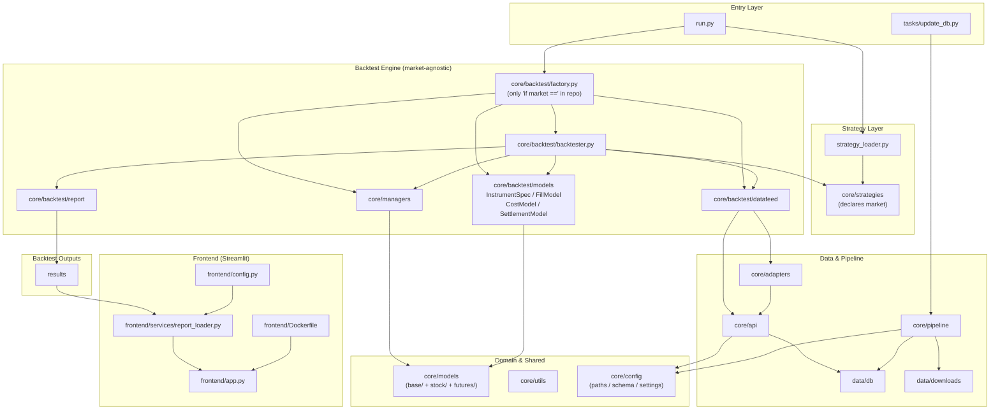

[English](#) | [Chinese (中文版)](README_zh.md)

> `README_zh.md` is the source of truth; this file is its English translation. Edit the Chinese version first, then sync this one.

# AlphaEdge

AlphaEdge is a strategy research and trading framework focused on Taiwan market workflows (backtest + reporting + data update pipeline + Streamlit result viewer).

## Architecture Overview


```mermaid
graph TB
    subgraph entry ["Entry Layer"]
        RunPy["run.py"]
        Tasks["tasks/update_db.py"]
    end

    subgraph strategy_layer ["Strategy Layer"]
        Strategies["core/strategies<br/>(declares market)"]
        Loader["strategy_loader.py"]
    end

    subgraph engine_layer ["Backtest Engine (market-agnostic)"]
        Factory["core/backtest/factory.py<br/>(only 'if market ==' in repo)"]
        Backtester["core/backtest/backtester.py"]
        BTModels["core/backtest/models<br/>InstrumentSpec / FillModel<br/>CostModel / SettlementModel"]
        Feed["core/backtest/datafeed"]
        Managers["core/managers"]
        Report["core/backtest/report"]
    end

    subgraph domain_layer ["Domain & Shared"]
        Models["core/models<br/>(base/ + stock/ + futures/)"]
        Utils["core/utils"]
        Config["core/config<br/>(paths / schema / settings)"]
    end

    subgraph data_layer ["Data & Pipeline"]
        API["core/api"]
        Adapters["core/adapters"]
        Pipeline["core/pipeline"]
        DB["data/db"]
        Data["data/downloads"]
    end

    subgraph output_layer ["Backtest Outputs"]
        Results["results"]
    end

    subgraph frontend_layer ["Frontend (Streamlit)"]
        FrontendApp["frontend/app.py"]
        FrontendService["frontend/services/report_loader.py"]
        FrontendConfig["frontend/config.py"]
        FrontendDocker["frontend/Dockerfile"]
    end

    RunPy --> Loader
    Loader --> Strategies
    RunPy --> Factory
    Factory --> Backtester
    Factory --> BTModels
    Factory --> Feed
    Factory --> Managers
    Backtester --> Strategies
    Backtester --> BTModels
    Backtester --> Feed
    Backtester --> Managers
    Backtester --> Report
    Managers --> Models
    BTModels --> Models
    Feed --> API
    Feed --> Adapters
    API --> DB
    Adapters --> API
    API --> Config
    Pipeline --> Config
    Tasks --> Pipeline
    Pipeline --> DB
    Pipeline --> Data
    Report --> Results
    Results --> FrontendService
    FrontendConfig --> FrontendService
    FrontendService --> FrontendApp
    FrontendDocker --> FrontendApp
```

`Backtester` is the **only** backtest engine: market-agnostic, no subclasses. All market-specific behavior is injected as five pluggable models (`InstrumentSpec`, `FillModel`, `CostModel`, `SettlementModel`, `DataFeed`) assembled by `factory.py` from the `market` + `instrument_type` a strategy declares. Adding a (market, instrument) combination does not require changing `backtester.py`. See [Multi-Market Engine](docs/backtest/multi-market-engine.md) and [Module Map](docs/backtest/module-map.md).


## Module Guide


| Module          | Description                                                                                                                     |
| --------------- | ------------------------------------------------------------------------------------------------------------------------------- |
| `core/`         | Core trading domain code (strategies, managers, models, adapters, API, ETL, backtest engine; outputs land in the top-level `results/`) |
| `frontend/`     | Streamlit Docker image for viewing backtest results                                                                             |
| `tasks/`        | Data maintenance and database update scripts                                                                                    |
| `tests/`        | Unit/integration tests and the backtest regression lines (`tests/backtest/`)                                                    |
| `scripts/`      | Guardrail checks (layer deps, doc paths, orphan API methods), regression script and manual scripts                              |
| `docs/`         | Usage and architecture docs (setup, commands, deployment, data, backtest and ETL design)                                       |
| `strategy_lab/` | Research workspace organized by concept (`strategies/`, `data_analysis/`, `notebooks/`, `ideas/`); see `strategy_lab/README.md` |
| `dev/`          | Optional conda environment definitions (`dev/env/quant_mac.yml`, `quant_win.yml`)                                                |
| `backlog/`      | Internal notes and future work items                                                                                            |


---

## Documentation


| Document                                                | Description                                                   |
| ------------------------------------------------------- | ------------------------------------------------------------- |
| [Dev Setup](docs/setup/dev-setup.md)                    | Python environment, dependencies, formatting, env vars        |
| [Dev Deployment](docs/deployment/dev-deployment.md)     | Day-to-day local flow: update data, run a backtest, view results |
| [Prod Deployment](docs/deployment/prod-deployment.md)   | Building Docker images, running containers, role separation   |
| [Data Coverage](docs/exchanges/data_coverage.md)        | Data sources, API mapping, start dates and price adjustment   |
| [Command Usage](docs/commands/command-usage.md)         | Full `update_db` target reference and runnable examples       |
| [Strategy Development Guide](core/strategies/README.md) | How to implement strategies in this project                   |
| [Multi-Market Engine](docs/backtest/multi-market-engine.md) | Backtest engine architecture: one engine, five pluggable models |
| [Module Map](docs/backtest/module-map.md)               | Who calls whom on the backtest path, per-file responsibilities |
| [Short-Selling Framework](docs/backtest/short-selling-framework.md) | Direction-driven accounting, costs, margin call, forced cover |
| [TW Futures Platform](docs/futures/tw-futures-platform.md) | Futures tables and commands; mark-to-market, margin, contract roll and session semantics; known limits |
| [ETL Ingestion](docs/pipeline/etl-ingestion.md)         | Batching, idempotency and failure semantics of the data-load stage; per-updater checklist |
| [Equity Change Data](docs/pipeline/equity-change.md)    | `equity_change` data shape, known limits and throttling       |
| [Corporate Actions](docs/pipeline/corporate-action.md)  | `corporate_action` table: sources, adjustment ratios and the false-gap guard |
| [Code Quality](docs/dev/code-quality.md)                | Tooling (pyproject / ruff / CI / pre-commit) and lint ignore rationale |
| [Naming Axes](docs/dev/naming-axes.md)                  | Directory naming decision for the market axis vs the instrument-type axis |
| [Runtime Artifacts](docs/dev/runtime-artifacts.md)      | Conventions for `data/` / `results/` / `logs/`, log bucketing and retention |


---

## Environment Setup

### Option 1: Local venv + requirements.txt

**macOS / Linux**

```bash
# create virtualenv
python3 -m venv .venv
# activate virtualenv
source .venv/bin/activate

# install dependencies (use -m pip so installs target this venv’s Python)
python -m pip install --upgrade pip
python -m pip install -r requirements.txt
```

**Windows (PowerShell or CMD)**

```powershell
# create virtualenv
python -m venv .venv
# activate virtualenv
.venv\Scripts\activate

# install dependencies (use -m pip so installs target this venv’s Python)
python -m pip install --upgrade pip
python -m pip install -r requirements.txt
```

To exit the virtualenv in the current shell:

```bash
deactivate
```

`requirements.txt` holds fully pinned versions plus a trailing `-e .`, so that single
command installs both the dependencies and the project itself — `core` / `tasks` /
`tests` become importable from **any** working directory. The package metadata
(dependency names, optional extras, Python version) lives in `pyproject.toml`.

For development work, install the dev extras as well:

```bash
python -m pip install -e ".[dev]"   # pytest, pytest-timeout, pytest-cov, ruff
```

Optional extras: `frontend` (Streamlit UI), `tick` (DolphinDB tick storage), `lab`
(`strategy_lab` report output). They are deliberately **not** part of the base install —
the backtest and ETL paths run without them.

#### Lint, format and tests

```bash
ruff check .            # CLAUDE.md §2.5 / §2.10, configured in pyproject.toml
ruff format .
pytest -m "not slow"    # skips tests needing tw_stock.db or API credentials
pytest                  # full suite (needs data/db/tw_stock.db)
./scripts/run_regression.sh   # LONG + SHORT regression, must stay row-identical
```

To have the same checks run automatically before each commit:

```bash
pip install pre-commit
pre-commit install       # one-time; installs the git hook
pre-commit run --all-files
```

On every push GitHub Actions runs, in order: `ruff check`, `ruff format --check`, the
layer-dependency gate (`scripts/check_layer_deps.py`), the SHORT regression line, and
`pytest -m "not slow"`, finishing with a coverage report under `continue-on-error`
(see `.github/workflows/ci.yml`). **The LONG regression line needs
`data/db/tw_stock.db`, which CI does not have, so it only runs locally.**

If you switch to **Option 2 (Docker)** for this project, you do not need a local venv: the container image already provides an isolated Python environment.

Copy and fill credentials / paths: `cp .env.example .env` (details in [Dev Setup](docs/setup/dev-setup.md)).

### Run Trader + Frontend Together (Local)

After installing dependencies above, open two terminal tabs at project root:

**Tab 1 (Trader: run backtest)**

```bash
source .venv/bin/activate
python run.py --strategy <StrategyClassName>
# optional: --show opens charts in a browser; --mode live is not implemented (exits with code 1)
```

**Tab 2 (Frontend: view results)**

```bash
source .venv/bin/activate
streamlit run frontend/app.py
```

Then open: `http://localhost:8501`

### Option 2: Docker Container

Open an **interactive shell** inside the image and run commands exactly as you would in the venv. The trader image sets `ENTRYPOINT` to `python run.py`, so override it with `--entrypoint` to get a terminal.

#### Trader Container

```bash
# build image
docker build -f core/Dockerfile -t alphaedge-core .

# start the container and enter a shell (working directory: /app); the image has no database, mount the host data/
docker run --rm -it -v "$(pwd)/data:/app/data:ro" --entrypoint /bin/bash alphaedge-core
```

Inside the container:

```bash
python run.py --help
python run.py --strategy <StrategyClassName>
```

#### Frontend Container

```bash
# build image
docker build -f frontend/Dockerfile -t alphaedge-frontend .

# map the port, start the container and enter a shell (working directory: /app)
docker run --rm -it -p 8501:8501 --entrypoint /bin/bash alphaedge-frontend
```

Inside the container:

```bash
streamlit run frontend/app.py --server.address=0.0.0.0 --server.port=8501
```

Then open `http://localhost:8501` in the browser.

#### One-off run (no interactive shell)

```bash
docker run --rm alphaedge-core --help
docker run --rm -p 8501:8501 alphaedge-frontend
```

### Option 3: Docker Compose (Trader + Frontend)

> ⚠️ **You must prepare `data/db/*.db` on the host first.** The images contain **no
> database**; compose bind-mounts the host's `./data` **read-only** at `/app/data`.
> Without it the core service fails at `sqlite3.connect`.
> See "Update database" under Command Usage below for how to build the database.
>
> Read-only is deliberate: the container only runs backtests and must not write to
> the host database, which a background ETL job may be writing at the same time.
> Backtest output goes to the `alphaedge_results` volume; logs go to the mounted `./logs`.

#### Build and Start

```bash
# Build all services
docker compose build

# Start core and frontend together
docker compose up
```

#### Run in Background / Stop

```bash
# Start in detached mode
docker compose up -d

# Stop and remove containers
docker compose down
```

## Command Usage

### Update database

For full target reference and single/multi-target examples, see [Command Usage](docs/commands/command-usage.md).

```bash
python -m tasks.update_db --target no_tick
```

### Run backtest

Replace `<StrategyClassName>` with your strategy class name. More command scenarios are documented in [Command Usage](docs/commands/command-usage.md).

```bash
python run.py --strategy <StrategyClassName>
# optional: --show opens charts in a browser; --mode live is not implemented (exits with code 1)
```

## Project Structure

```text
AlphaEdge/
├── core/                    # trading domain modules
│   ├── strategies/            # strategy implementations
│   │   ├── base.py            # BaseStrategy (market-agnostic)
│   │   ├── strategy_loader.py # auto-scans every instrument-type sub-package (stock / futures)
│   │   ├── ridge.py           # ridge signal shared by research and production (a module on purpose)
│   │   ├── stock/             # BaseStockStrategy + concrete stock strategies
│   │   └── futures/           # BaseFuturesStrategy + TW futures strategies
│   ├── api/                   # data access APIs (SQLite / DolphinDB)
│   ├── adapters/              # data adapters / integrations
│   │   └── tw/                # StockQuoteAdapter (day/tick → StockQuote), FuturesQuoteAdapter
│   ├── managers/              # position managers (base/ + stock/ + futures/)
│   ├── models/                # domain models (base/ + stock/ + futures/)
│   ├── utils/                 # shared helpers (enums, time, logging, Shioaji account)
│   ├── config/                # paths, table schema and settings constants (lowest layer)
│   ├── pipeline/              # ETL/update pipeline
│   │   ├── shared/           # cross-market: four layer bases, HTTP helpers, date/season diffing
│   │   ├── tw/               # TW equity/futures ETL (crawlers/cleaners/loaders/updaters)
│   │   │   └── utils/        # TW-only helpers (URL table, tick metadata)
│   │   └── utils/            # cross-market: constants, DataFrame and SQLite helpers, exceptions
│   ├── backtest/              # backtest engine
│   │   ├── backtester.py      # the only engine: market/instrument-agnostic, no subclasses
│   │   ├── factory.py         # assembles the model set from (market, instrument_type)
│   │   ├── models/            # InstrumentSpec / FillModel / CostModel / SettlementModel
│   │   ├── datafeed/          # data loading, quote conversion, trading calendar
│   │   ├── report/            # trading report, direction summary, charts
│   │   └── analysis/          # performance metrics (`risk_metrics.py` is pure functions, shared by the frontend and the analyzer)
├── data/                      # runtime data (git-ignored): db/ (tw_stock.db, tw_futures.db) + downloads/
├── results/                   # per-strategy backtest outputs (csv / png), git-ignored
├── logs/                      # api/ pipeline/ backtest/, git-ignored
├── frontend/                  # Streamlit docker image
│   ├── app.py                 # Streamlit entrypoint
│   ├── config.py              # frontend configuration
│   ├── services/              # data loading and metrics (no Streamlit calls, so testable)
│   │   ├── report_loader.py   # load backtest report files
│   │   ├── metrics.py         # stock report metrics (same formulas as the reporter)
│   │   └── futures_metrics.py # futures-only metrics (margin, lot exposure)
│   ├── static/theme.css       # page styles
│   ├── requirements.txt       # frontend image dependencies
│   ├── Dockerfile             # frontend container image
│   ├── README.md              # frontend usage notes
│   └── __init__.py
├── strategy_lab/              # research workspace (strategies/ / data_analysis/ / notebooks/ / ideas/)
├── tasks/                     # data update and maintenance entrypoints (update_db, delete_price_data, clean_logs)
├── tests/                     # test suites (`backtest/` holds engine and regression lines; `temp/`, `database/`, `downloads/` are runtime artifacts)
├── dev/env/                   # optional conda environment definitions (mac/win)
├── backlog/                   # internal planning notes
├── docs/                      # project docs
│   ├── backtest/              # engine architecture, module map, short-selling spec
│   ├── dev/                   # code quality, naming axes, runtime artifacts
│   ├── futures/               # TW futures platform: data, backtest semantics, known limits
│   ├── pipeline/              # ETL ingestion contract, equity change, corporate actions
│   ├── setup/                 # dev environment setup
│   ├── deployment/            # dev and prod deployment
│   ├── exchanges/             # data coverage
│   └── commands/              # command usage (zh-TW / en)
├── scripts/                   # guardrail checks and one-off tools
│   ├── run_regression.sh      # SHORT + LONG regression guardrail (run before/after engine changes)
│   ├── check_layer_deps.py    # layer deps, import cycles, cross-axis directory pollution (CI + pre-commit)
│   ├── check_doc_paths.py     # file paths in docs that no longer resolve (stale after a move)
│   ├── check_api_orphan_methods.py  # public methods in `core/api` with zero callers and zero tests
│   ├── clean_pycache.sh/.ps1  # remove __pycache__ and .pyc (macOS/Linux, Windows)
│   ├── fix_single_market_batches.py  # one-off data fix: batches loaded for only one market
│   └── manual/                # scripts needing credentials or a database (see its README)
├── docker-compose.yml         # compose: core + frontend + shared results volume
├── run.py
├── README.md
└── README_zh.md
```

