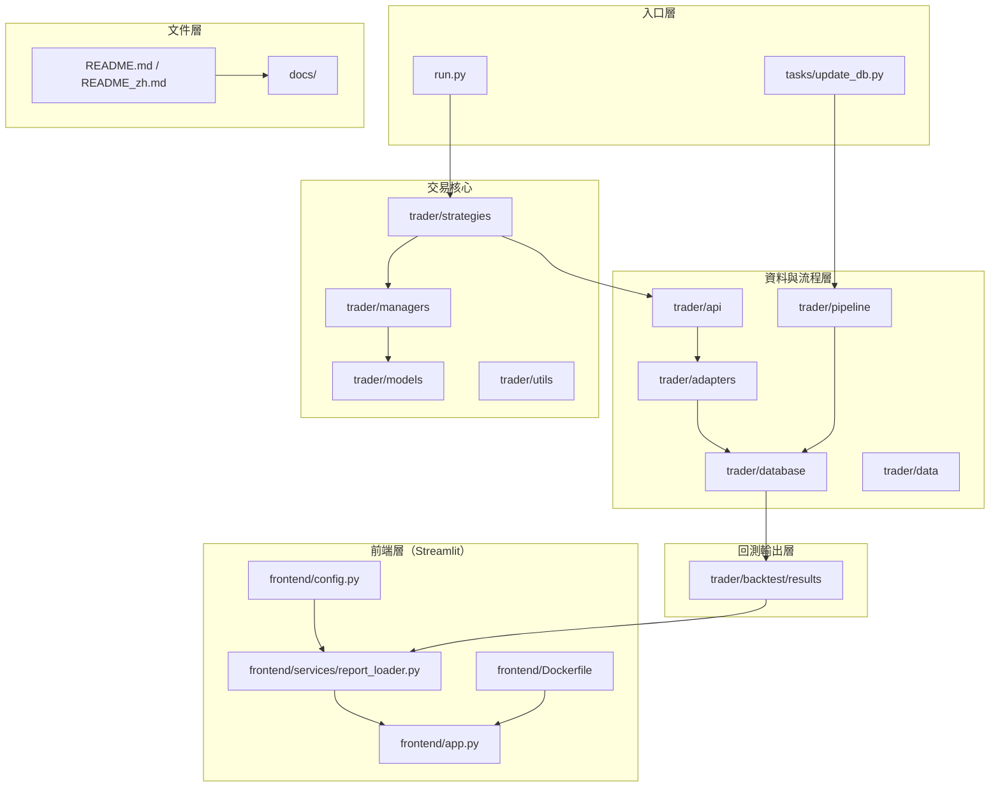

[English](README.md) | [Chinese (中文版)](#)

# AlphaEdge

AlphaEdge 是一個聚焦台灣市場工作流程的策略研究與交易框架（回測 + 報表 + 資料更新流程 + Streamlit 結果檢視器）。

## 架構總覽



## 模組說明

| 模組                     | 說明                                                                  |
| ------------------------ | --------------------------------------------------------------------- |
| `trader/`                | 交易領域核心程式碼（策略、管理器、模型、介接層、API、資料與回測輸出） |
| `frontend/`              | 用於檢視回測結果的 Streamlit Docker 映像                              |
| `tasks/`                 | 資料維護與資料庫更新腳本                                              |
| `tests/`                 | crawler、updater 與資料庫流程的單元/整合測試                          |
| `docs/`                  | 專案文件（環境設定、部署、資料覆蓋範圍）                              |
| `ARCHITECTURE_REVIEW.md` | 補充架構分析說明                                                      |

---

## 文件

| 文件                                               | 說明                                            |
| -------------------------------------------------- | ----------------------------------------------- |
| [開發環境設定](docs/setup/dev-setup.md)            | Python 環境、相依套件、格式化工具、環境變數     |
| [開發部署](docs/deployment/dev-deployment.md)      | 本地服務啟動流程、collector 執行指令、dashboard |
| [正式環境部署](docs/deployment/prod-deployment.md) | Docker Compose 部署、監控、多節點策略           |
| [資料覆蓋範圍](docs/exchanges/data_coverage.md)    | 目前平台資料來源與 API 覆蓋範圍                 |
| [策略開發指南](trader/strategies/README.md)        | 本專案策略實作方式                              |

---

## 環境建立

### 方式 1：本機 venv + requirements.txt

```bash
# 建立虛擬環境
python3 -m venv .venv
# 啟用虛擬環境
source .venv/bin/activate

# 安裝相依套件
pip install --upgrade pip
pip install -r requirements.txt
```

### 本機同時執行 Trader + Frontend

先完成上面的安裝，然後開兩個終端機分頁（都在專案根目錄）：

**分頁 1（Trader：執行回測）**

```bash
source .venv/bin/activate
python run.py --strategy <StrategyClassName>
```

**分頁 2（Frontend：檢視回測結果）**

```bash
source .venv/bin/activate
streamlit run frontend/app.py
```

啟動後在瀏覽器開啟：`http://localhost:8501`

### 方式 2：Docker Container

#### Trader Container

```bash
# 建立映像
docker build -f trader/Dockerfile -t alphaedge-trader .

# 啟動 container 並顯示 CLI 說明
docker run --rm alphaedge-trader --help
```

#### Frontend Container

```bash
# 建立映像
docker build -f frontend/Dockerfile -t alphaedge-frontend .

# 啟動 container
docker run --rm -p 8501:8501 alphaedge-frontend
```

### 方式 3：Docker Compose（同時啟動 Trader + Frontend）

#### 建立與啟動

```bash
# 建立所有服務映像
docker compose build

# 同時啟動 trader 與 frontend
docker compose up
```

#### 背景執行 / 停止

```bash
# 以背景模式啟動
docker compose up -d

# 停止並移除 containers
docker compose down
```

## 指令教學

```bash
# 更新資料庫（預設 no_tick）
python -m tasks.update_db --target no_tick

# 使用你的策略類別執行回測
python run.py --strategy <StrategyClassName>
```

## 專案結構

```text
AlphaEdge/
├── trader/                    # 交易領域模組
│   ├── strategies/            # 策略實作
│   ├── api/                   # 資料存取 API
│   ├── adapters/              # 資料介接 / 整合層
│   ├── managers/              # 帳務 / 訂單 / 流程管理
│   ├── models/                # 領域模型
│   ├── pipeline/              # ETL / 更新流程
│   ├── database/              # sqlite 資料庫檔案
│   ├── backtest/              # 回測引擎與輸出
│   └── data/                  # 下載 / 原始資料
├── frontend/                  # Streamlit Docker 映像
│   ├── app.py                 # Streamlit 入口
│   ├── config.py              # frontend 設定
│   ├── services/              # 資料載入服務
│   │   └── report_loader.py   # 載入回測報表檔案
│   ├── Dockerfile             # frontend 容器映像
│   ├── README.md              # frontend 使用說明
│   └── __init__.py
├── tasks/                     # 資料更新腳本
├── tests/                     # 測試套件
├── docs/                      # 專案文件
│   ├── setup/
│   ├── deployment/
│   └── exchanges/
├── run.py
├── ARCHITECTURE_REVIEW.md
├── README.md
└── README_zh.md
```
