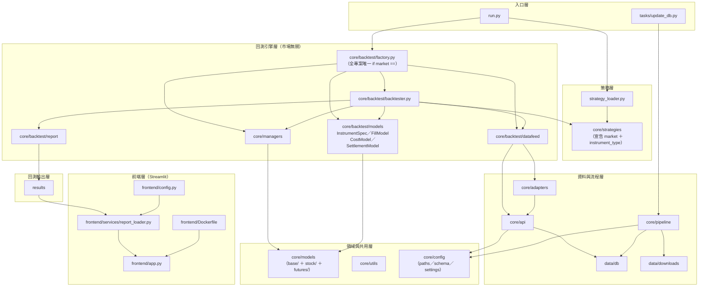

[English](README.md) | [Chinese (中文版)](#)

> 本檔為權威版本；`README.md` 為其英譯。改動時先改本檔，再同步英文版。

# AlphaEdge

AlphaEdge 是一個聚焦台灣市場工作流程的策略研究與交易框架（回測 + 報表 + 資料更新流程 + Streamlit 結果檢視器）。

## 架構總覽


```mermaid
graph TB
    subgraph entry ["入口層"]
        RunPy["run.py"]
        Tasks["tasks/update_db.py"]
    end

    subgraph strategy_layer ["策略層"]
        Strategies["core/strategies<br/>（宣告 market ＋ instrument_type）"]
        Loader["strategy_loader.py"]
    end

    subgraph engine_layer ["回測引擎層（市場無關）"]
        Factory["core/backtest/factory.py<br/>（全專案唯一 if market ==）"]
        Backtester["core/backtest/backtester.py"]
        BTModels["core/backtest/models<br/>InstrumentSpec／FillModel<br/>CostModel／SettlementModel"]
        Feed["core/backtest/datafeed"]
        Managers["core/managers"]
        Report["core/backtest/report"]
    end

    subgraph domain_layer ["領域與共用層"]
        Models["core/models<br/>（base/ ＋ stock/ ＋ futures/）"]
        Utils["core/utils"]
        Config["core/config<br/>（paths／schema／settings）"]
    end

    subgraph data_layer ["資料與流程層"]
        API["core/api"]
        Adapters["core/adapters"]
        Pipeline["core/pipeline"]
        DB["data/db"]
        Data["data/downloads"]
    end

    subgraph output_layer ["回測輸出層"]
        Results["results"]
    end

    subgraph frontend_layer ["前端層（Streamlit）"]
        FrontendApp["frontend/app.py"]
        FrontendService["frontend/services/report_loader.py"]
        FrontendConfig["frontend/config.py"]
        FrontendDocker["frontend/Dockerfile"]
    end

    RunPy --> Loader
    Loader --> Strategies
    RunPy --> Factory
    Factory --> Backtester
    Factory --> BTModels
    Factory --> Feed
    Factory --> Managers
    Backtester --> Strategies
    Backtester --> BTModels
    Backtester --> Feed
    Backtester --> Managers
    Backtester --> Report
    Managers --> Models
    BTModels --> Models
    Feed --> API
    Feed --> Adapters
    API --> DB
    Adapters --> API
    API --> Config
    Pipeline --> Config
    Tasks --> Pipeline
    Pipeline --> DB
    Pipeline --> Data
    Report --> Results
    Results --> FrontendService
    FrontendConfig --> FrontendService
    FrontendService --> FrontendApp
    FrontendDocker --> FrontendApp
```

`Backtester` 是**唯一的回測引擎，市場無關、沒有子類**。市場差異全部下沉為五個可插拔的 model（`InstrumentSpec`、`FillModel`、`CostModel`、`SettlementModel`、`DataFeed`），由 `factory.py` 依策略宣告的 `market` ＋ `instrument_type` 組裝。新增一個（市場, 商品）組合不需要修改 `backtester.py` 一行。詳見[多市場回測引擎架構](docs/backtest/multi-market-engine.md)與[模組使用關係](docs/backtest/module-map.md)。

## 回測支援範圍

一次回測跑一個（市場, 商品）組合，由策略基底宣告、`factory.py` 分派；方向（LONG／SHORT）與商品類別是兩條獨立的軸，
記帳一律看每一張訂單的 `position_type`，策略的 `allowed_directions` 只是方向白名單。

表中的資料區間是 2026-09-15 盤點 `data/db` 的結果，更新資料後會跟著變動。

| 市場 × 商品 | 狀態 | 範圍與資料區間 | K 棒級別 | 方向 | 策略基底 |
| ----------- | ---- | -------------- | -------- | ---- | -------- |
| 台股（`TW` × `STOCK`） | ✅ 支援 | `tw_stock.db` 內的標的：行情 2013-01-02～2026-09-15（最新交易日 2,392 檔）<br>訊號預設用還原價，除權息與公司行動資料同樣自 2013-01 起<br>融資融券、法人籌碼 2013-01-02～2026-09-14 | `DAY`、`TICK`（tick 存在 DolphinDB，不在 `data/db`，需 `[tick]` 相依） | **LONG**：現金全額買進（不支援融資），留倉或當沖<br>**SHORT**：`DAY_TRADE` 現股當沖沖賣、`MARGIN` 融券留倉（預設）、`SBL` 借券留倉；含借券費、維持率追繳、除權息強制回補<br>跨標的可多空並存，同一檔雙向持倉拒單 | `BaseStockStrategy` |
| 台指數期貨（`TW` × `FUTURE`） | ✅ 支援 | TX、MTX、TMF、TE、ZEF、TF、ZFF；自動換月<br>**日盤行情**（`DAY`）：TX／MTX／TE／TF 2015-01-05 起（回補起點），ZEF 2021-06-28、ZFF 2021-12-06、TMF 2024-07-29 起（上市日）；更新至 2026-09-01～09-03<br>**夜盤行情**（`NIGHT`／`COMBINED`）：TX／MTX 2017-05-16、TE 2018-11-20、ZEF 2021-06-29、TMF 2024-07-30 起；**TF／ZFF 只有 2025-06-24 起**<br>**保證金**（查表模式）：TX／MTX 2020-03-13、TE／TF 2020-07-22、ZEF 2021-08-12、ZFF 2022-01-26、TMF 2024-08-09 起 | 僅 `DAY` | **LONG／SHORT**：同一套保證金交易、逐日盯市與追繳，沒有券源與借券費<br>跨契約可多空並存，同一契約雙向持倉拒單 | `BaseFuturesStrategy` |
| 股票期貨／ETF 期貨 | ❌ 目前無法回測 | **資料**：標的池 320 檔（個股 249、小型個股 47、ETF 21、小型 ETF 3），快照只有 2026-08-29～09-02；行情只有 CDF、NYF（2026-08-27～08-28）與 EEF（2026-08-27 日盤）三檔試跑資料<br>**程式阻斷**：`FuturesPositionManager.open_position()` 以 `FUTURES_MULTIPLIER` 查乘數，股期不在表內，**第一筆開倉就 `KeyError`**，查表與比率兩種保證金模式皆然（DataFeed 已改查標的池，部位管理層沒接上）<br>**其餘缺口**：個股期貨保證金在比例表，查表模式只讀金額表，開倉會中止（ETF 期貨 NYF 在金額表，2020-07-22 起）；契約單位只回溯到 2026-08-29 的快照 | 僅 `DAY` | 設計上同台指數期貨，實際開倉即中斷 | `BaseFuturesStrategy` |
| 美股、選擇權 | ❌ 未支援 | `Market.US`、`InstrumentType.OPTION` 只有定義，factory 遇到會拋 `ValueError` | — | — | — |

> - 多空並存要宣告 `allowed_directions = {LONG, SHORT}`；做多當沖需自行宣告 `bar_execution_order = OPEN_THEN_CLOSE`。
> - SHORT 策略的 `enable_intraday` 預設為 `True`，會自動走 `DAY_TRADE`；要留倉放空必須設為 `False` 再指定 `short_method`。
> - 期貨跨月份價差部位兩腿各繳全額保證金（價差保證金未模擬）。

### 主要限制

- 期貨 Tick 級別回測未實作（`TwFuturesDataFeed.get_quotes()` 回空 list）。
- 期貨保證金查表的起點依商品而異（最早 2020-03，見上表）；早於起點的區間只能用 `FuturesMarginConfig.ratio()` 近似，可開口數與追繳門檻會失真。
- 期貨跳動點只登錄台指期系列（1 點）；TE／ZEF／TF／ZFF 若以跳動點數設定滑價會失真（預設滑價為 0，不受影響）。
- 同一次回測無法同時持有台股與台期貨（跨市場組合／避險）。
- 台股平盤下放空限制與每日可當沖清單尚未接上撮合，會高估放空與當沖機會。
- `--mode live` 實盤路徑未實作。

細節見[放空回測框架規格](docs/backtest/short-selling-framework.md)與[台期貨平台](docs/futures/tw-futures-platform.md)。

## 模組說明

| 模組            | 說明                                                                  |
| --------------- | --------------------------------------------------------------------- |
| `core/`         | 交易領域核心程式碼（策略、管理器、模型、介接層、API、ETL 與回測引擎；回測輸出落在根目錄的 `results/`） |
| `frontend/`     | 用於檢視回測結果的 Streamlit Docker 映像                              |
| `tasks/`        | 資料維護與資料庫更新腳本                                              |
| `tests/`        | 單元／整合測試與回測回歸線（`tests/backtest/`）                       |
| `scripts/`      | 護欄檢查（分層相依、文件路徑、API 孤兒方法）、回歸腳本與人工執行腳本   |
| `docs/`         | 使用與架構說明文件（安裝、指令、部署、資料、回測與 ETL 設計）          |
| `strategy_lab/` | 策略研究工作區，依概念分為 `strategies/`、`data_analysis/`、`notebooks/`、`ideas/`；見 `strategy_lab/README.md` |
| `backlog/`      | 內部規劃與待辦筆記                                                    |

---

## 文件

| 文件                                               | 說明                                            |
| -------------------------------------------------- | ----------------------------------------------- |
| [開發環境設定](docs/setup/dev-setup.md)            | Python 環境、相依套件、格式化工具、環境變數     |
| [開發部署](docs/deployment/dev-deployment.md)      | 本機更新資料、執行回測、檢視結果的日常流程      |
| [正式環境部署](docs/deployment/prod-deployment.md) | Docker 映像建置、容器執行與角色切分             |
| [資料覆蓋範圍](docs/exchanges/data_coverage.md)    | 資料來源、API 對照、起始日期與股價還原          |
| [指令教學](docs/commands/command-usage.zh-TW.md)   | `update_db` target 對照與完整執行範例           |
| [策略開發指南](core/strategies/README.md)          | 本專案策略實作方式                              |
| [多市場回測引擎架構](docs/backtest/multi-market-engine.md) | 單一引擎 ＋ 五個可插拔 model 的設計與已知簡化 |
| [模組使用關係](docs/backtest/module-map.md)        | 回測路徑上誰呼叫誰、逐檔案職責與輸出檔案        |
| [放空回測框架規格](docs/backtest/short-selling-framework.md) | 方向驅動的記帳、成本、維持率追繳與強制回補 |
| [台期貨平台](docs/futures/tw-futures-platform.md) | 期貨資料表與指令、盯市／保證金／換月／日夜盤語意與已知限制 |
| [ETL 入庫約定](docs/pipeline/etl-ingestion.md) | 入庫階段的分批時機、冪等性與失敗語意；新增 updater 的檢查表 |
| [權益變動表資料](docs/pipeline/equity-change.md) | `equity_change` 的資料形狀、已知限制與節流設定 |
| [非除權息的公司行動](docs/pipeline/corporate-action.md) | `corporate_action` 表的資料源、調整倍率與假跳空護欄 |
| [程式碼品質工具鏈](docs/dev/code-quality.md) | pyproject／ruff／CI／pre-commit 設定與 lint ignore 理由 |
| [命名軸線](docs/dev/naming-axes.md) | 市場軸與商品類別軸的目錄命名定案，以及哪些目錄不分市場 |
| [執行期產物](docs/dev/runtime-artifacts.md) | `data/`／`results/`／`logs/` 的目錄約定、日誌分桶與保留策略 |

---

## 環境建立

第一次使用請照順序做：**準備資料庫 → 從三種執行方式挑一種 → （需要時）設定環境變數**。
第 4 節只有要修改程式碼時才需要。

### 1. 準備資料庫

回測與前端都需要 SQLite3 資料庫，請先到 [Google Drive](https://drive.google.com/drive/folders/1iKTpnfECyHIgVj9SJ2al5BKBwceXr_ZE?usp=share_link) 下載，
並放到專案根目錄的 `data/db/` 中（程式預期的路徑為 `data/db/tw_stock.db`、`data/db/tw_futures.db`）。

```text
AlphaEdge/
└── data/
    └── db/
        ├── tw_stock.db
        └── tw_futures.db
```

之後要更新到最新資料，見下方〈指令教學〉的「更新資料庫」。

### 2. 選擇執行方式（三選一）

三種方式跑的是同一套程式，**挑一種照做即可**，不需要全部裝：

| 方式 | 適合 | 需要先安裝 | 回測結果存放位置 |
| ---- | ---- | ---------- | ---------------- |
| 方式 1：本機 Python（推薦） | 要寫策略、改程式碼 | Python 3.12 以上 | 專案根目錄的 `results/` |
| 方式 2：Docker Compose | 不想裝 Python，只想一個指令跑回測並看結果 | Docker | Docker volume `alphaedge_results` |
| 方式 3：Docker Container | 想分開控制回測與前端兩個容器 | Docker | 專案根目錄的 `results/`（掛載） |

#### 方式 1：本機 Python（推薦）

**步驟 1：建立虛擬環境並安裝**

macOS / Linux：

```bash
python3 -m venv .venv                       # 建立虛擬環境
source .venv/bin/activate                   # 啟用虛擬環境
python -m pip install --upgrade pip
python -m pip install -r requirements.txt   # 安裝相依套件與專案本身
```

Windows（PowerShell 或 CMD）：

```powershell
python -m venv .venv
.venv\Scripts\activate
python -m pip install --upgrade pip
python -m pip install -r requirements.txt
```

`requirements.txt` 最後一行是 `-e .`，所以同一個指令會一併把專案裝好，之後在任何目錄都能
import `core`／`tasks`／`tests`。之後每開一個新的終端機都要先啟用虛擬環境；要離開時執行 `deactivate`。

**步驟 2：執行回測**

```bash
python run.py --strategy MomentumStrategy1
```

- `--strategy` 填策略類別名稱，現有策略在 `core/strategies/stock/` 與 `core/strategies/futures/`。
- 選用參數：`--show` 在瀏覽器開圖；`--mode live` 尚未實作（以結束碼 1 結束）。
- 結果會寫到專案根目錄的 `results/`。

**步驟 3：開啟前端檢視結果**

前端套件不在基本安裝裡，第一次要先補裝：

```bash
python -m pip install -e ".[frontend]"   # 只需裝一次
streamlit run frontend/app.py
```

在瀏覽器開啟 `http://localhost:8501`。前端可以開著不關，另開一個終端機分頁（同樣先啟用虛擬環境）繼續跑回測。

#### 方式 2：Docker Compose

一個指令建好並啟動兩個容器：`core` 跑完一次回測就結束，`frontend` 會持續提供網頁。

```bash
# 建立映像並啟動（預設策略為 MomentumStrategy1）
docker compose up --build

# 換成其他策略
STRATEGY=MomentumFuturesStrategy docker compose up

# 在背景執行／停止並移除容器
docker compose up -d
docker compose down
```

在瀏覽器開啟 `http://localhost:8501`。改過程式碼後要加 `--build` 重建映像，變更才會進到容器裡。

> 映像裡**不含資料庫**，compose 會把本機的 `./data` 以**唯讀**掛進容器；沒有先做〈1. 準備資料庫〉，
> 回測會在 `sqlite3.connect` 當場失敗。唯讀是刻意的：容器只跑回測，不該寫到本機資料庫。
> 回測結果存在 `alphaedge_results` volume，日誌寫到本機的 `./logs`。

#### 方式 3：Docker Container

**步驟 1：建立映像**

```bash
docker build -f core/Dockerfile -t alphaedge-core .
docker build -f frontend/Dockerfile -t alphaedge-frontend .
```

**步驟 2：執行回測**

```bash
docker run --rm \
  -v "$(pwd)/data:/app/data:ro" \
  -v "$(pwd)/results:/app/results" \
  alphaedge-core --strategy MomentumStrategy1
```

映像不含資料庫，所以要唯讀掛入本機 `data/`；結果寫回本機 `results/`，否則容器結束時會跟著消失。
想進容器手動下指令，改用 `--entrypoint /bin/bash` 並加上 `-it`，進去後執行 `python run.py --help`。

**步驟 3：啟動前端**

```bash
docker run --rm -p 8501:8501 -v "$(pwd)/results:/results:ro" alphaedge-frontend
```

在瀏覽器開啟 `http://localhost:8501`。前端讀的是掛進去的 `results/`，沒掛就看不到任何回測結果。

### 3. 設定環境變數（選用）

**只跑日線回測可以跳過這一步。** 要更新資料或使用 tick 時，複製範本並填入需要的欄位：

```bash
cp .env.example .env
```

| 變數 | 用途 | 什麼時候需要 |
| ---- | ---- | ------------ |
| `DDB_PATH`、`DDB_HOST`、`DDB_PORT`、`DDB_USER`、`DDB_PASSWORD` | DolphinDB 連線 | 存取 tick 資料、跑 tick 回測 |
| `API_KEY`、`API_SECRET_KEY` | 永豐 Shioaji API | 爬 tick 資料 |
| `FINMIND_API_TOKEN` | FinMind API | 更新 FinMind 資料（台股總覽、證券商、券商分點） |

`.env` 由本機程式讀取；Docker 映像不會帶入這個檔。細節見[開發環境設定](docs/setup/dev-setup.md)。

### 4. 開發工具（要修改程式碼時）

在方式 1 的虛擬環境裡加裝 dev 相依：

```bash
python -m pip install -e ".[dev]"   # pytest、pytest-timeout、pytest-cov、ruff
```

其他選用相依：`[tick]` DolphinDB tick 儲存、`[lab]` `strategy_lab` 報告輸出；回測與 ETL 主流程不需要它們。

**Lint、格式與測試**

```bash
ruff check .            # 設定於 pyproject.toml，對應 CLAUDE.md §2.5／§2.10
ruff format .
pytest -m "not slow"    # 略過需要 tw_stock.db 或 API 憑證的測試
pytest                  # 全部（需 data/db/tw_stock.db）
./scripts/run_regression.sh   # LONG ＋ SHORT 回歸，必須逐筆相同
```

**commit 前自動檢查**：每次 commit 前自動跑 ruff、分層相依檢查與文件路徑檢查（測試與 API 死介面檢查留給 CI）。

```bash
pip install pre-commit
pre-commit install       # 只需執行一次，安裝 git hook
pre-commit run --all-files
```

**CI**：每次 push 時 GitHub Actions 會依序跑 `ruff check`、`ruff format --check`、
分層相依檢查（`scripts/check_layer_deps.py`）、文件路徑檢查（`scripts/check_doc_paths.py`）、
API 死介面檢查（`scripts/check_api_orphan_methods.py`）、SHORT 回歸線與
`pytest -m "not slow"`，最後以 `continue-on-error` 產出覆蓋率報告
（見 `.github/workflows/ci.yml`）。**LONG 回歸線需要 `data/db/tw_stock.db`，
CI 沒有該檔，只能在本機跑。**

## 指令教學

### 更新資料庫

完整 target 對照表與單一/組合範例請見：[指令教學](docs/commands/command-usage.zh-TW.md)。

```bash
python -m tasks.update_db --target no_tick
```

### 執行回測

將 `<StrategyClassName>` 換成你的策略類別名稱；更多指令情境可參考同一份[指令教學](docs/commands/command-usage.zh-TW.md)。

```bash
python run.py --strategy <StrategyClassName>
# 選用：--show 在瀏覽器開圖；--mode live 尚未實作（以結束碼 1 結束）
```

## 專案結構

```text
AlphaEdge/
├── core/                    # 交易領域模組
│   ├── strategies/            # 策略實作
│   │   ├── base.py            # BaseStrategy（市場無關）
│   │   ├── strategy_loader.py # 自動掃描所有商品類別子套件（stock／futures）
│   │   ├── ridge.py           # 研究版與成品版共用的 ridge 訊號（刻意為模組，不是子套件）
│   │   ├── stock/             # BaseStockStrategy ＋ 各支台股策略
│   │   └── futures/           # BaseFuturesStrategy 與台期貨策略
│   ├── api/                   # 資料存取 API（SQLite／DolphinDB）
│   ├── adapters/              # 資料介接 / 整合層
│   │   └── tw/               # StockQuoteAdapter（日線/Tick → StockQuote）、FuturesQuoteAdapter
│   ├── managers/              # 倉位管理器（base/ ＋ stock/ ＋ futures/）
│   ├── models/                # 領域模型（base/ ＋ stock/ ＋ futures/）
│   ├── utils/                 # 共用工具（enum、時間、日誌、Shioaji 帳號）
│   ├── config/                # 路徑、資料表 schema 與設定常數（全專案最底層）
│   ├── pipeline/              # ETL / 更新流程
│   │   ├── shared/           # 跨市場共用：四層 base ＋ HTTP 工具、日期／年季差集
│   │   ├── tw/               # 台股／台期貨 ETL（crawlers／cleaners／loaders／updaters）
│   │   │   └── utils/        # 只有台股用得到的工具（URL 總表、tick metadata）
│   │   └── utils/            # 跨市場通用：常數、DataFrame 與 SQLite 工具、例外類別
│   ├── backtest/              # 回測引擎
│   │   ├── README.md          # 回測級別、價格口徑、成交假設、績效指標
│   │   ├── backtester.py      # 唯一引擎：市場與商品皆無關、無子類
│   │   ├── factory.py         # 依（market, instrument_type）組合組裝 model 組合
│   │   ├── models/            # InstrumentSpec／FillModel／CostModel／SettlementModel
│   │   ├── datafeed/          # 資料載入、報價轉換、交易日曆、期貨換月
│   │   ├── report/            # 交易報表、多空統計、圖表
│   │   └── analysis/          # 績效指標（`risk_metrics.py` 為風險調整後報酬的純函式，目前由前端呼叫）
├── data/                      # 執行期資料（不進版控）：db/（tw_stock.db、tw_futures.db）＋ downloads/
├── results/                   # 各策略回測輸出（csv／png），不進版控
├── logs/                      # api/、pipeline/、backtest/ 三桶，不進版控
├── frontend/                  # Streamlit Docker 映像
│   ├── app.py                 # Streamlit 入口
│   ├── config.py              # frontend 設定
│   ├── services/              # 資料載入與指標計算（不含 Streamlit 呼叫，測試得到）
│   │   ├── report_loader.py   # 載入回測報表檔案
│   │   ├── metrics.py         # 股票報表指標（Sharpe／Sortino 走 `risk_metrics.py`）
│   │   └── futures_metrics.py # 期貨專屬指標（保證金、口數曝險）
│   ├── static/theme.css       # 版面樣式
│   ├── requirements.txt       # frontend 映像的相依
│   ├── Dockerfile             # frontend 容器映像
│   ├── README.md              # frontend 使用說明
│   └── __init__.py
├── strategy_lab/              # 策略研究工作區（strategies/ / data_analysis/ / notebooks/ / ideas/）
├── tasks/                     # 資料更新與維運入口（update_db、delete_price_data、clean_logs）
├── tests/                     # 測試套件（`backtest/` 為引擎與回歸線；`temp/`、`database/`、`downloads/` 為執行期產物）
├── backlog/                   # 內部規劃筆記
├── docs/                      # 專案文件
│   ├── backtest/              # 引擎架構、模組使用關係、放空框架規格
│   ├── dev/                   # 程式碼品質、命名軸線、執行期產物
│   ├── futures/               # 台期貨平台：資料、回測語意與已知限制
│   ├── pipeline/              # ETL 入庫約定、權益變動表、公司行動
│   ├── setup/                 # 開發環境設定
│   ├── deployment/            # 開發與正式環境部署
│   ├── exchanges/             # 資料覆蓋範圍
│   └── commands/              # 指令教學（中文／英文）
├── scripts/                   # 護欄檢查與一次性工具
│   ├── run_regression.sh      # 回歸雙線護欄（動回測引擎前後都要跑）
│   ├── check_layer_deps.py    # 分層相依、循環 import、市場語意洩漏、跨軸目錄污染（CI 與 pre-commit 皆跑）
│   ├── check_doc_paths.py     # 文件裡指不到的檔案路徑（搬家後沒更新的引用；CI 與 pre-commit 皆跑）
│   ├── check_api_orphan_methods.py  # `core/api` 零呼叫零測試的公開方法（CI 跑）
│   ├── clean_pycache.sh／.ps1 # 清除 __pycache__ 與 .pyc（macOS／Linux、Windows）
│   └── manual/                # 需要金鑰或資料庫的人工執行腳本（見該目錄 README）
├── docker-compose.yml         # compose：core + frontend + 共用 results volume
├── run.py
├── README.md
└── README_zh.md
```
