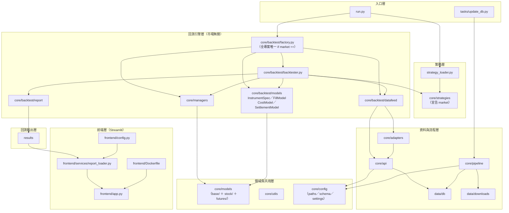

[English](README.md) | [Chinese (中文版)](#)

> 本檔為權威版本；`README.md` 為其英譯。改動時先改本檔，再同步英文版。

# AlphaEdge

AlphaEdge 是一個聚焦台灣市場工作流程的策略研究與交易框架（回測 + 報表 + 資料更新流程 + Streamlit 結果檢視器）。

## 架構總覽


```mermaid
graph TB
    subgraph entry ["入口層"]
        RunPy["run.py"]
        Tasks["tasks/update_db.py"]
    end

    subgraph strategy_layer ["策略層"]
        Strategies["core/strategies<br/>（宣告 market）"]
        Loader["strategy_loader.py"]
    end

    subgraph engine_layer ["回測引擎層（市場無關）"]
        Factory["core/backtest/factory.py<br/>（全專案唯一 if market ==）"]
        Backtester["core/backtest/backtester.py"]
        BTModels["core/backtest/models<br/>InstrumentSpec／FillModel<br/>CostModel／SettlementModel"]
        Feed["core/backtest/datafeed"]
        Managers["core/managers"]
        Report["core/backtest/report"]
    end

    subgraph domain_layer ["領域與共用層"]
        Models["core/models<br/>（base/ ＋ stock/ ＋ futures/）"]
        Utils["core/utils"]
        Config["core/config<br/>（paths／schema／settings）"]
    end

    subgraph data_layer ["資料與流程層"]
        API["core/api"]
        Adapters["core/adapters"]
        Pipeline["core/pipeline"]
        DB["data/db"]
        Data["data/downloads"]
    end

    subgraph output_layer ["回測輸出層"]
        Results["results"]
    end

    subgraph frontend_layer ["前端層（Streamlit）"]
        FrontendApp["frontend/app.py"]
        FrontendService["frontend/services/report_loader.py"]
        FrontendConfig["frontend/config.py"]
        FrontendDocker["frontend/Dockerfile"]
    end

    RunPy --> Loader
    Loader --> Strategies
    RunPy --> Factory
    Factory --> Backtester
    Factory --> BTModels
    Factory --> Feed
    Factory --> Managers
    Backtester --> Strategies
    Backtester --> BTModels
    Backtester --> Feed
    Backtester --> Managers
    Backtester --> Report
    Managers --> Models
    BTModels --> Models
    Feed --> API
    Feed --> Adapters
    API --> DB
    Adapters --> API
    API --> Config
    Pipeline --> Config
    Tasks --> Pipeline
    Pipeline --> DB
    Pipeline --> Data
    Report --> Results
    Results --> FrontendService
    FrontendConfig --> FrontendService
    FrontendService --> FrontendApp
    FrontendDocker --> FrontendApp
```

`Backtester` 是**唯一的回測引擎，市場無關、沒有子類**。市場差異全部下沉為五個可插拔的 model（`InstrumentSpec`、`FillModel`、`CostModel`、`SettlementModel`、`DataFeed`），由 `factory.py` 依策略宣告的 `market` ＋ `instrument_type` 組裝。新增一個（市場, 商品）組合不需要修改 `backtester.py` 一行。詳見[多市場回測引擎架構](docs/backtest/multi-market-engine.md)與[模組使用關係](docs/backtest/module-map.md)。

## 模組說明

| 模組            | 說明                                                                  |
| --------------- | --------------------------------------------------------------------- |
| `core/`         | 交易領域核心程式碼（策略、管理器、模型、介接層、API、ETL 與回測引擎；回測輸出落在根目錄的 `results/`） |
| `frontend/`     | 用於檢視回測結果的 Streamlit Docker 映像                              |
| `tasks/`        | 資料維護與資料庫更新腳本                                              |
| `tests/`        | 單元／整合測試與回測回歸線（`tests/backtest/`）                       |
| `scripts/`      | 護欄檢查（分層相依、文件路徑、API 孤兒方法）、回歸腳本與人工執行腳本   |
| `docs/`         | 使用與架構說明文件（安裝、指令、部署、資料、回測與 ETL 設計）          |
| `strategy_lab/` | 策略研究工作區，依概念分為 `strategies/`、`data_analysis/`、`notebooks/`、`ideas/`；見 `strategy_lab/README.md` |
| `dev/`          | 選用的 conda 環境定義（`dev/env/quant_mac.yml`、`quant_win.yml`）      |
| `backlog/`      | 內部規劃與待辦筆記                                                    |

---

## 文件

| 文件                                               | 說明                                            |
| -------------------------------------------------- | ----------------------------------------------- |
| [開發環境設定](docs/setup/dev-setup.md)            | Python 環境、相依套件、格式化工具、環境變數     |
| [開發部署](docs/deployment/dev-deployment.md)      | 本機更新資料、執行回測、檢視結果的日常流程      |
| [正式環境部署](docs/deployment/prod-deployment.md) | Docker 映像建置、容器執行與角色切分             |
| [資料覆蓋範圍](docs/exchanges/data_coverage.md)    | 資料來源、API 對照、起始日期與股價還原          |
| [指令教學](docs/commands/command-usage.zh-TW.md)   | `update_db` target 對照與完整執行範例           |
| [策略開發指南](core/strategies/README.md)          | 本專案策略實作方式                              |
| [多市場回測引擎架構](docs/backtest/multi-market-engine.md) | 單一引擎 ＋ 五個可插拔 model 的設計與已知簡化 |
| [模組使用關係](docs/backtest/module-map.md)        | 回測路徑上誰呼叫誰、逐檔案職責與輸出檔案        |
| [放空回測框架規格](docs/backtest/short-selling-framework.md) | 方向驅動的記帳、成本、維持率追繳與強制回補 |
| [台期貨平台](docs/futures/tw-futures-platform.md) | 期貨資料表與指令、盯市／保證金／換月／日夜盤語意與已知限制 |
| [ETL 入庫約定](docs/pipeline/etl-ingestion.md) | 入庫階段的分批時機、冪等性與失敗語意；新增 updater 的檢查表 |
| [權益變動表資料](docs/pipeline/equity-change.md) | `equity_change` 的資料形狀、已知限制與節流設定 |
| [非除權息的公司行動](docs/pipeline/corporate-action.md) | `corporate_action` 表的資料源、調整倍率與假跳空護欄 |
| [程式碼品質工具鏈](docs/dev/code-quality.md) | pyproject／ruff／CI／pre-commit 設定與 lint ignore 理由 |
| [命名軸線](docs/dev/naming-axes.md) | 市場軸與商品類別軸的目錄命名定案，以及哪些目錄不分市場 |
| [執行期產物](docs/dev/runtime-artifacts.md) | `data/`／`results/`／`logs/` 的目錄約定、日誌分桶與保留策略 |

---

## 環境建立

### 方式 1：本機 venv + requirements.txt

**macOS / Linux**

```bash
# 建立虛擬環境
python3 -m venv .venv
# 啟用虛擬環境
source .venv/bin/activate

# 安裝相依套件（使用 -m pip 可確保安裝在目前這支 Python／venv 底下）
python -m pip install --upgrade pip
python -m pip install -r requirements.txt
```

**Windows（PowerShell 或 CMD）**

```powershell
# 建立虛擬環境
python -m venv .venv
# 啟用虛擬環境
.venv\Scripts\activate

# 安裝相依套件（使用 -m pip 可確保安裝在目前這支 Python／venv 底下）
python -m pip install --upgrade pip
python -m pip install -r requirements.txt
```

若要關閉目前終端機裡已啟用的 venv：

```bash
deactivate
```

`requirements.txt` 內含鎖定版本的完整清單，最後一行是 `-e .`，因此上面那一行指令
會同時裝好相依套件與專案本身——安裝後 `core` / `tasks` / `tests` 於**任意工作目錄**
皆可 import。套件metadata（相依名稱、optional extras、Python 版本）定義在
`pyproject.toml`。

開發用途請一併安裝 dev extras：

```bash
python -m pip install -e ".[dev]"   # pytest、pytest-timeout、pytest-cov、ruff
```

選用相依（預設不裝）：`[frontend]` Streamlit 介面、`[tick]` DolphinDB tick 儲存、
`[lab]` `strategy_lab` 報告輸出。回測與 ETL 主流程不需要它們。

#### Lint、格式與測試

```bash
ruff check .            # 設定於 pyproject.toml，對應 CLAUDE.md §2.5／§2.10
ruff format .
pytest -m "not slow"    # 略過需要 tw_stock.db 或 API 憑證的測試
pytest                  # 全部（需 data/db/tw_stock.db）
./scripts/run_regression.sh   # LONG ＋ SHORT 回歸，必須逐筆相同
```

要讓每次 commit 前自動跑同一組檢查：

```bash
pip install pre-commit
pre-commit install       # 只需執行一次，安裝 git hook
pre-commit run --all-files
```

每次 push 時 GitHub Actions 會依序跑 `ruff check`、`ruff format --check`、
分層相依檢查（`scripts/check_layer_deps.py`）、SHORT 回歸線與
`pytest -m "not slow"`，最後以 `continue-on-error` 產出覆蓋率報告
（見 `.github/workflows/ci.yml`）。**LONG 回歸線需要 `data/db/tw_stock.db`，
CI 沒有該檔，只能在本機跑。**

若改採下方 **方式 2（Docker）**，則**不需要**在本機使用 venv，映像內已具備隔離的 Python 環境。

API 金鑰與路徑等設定請複製範本並自行填寫：`cp .env.example .env`（細節見 [開發環境設定](docs/setup/dev-setup.md)）。

### 本機同時執行 Trader + Frontend

先完成上面的安裝，然後開兩個終端機分頁（都在專案根目錄）：

**分頁 1（Trader：執行回測）**

```bash
source .venv/bin/activate
python run.py --strategy <StrategyClassName>
# 選用：--show 在瀏覽器開圖；--mode live 尚未實作（以結束碼 1 結束）
```

**分頁 2（Frontend：檢視回測結果）**

```bash
source .venv/bin/activate
streamlit run frontend/app.py
```

啟動後在瀏覽器開啟：`http://localhost:8501`

### 方式 2：Docker Container

在映像裡開 **互動式 shell**，即可像在 venv 裡一樣下指令。Trader 映像預設 `ENTRYPOINT` 為 `python run.py`，若要進入終端機，需用 `--entrypoint` 覆寫。

#### Trader Container

```bash
# 建立映像
docker build -f core/Dockerfile -t alphaedge-core .

# 啟動 container 並進入 shell（工作目錄：/app）；映像不含資料庫，回測需掛入本機 data/
docker run --rm -it -v "$(pwd)/data:/app/data:ro" --entrypoint /bin/bash alphaedge-core
```

在 container 內：

```bash
python run.py --help
python run.py --strategy <StrategyClassName>
```

#### Frontend Container

```bash
# 建立映像
docker build -f frontend/Dockerfile -t alphaedge-frontend .

# 對應埠並啟動 container、進入 shell（工作目錄：/app）
docker run --rm -it -p 8501:8501 --entrypoint /bin/bash alphaedge-frontend
```

在 container 內：

```bash
streamlit run frontend/app.py --server.address=0.0.0.0 --server.port=8501
```

啟動後在瀏覽器開啟：`http://localhost:8501`

#### 單次執行（不進入互動 shell）

```bash
docker run --rm alphaedge-core --help
docker run --rm -p 8501:8501 alphaedge-frontend
```

### 方式 3：Docker Compose（同時啟動 Trader + Frontend）

> ⚠️ **必須先在本機備妥 `data/db/*.db`**。映像裡**不含資料庫**，compose 是把本機的
> `./data` 以**唯讀**掛進容器（`/app/data:ro`）。沒有資料庫時 core 服務會在
> `sqlite3.connect` 當場失敗。資料庫怎麼來見下方〈指令教學〉的「更新資料庫」。
>
> 唯讀是刻意的：容器只跑回測，不該寫到本機的資料庫——背景 ETL 可能正在寫同一個檔。
> 回測產出走 `alphaedge_results` volume，日誌走掛載的 `./logs`。

#### 建立與啟動

```bash
# 建立所有服務映像
docker compose build

# 同時啟動 core 與 frontend
docker compose up
```

#### 背景執行 / 停止

```bash
# 以背景模式啟動
docker compose up -d

# 停止並移除 containers
docker compose down
```

## 指令教學

### 更新資料庫

完整 target 對照表與單一/組合範例請見：[指令教學](docs/commands/command-usage.zh-TW.md)。

```bash
python -m tasks.update_db --target no_tick
```

### 執行回測

將 `<StrategyClassName>` 換成你的策略類別名稱；更多指令情境可參考同一份[指令教學](docs/commands/command-usage.zh-TW.md)。

```bash
python run.py --strategy <StrategyClassName>
# 選用：--show 在瀏覽器開圖；--mode live 尚未實作（以結束碼 1 結束）
```

## 專案結構

```text
AlphaEdge/
├── core/                    # 交易領域模組
│   ├── strategies/            # 策略實作
│   │   ├── base.py            # BaseStrategy（市場無關）
│   │   ├── strategy_loader.py # 自動掃描所有商品類別子套件（stock／futures）
│   │   ├── ridge.py           # 研究版與成品版共用的 ridge 訊號（刻意為模組，不是子套件）
│   │   ├── stock/             # BaseStockStrategy ＋ 各支台股策略
│   │   └── futures/           # BaseFuturesStrategy 與台期貨策略
│   ├── api/                   # 資料存取 API（SQLite／DolphinDB）
│   ├── adapters/              # 資料介接 / 整合層
│   │   └── tw/               # StockQuoteAdapter（日線/Tick → StockQuote）、FuturesQuoteAdapter
│   ├── managers/              # 倉位管理器（base/ ＋ stock/ ＋ futures/）
│   ├── models/                # 領域模型（base/ ＋ stock/ ＋ futures/）
│   ├── utils/                 # 共用工具（enum、時間、日誌、Shioaji 帳號）
│   ├── config/                # 路徑、資料表 schema 與設定常數（全專案最底層）
│   ├── pipeline/              # ETL / 更新流程
│   │   ├── shared/           # 跨市場共用：四層 base ＋ HTTP 工具、日期／年季差集
│   │   ├── tw/               # 台股／台期貨 ETL（crawlers／cleaners／loaders／updaters）
│   │   │   └── utils/        # 只有台股用得到的工具（URL 總表、tick metadata）
│   │   └── utils/            # 跨市場通用：常數、DataFrame 與 SQLite 工具、例外類別
│   ├── backtest/              # 回測引擎
│   │   ├── backtester.py      # 唯一引擎：市場與商品皆無關、無子類
│   │   ├── factory.py         # 依（market, instrument_type）組合組裝 model 組合
│   │   ├── models/            # InstrumentSpec／FillModel／CostModel／SettlementModel
│   │   ├── datafeed/          # 資料載入、報價轉換、交易日判定
│   │   ├── report/            # 交易報表、多空統計、圖表
│   │   └── analysis/          # 績效指標（`risk_metrics.py` 為純函式，前端與 analyzer 共用同一組公式）
├── data/                      # 執行期資料（不進版控）：db/（tw_stock.db、tw_futures.db）＋ downloads/
├── results/                   # 各策略回測輸出（csv／png），不進版控
├── logs/                      # api/、pipeline/、backtest/ 三桶，不進版控
├── frontend/                  # Streamlit Docker 映像
│   ├── app.py                 # Streamlit 入口
│   ├── config.py              # frontend 設定
│   ├── services/              # 資料載入與指標計算（不含 Streamlit 呼叫，測試得到）
│   │   ├── report_loader.py   # 載入回測報表檔案
│   │   ├── metrics.py         # 股票報表指標（與 reporter 共用公式）
│   │   └── futures_metrics.py # 期貨專屬指標（保證金、口數曝險）
│   ├── static/theme.css       # 版面樣式
│   ├── requirements.txt       # frontend 映像的相依
│   ├── Dockerfile             # frontend 容器映像
│   ├── README.md              # frontend 使用說明
│   └── __init__.py
├── strategy_lab/              # 策略研究工作區（strategies/ / data_analysis/ / notebooks/ / ideas/）
├── tasks/                     # 資料更新與維運入口（update_db、delete_price_data、clean_logs）
├── tests/                     # 測試套件（`backtest/` 為引擎與回歸線；`temp/`、`database/`、`downloads/` 為執行期產物）
├── dev/env/                   # 選用的 conda 環境定義（mac／win）
├── backlog/                   # 內部規劃筆記
├── docs/                      # 專案文件
│   ├── backtest/              # 引擎架構、模組使用關係、放空框架規格
│   ├── dev/                   # 程式碼品質、命名軸線、執行期產物
│   ├── futures/               # 台期貨平台：資料、回測語意與已知限制
│   ├── pipeline/              # ETL 入庫約定、權益變動表、公司行動
│   ├── setup/                 # 開發環境設定
│   ├── deployment/            # 開發與正式環境部署
│   ├── exchanges/             # 資料覆蓋範圍
│   └── commands/              # 指令教學（中文／英文）
├── scripts/                   # 護欄檢查與一次性工具
│   ├── run_regression.sh      # 回歸雙線護欄（動回測引擎前後都要跑）
│   ├── check_layer_deps.py    # 分層相依、循環 import、跨軸目錄污染（CI 與 pre-commit 皆跑）
│   ├── check_doc_paths.py     # 文件裡指不到的檔案路徑（搬家後沒更新的引用）
│   ├── check_api_orphan_methods.py  # `core/api` 零呼叫零測試的公開方法
│   ├── clean_pycache.sh／.ps1 # 清除 __pycache__ 與 .pyc（macOS／Linux、Windows）
│   ├── fix_single_market_batches.py  # 一次性資料修復：只入庫單一市場的批次
│   └── manual/                # 需要金鑰或資料庫的人工執行腳本（見該目錄 README）
├── docker-compose.yml         # compose：core + frontend + 共用 results volume
├── run.py
├── README.md
└── README_zh.md
```
