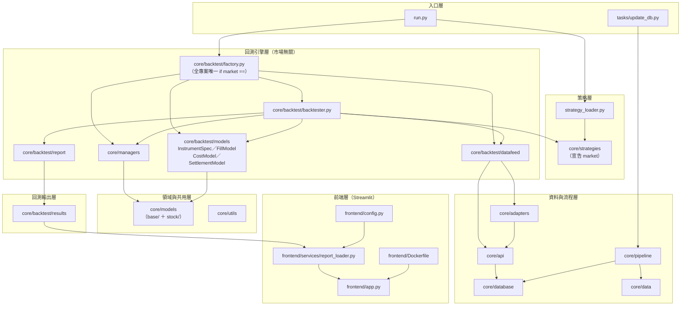

[English](README.md) | [Chinese (中文版)](#)

# AlphaEdge

AlphaEdge 是一個聚焦台灣市場工作流程的策略研究與交易框架（回測 + 報表 + 資料更新流程 + Streamlit 結果檢視器）。

## 架構總覽


```mermaid
graph TB
    subgraph entry ["入口層"]
        RunPy["run.py"]
        Tasks["tasks/update_db.py"]
    end

    subgraph strategy_layer ["策略層"]
        Strategies["core/strategies<br/>（宣告 market）"]
        Loader["strategy_loader.py"]
    end

    subgraph engine_layer ["回測引擎層（市場無關）"]
        Factory["core/backtest/factory.py<br/>（全專案唯一 if market ==）"]
        Backtester["core/backtest/backtester.py"]
        BTModels["core/backtest/models<br/>InstrumentSpec／FillModel<br/>CostModel／SettlementModel"]
        Feed["core/backtest/datafeed"]
        Managers["core/managers"]
        Report["core/backtest/report"]
    end

    subgraph domain_layer ["領域與共用層"]
        Models["core/models<br/>（base/ ＋ stock/）"]
        Utils["core/utils"]
    end

    subgraph data_layer ["資料與流程層"]
        API["core/api"]
        Adapters["core/adapters"]
        Pipeline["core/pipeline"]
        DB["core/database"]
        Data["core/data"]
    end

    subgraph output_layer ["回測輸出層"]
        Results["core/backtest/results"]
    end

    subgraph frontend_layer ["前端層（Streamlit）"]
        FrontendApp["frontend/app.py"]
        FrontendService["frontend/services/report_loader.py"]
        FrontendConfig["frontend/config.py"]
        FrontendDocker["frontend/Dockerfile"]
    end

    RunPy --> Loader
    Loader --> Strategies
    RunPy --> Factory
    Factory --> Backtester
    Factory --> BTModels
    Factory --> Feed
    Factory --> Managers
    Backtester --> Strategies
    Backtester --> BTModels
    Backtester --> Feed
    Backtester --> Managers
    Backtester --> Report
    Managers --> Models
    BTModels --> Models
    Feed --> API
    Feed --> Adapters
    API --> DB
    Adapters --> API
    Tasks --> Pipeline
    Pipeline --> DB
    Pipeline --> Data
    Report --> Results
    Results --> FrontendService
    FrontendConfig --> FrontendService
    FrontendService --> FrontendApp
    FrontendDocker --> FrontendApp
```

`Backtester` 是**唯一的回測引擎，市場無關、沒有子類**。市場差異全部下沉為五個可插拔的 model（`InstrumentSpec`、`FillModel`、`CostModel`、`SettlementModel`、`DataFeed`），由 `factory.py` 依策略宣告的 `market` 組裝。新增一個市場不需要修改 `backtester.py` 一行。詳見[多市場回測引擎架構](docs/backtest/multi-market-engine.md)與[模組使用關係](docs/backtest/module-map.md)。

## 模組說明

| 模組            | 說明                                                                  |
| --------------- | --------------------------------------------------------------------- |
| `core/`         | 交易領域核心程式碼（策略、管理器、模型、介接層、API、資料與回測輸出） |
| `frontend/`     | 用於檢視回測結果的 Streamlit Docker 映像                              |
| `tasks/`        | 資料維護與資料庫更新腳本                                              |
| `tests/`        | crawler、updater 與資料庫流程的單元/整合測試                          |
| `docs/`         | 專案文件（環境設定、部署、資料覆蓋範圍）                              |
| `strategy_lab/` | 策略研究工作區，依概念分為 `strategies/`、`data_analysis/`、`notebooks/`、`ideas/`；見 `strategy_lab/README.md` |
| `dev/`          | 選用開發工具（conda 環境 YAML、輔助腳本）                             |
| `backlog/`      | 內部規劃與待辦筆記                                                    |

---

## 文件

| 文件                                               | 說明                                            |
| -------------------------------------------------- | ----------------------------------------------- |
| [開發環境設定](docs/setup/dev-setup.md)            | Python 環境、相依套件、格式化工具、環境變數     |
| [開發部署](docs/deployment/dev-deployment.md)      | 本地服務啟動流程、collector 執行指令、dashboard |
| [正式環境部署](docs/deployment/prod-deployment.md) | Docker Compose 部署、監控、多節點策略           |
| [資料覆蓋範圍](docs/exchanges/data_coverage.md)    | 目前平台資料來源與 API 覆蓋範圍                 |
| [指令教學](docs/commands/command-usage.zh-TW.md)   | `update_db` target 對照與完整執行範例           |
| [策略開發指南](core/strategies/README.md)          | 本專案策略實作方式                              |
| [多市場回測引擎架構](docs/backtest/multi-market-engine.md) | 單一引擎 ＋ 五個可插拔 model 的設計與已知簡化 |
| [模組使用關係](docs/backtest/module-map.md)        | 回測路徑上誰呼叫誰、逐檔案職責與輸出檔案        |
| [放空回測框架規格](docs/backtest/short-selling-framework.md) | 方向驅動的記帳、成本、維持率追繳與強制回補 |

---

## 環境建立

### 方式 1：本機 venv + requirements.txt

**macOS / Linux**

```bash
# 建立虛擬環境
python3 -m venv .venv
# 啟用虛擬環境
source .venv/bin/activate

# 安裝相依套件（使用 -m pip 可確保安裝在目前這支 Python／venv 底下）
python -m pip install --upgrade pip
python -m pip install -r requirements.txt
```

**Windows（PowerShell 或 CMD）**

```powershell
# 建立虛擬環境
python -m venv .venv
# 啟用虛擬環境
.venv\Scripts\activate

# 安裝相依套件（使用 -m pip 可確保安裝在目前這支 Python／venv 底下）
python -m pip install --upgrade pip
python -m pip install -r requirements.txt
```

若要關閉目前終端機裡已啟用的 venv：

```bash
deactivate
```

若改採下方 **方式 2（Docker）**，則**不需要**在本機使用 venv，映像內已具備隔離的 Python 環境。

API 金鑰與路徑等設定請複製範本並自行填寫：`cp .env.example .env`（細節見 [開發環境設定](docs/setup/dev-setup.md)）。

### 本機同時執行 Trader + Frontend

先完成上面的安裝，然後開兩個終端機分頁（都在專案根目錄）：

**分頁 1（Trader：執行回測）**

```bash
source .venv/bin/activate
python run.py --strategy <StrategyClassName>
# 選用：--mode backtest|live（預設 backtest）
```

**分頁 2（Frontend：檢視回測結果）**

```bash
source .venv/bin/activate
streamlit run frontend/app.py
```

啟動後在瀏覽器開啟：`http://localhost:8501`

### 方式 2：Docker Container

在映像裡開 **互動式 shell**，即可像在 venv 裡一樣下指令。Trader 映像預設 `ENTRYPOINT` 為 `python run.py`，若要進入終端機，需用 `--entrypoint` 覆寫。

#### Trader Container

```bash
# 建立映像
docker build -f core/Dockerfile -t alphaedge-core .

# 啟動 container 並進入 shell（工作目錄：/app）
docker run --rm -it --entrypoint /bin/bash alphaedge-core
```

在 container 內：

```bash
python run.py --help
python run.py --strategy <StrategyClassName>
```

#### Frontend Container

```bash
# 建立映像
docker build -f frontend/Dockerfile -t alphaedge-frontend .

# 對應埠並啟動 container、進入 shell（工作目錄：/app）
docker run --rm -it -p 8501:8501 --entrypoint /bin/bash alphaedge-frontend
```

在 container 內：

```bash
streamlit run frontend/app.py --server.address=0.0.0.0 --server.port=8501
```

啟動後在瀏覽器開啟：`http://localhost:8501`

#### 單次執行（不進入互動 shell）

```bash
docker run --rm alphaedge-core --help
docker run --rm -p 8501:8501 alphaedge-frontend
```

### 方式 3：Docker Compose（同時啟動 Trader + Frontend）

#### 建立與啟動

```bash
# 建立所有服務映像
docker compose build

# 同時啟動 core 與 frontend
docker compose up
```

#### 背景執行 / 停止

```bash
# 以背景模式啟動
docker compose up -d

# 停止並移除 containers
docker compose down
```

## 指令教學

### 更新資料庫

完整 target 對照表與單一/組合範例請見：[指令教學](docs/commands/command-usage.zh-TW.md)。

```bash
python -m tasks.update_db --target no_tick
```

### 執行回測

將 `<StrategyClassName>` 換成你的策略類別名稱；更多指令情境可參考同一份[指令教學](docs/commands/command-usage.zh-TW.md)。

```bash
python run.py --strategy <StrategyClassName>
```

## 專案結構

```text
AlphaEdge/
├── core/                    # 交易領域模組
│   ├── strategies/            # 策略實作
│   │   ├── base.py            # BaseStrategy（市場無關）
│   │   ├── strategy_loader.py # 自動掃描所有市場子套件
│   │   └── stock/             # BaseStockStrategy ＋ 各支台股策略
│   ├── api/                   # 資料存取 API（SQLite／DolphinDB）
│   ├── adapters/              # 資料介接 / 整合層
│   │   └── stock_quote_adapter.py  # StockQuoteAdapter（日線/Tick → StockQuote）
│   ├── managers/              # 倉位管理器（base/ ＋ 各市場）
│   ├── models/                # 領域模型（base/ ＋ stock/）
│   ├── utils/                 # 共用工具（enum、路徑、時間、日誌）
│   ├── pipeline/              # ETL / 更新流程
│   ├── database/              # sqlite 資料庫檔案（stock.db）
│   ├── backtest/              # 回測引擎
│   │   ├── backtester.py      # 唯一引擎：市場無關、無子類
│   │   ├── factory.py         # 依 strategy.market 組裝 model 組合
│   │   ├── models/            # InstrumentSpec／FillModel／CostModel／SettlementModel
│   │   ├── datafeed/          # 資料載入、報價轉換、交易日判定
│   │   ├── report/            # 交易報表、多空統計、圖表
│   │   ├── analysis/          # 績效指標（尚未接進 run() 主流程）
│   │   └── results/           # 各策略輸出（csv／png／logs）
│   └── data/                  # 下載 / 原始資料
├── frontend/                  # Streamlit Docker 映像
│   ├── app.py                 # Streamlit 入口
│   ├── config.py              # frontend 設定
│   ├── services/              # 資料載入服務
│   │   └── report_loader.py   # 載入回測報表檔案
│   ├── Dockerfile             # frontend 容器映像
│   ├── README.md              # frontend 使用說明
│   └── __init__.py
├── strategy_lab/              # 策略研究工作區（strategies/ / data_analysis/ / notebooks/ / ideas/）
├── tasks/                     # 資料更新腳本
├── tests/                     # 測試套件
├── dev/                       # 選用 conda 環境與開發腳本
├── backlog/                   # 內部規劃筆記
├── docs/                      # 專案文件
│   ├── backtest/              # 引擎架構、模組使用關係、放空框架規格
│   ├── setup/
│   ├── deployment/
│   ├── exchanges/
│   └── commands/
├── scripts/
│   └── run_regression.sh      # 回歸雙線護欄（動回測引擎前後都要跑）
├── docker-compose.yml         # compose：core + frontend + 共用 results volume
├── run.py
├── README.md
└── README_zh.md
```
