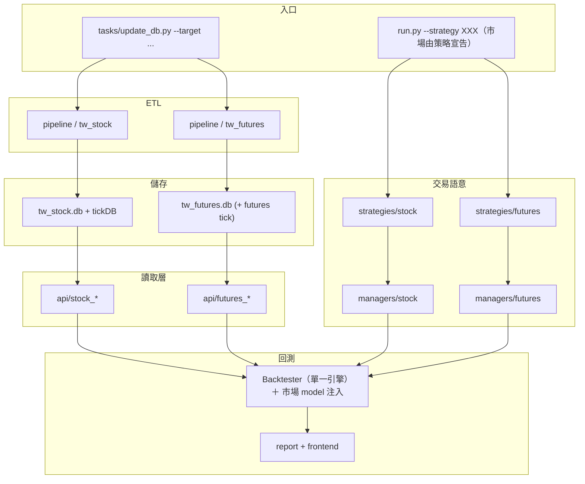

# 台期貨 ETL 與回測架構規劃

## Abstract

- **背景／問題**（撰寫當時）：專案只支援台股，沒有期貨目錄、TAIFEX crawler、期貨表／API 與期貨部位管理；合約生命週期、保證金、點值、夜盤日曆皆未建模。當時連一筆台指期日線都沒有，所以最大宗的缺口在 ETL，不在回測引擎。
  > **現況（2026-09-02）**：Phase0-1／1-1／1-2／**6-1** 已完成——`tw_futures.db` 已建、TAIFEX crawler 四層可跑、`--target futures_price` 與 `--target futures_stock_universe` 皆可用，股期標的池 320 檔已入庫。**仍缺**：全部的 Phase2 之後、Phase1-7 與 Phase6-2。**2026-09-02 Phase1-6 完成**——期貨 model 組已接進既有引擎，`--strategy MomentumFuturesStrategy` 可端對端跑完並產出報表。**2026-09-01：Phase1-3a／1-3b／1-4 全數完成**——`FuturesPriceAPI`、`FuturesQuoteAdapter`、`models/futures`、`managers/futures` 已就位（含逐日盯市），TX 歷史回補進行中。
- **目標**：以「平行垂直切片」把台灣期貨（台指期系列 ＋ 股票期貨）加入專案：pipeline → `tw_futures.db` → API → models/managers → strategies → **既有的單一 `Backtester`**（透過 [多市場回測引擎架構](../docs/backtest/multi-market-engine.md) 建立的 model 掛點接入），並與 [美股ETL與回測架構規劃.md](美股ETL與回測架構規劃.md) 共用「平行市場模組、共享核心、不共享市場細節」原則。
- **範圍界線**：**保留現有台股流程不動**，不在 `Stock*` 類上硬接期貨分支；**不新增第二支 backtester**（原規劃的 `FuturesBacktester` 已作廢，理由見 §一）；本規劃**不含**選擇權策略回測（PCR 僅作輔助訊號）、不含實盤下單、不含跨市場組合回測；股票期貨先鎖定流動性前 N 大標的，不一次攤開 250+ 檔。
- **驗收標準**：`--target futures_price` 跑完後可用 `sqlite3 core/database/tw_futures.db` 直接查到資料且重跑冪等；一支期貨示範策略可經 `python run.py --strategy XXX` 跑完並產出報表；台股既有回歸雙線（LONG 915 筆 ＋ SHORT 快照）逐筆不受影響，且**回測引擎本身 0 行改動**（2026-09-02 修正為「一處」——`snapshot_daily_equity()` 的部位計價下沉成掛點，預設實作逐字不動故雙線仍逐筆相同，理由見 Phase1-6 的完成紀錄）。

涵蓋範圍：連續合約構建（換月接續）與展期價差、日盤與夜盤資料整併、三大法人與大額交易人籌碼訊號、保證金制度變動下的槓桿與部位控管、交易成本模型（期交稅、手續費、滑價）、股票期貨標的池管理與流動性分級。

資料來源以台灣期貨交易所（TAIFEX）為主，行情細節資料以 Shioaji（永豐金 API）為輔。

---

## 進度追蹤表

| 編號 | 步驟名稱 | 產出檔案 | 驗證方式 | 狀態 | 備註／中斷點 |
|------|----------|----------|----------|:----:|--------------|
| Phase0-1 | `downloads/` 收斂為市場維度目錄 | `core/config.py`、`core/pipeline/downloads/` | 既有 ETL 全部跑通且落點正確；`tests/` 全綠 | ✅ | **2026-08-22 完成**：9 個常數改掛 `TW_STOCK_DOWNLOADS_PATH`，常數名稱不動；`git mv` 為純 rename。實作時多抓到 1 處漏網（`tests/test_finmind_pipeline.py`），見完成紀錄 |
| Phase1-1 | `core/config.py` 新增期貨 DB 與表名常數 | `core/config.py` | `TW_FUTURES_DB_PATH` 可解析 | ✅ | **2026-08-22 完成**：DB 路徑 ＋ 6 個表名 ＋ 5 個中繼目錄 ＋ meta 目錄。`DEFAULT_FUTURES_START_DATE` 當時刻意未加，已於 **2026-08-29 補上為 2015-01-01**（見 Phase1-2） |
| Phase1-2 | `futures_price` 四層 ETL（TAIFEX 日線／結算價） | `core/pipeline/tw/*/futures_price_*.py`、`tasks/update_db.py` | `--target futures_price` 跑完可查到資料且重跑冪等 | ✅ | **2026-08-29 完成**：`tw_futures.db` 已建，TX 端對端驗過（3 日 36 列），續跑零重爬。schema 較原規格多 `最後最佳買價／賣價` 兩欄（理由見該步驟）
| Phase1-3a | `FuturesPriceAPI` | `core/api/futures_price_api.py` | 只從 `tw_futures.db` 讀，不讀中繼檔 | ✅ | **2026-09-01 完成**：17 條測試 ＋ 實資料 smoke test。**不做換月／不挑近月**，當日所有到期月原樣回傳 |
| Phase1-3b | `FuturesQuoteAdapter` | `core/adapters/futures_quote_adapter.py` | 產出的 `FuturesQuote` 欄位語意正確 | ✅ | **2026-09-01 完成**（與 Phase1-4 同批）：10 條測試。**只做型別轉換不做選擇**，換月屬 Phase1-7／2-4 |
| Phase1-4 | `models/futures` ＋ `managers/futures`（簡化保證金） | `core/models/futures/`、`core/managers/futures/` | 口數、多空、未平倉語意正確 | ✅ | **2026-09-01 完成**：23 條測試，PnL ＝ 價格變動 × 乘數 × 口數。**逐日盯市已實作**（`settle_daily()` 不再是 no-op）；保證金為簡化版，完整版仍屬 Phase2-2 |
| Phase1-5 | `BaseFuturesStrategy` ＋ 一支示範策略 | `core/strategies/futures/` | 19 條測試 ＋ 實資料產生訂單 | ✅ | **2026-09-01 完成**。**`load_futures_strategies()` 與 `run.py` 分流皆不需要**，理由見完成紀錄 |
| Phase1-6 | 實作期貨 model 組（不新增引擎） | `core/backtest/models/`、`core/backtest/datafeed/futures_datafeed.py`、`core/backtest/report/futures_reporter.py`、`core/backtest/factory.py` | 台股回歸雙線逐筆相同；期貨策略可跑完 | ✅ | **2026-09-02 完成**：LONG 915 筆與 SHORT 快照逐筆相同（快照重產後 0 diff）、493 條測試通過、`--strategy MomentumFuturesStrategy` 可跑完並產出五張圖與四份 CSV。**偏離原規格：引擎改了一處**（`snapshot_daily_equity()` 的部位計價 16 行，下沉為 1 行呼叫 `SettlementModel.mark_position()`），理由見下方步驟章節 |
| Phase1-7 | 連續合約構建（先做一種調整方式） | `core/pipeline/tw/{loaders,updaters}/futures_continuous_*.py`、`core/backtest/datafeed/futures_roll.py` | 換月接點的 `roll_flag` 正確 | ✅ | **2026-09-02 完成**：`--target futures_continuous` 可跑，TX 2015~2026 建出 2,842 個交易日、140 次換月、8,526 列（3 種調整方式）。**三種調整方式全做**（原規格只要求一種）、換月規則三種可切換並與 Phase2-4 共用同一份實作。12 條測試，含以真實表驗「還原一致 ＋ 接點無假跳空」 |
| Phase2-1 | 期貨成本模型（期交稅、手續費、滑價） | `core/backtest/models/cost_model.py`、`fill_model.py`、`core/utils/constant.py` | **不可複用證交稅**；有單元測試 | ✅ | **2026-09-02 完成**：期交稅（法規值十萬分之二、**買賣各課一次**、稅基為契約價值）、每口手續費（市場常見值 50 元，可逐商品指定）、滑價改以**跳動點**表達並可逐商品設定。16 條測試；`FuturesCostConfig` 一併從 `managers/` 移到 `cost_model.py`（與股票的 `CostConfig` 同位置），部位管理層改為一律問 CostModel，費率不再有第二份 |
| Phase2-2 | 槓桿／部位控管（保證金 ETL 已分家） | `core/managers/futures/`、`core/backtest/models/settlement_model.py`、`core/backtest/datafeed/futures_datafeed.py` | 追繳／可開口數依當時生效的保證金計算 | ✅ | **2026-09-02 完成**：查表改為**預設模式**（API 由 DataFeed 注入策略與部位管理層**共用的同一個設定物件**）、追繳以**權益 vs 維持保證金**判斷並可選強制平倉／僅標記、可開口數隨生效日改變。14 條測試（含一條以真實表驗證 TX 2024-08-09 → 08-22 由 265,000 調為 292,000）。保證金歷史序列本身見 [台期貨保證金ETL](台期貨保證金ETL.md) S1~S5 |
| Phase2-3 | 期貨交易日曆（日盤 ＋ 夜盤、結算日） | `core/backtest/datafeed/futures_calendar.py` | 不沿用股票 calendar | ✅ | **2026-09-02 完成**：交易日取自行情表（臨時休市／補行交易日自動涵蓋）、結算日為第三個星期三且**遇休市順延到期貨自己的下一個開盤日**、週契約另有規則、夜盤跨日與 2017-05-15 上線日皆已處理。14 條測試，含一條以真實表比對 **140 個已到期 TX 月契約的最後交易日，140/140 完全相同** |
| Phase2-4 | 換月規則參數化 | `core/backtest/datafeed/futures_roll.py`、`settlement_model.py`、`core/strategies/futures/base.py` | 三種換月規則可切換 | ✅ | **2026-09-02 完成**：`FuturesRollConfig` 由 factory 建立並由**策略、結算模型、DataFeed 三方共用**；結算模型在換月時自動轉倉（平舊倉 ＋ 同口數同方向開新倉，展期價差如實入帳）。13 條測試，含以真實資料驗「回測換月接點 ＝ `futures_continuous` 的 `roll_flag`」完全一致 |
| Phase3-1 | 籌碼訊號 ETL（三大法人、大額交易人、PCR） | `core/pipeline/tw/*/futures_chip_*.py`、`core/api/futures_chip_api.py` | 前視偏差對齊（T+1 可用） | ✅ | **2026-09-02 完成**：`--target futures_chip` 上線，三個資料集三張表，**一天三次請求即涵蓋全市場**（不逐商品打）。`FuturesChipAPI.get_available()` 只回傳「查詢日**之前**」已公布的籌碼——那一個等號就是前視偏差。13 條測試。⏳ 歷史回補背景進行中 |
| Phase4-1 | 多商品擴充（MTX、TMF、TE、TF） | `core/config.py`、`tests/test_futures_products.py` | 各商品點值／乘數正確 | ✅ | **2026-09-02 完成（程式面）**：`FUTURES_TARGET_PRODUCTS` 擴為 7 檔（TX／MTX／TMF／TE／ZEF／TF／ZFF），六檔新商品逐一實測可爬可清可入庫，**crawler／updater 一行都沒改**。15 條測試。⏳ **歷史回補進行中**（背景執行，約 40 小時），進度查 `SELECT product, MIN(date), MAX(date), COUNT(*) FROM futures_price_daily GROUP BY product` |
| Phase4-2 | 日盤／夜盤整併 | `core/utils/constant.py`、`core/adapters/futures_quote_adapter.py`、`core/backtest/datafeed/futures_datafeed.py` | 跨盤別跳空被保留 | ✅ | **2026-09-02 完成**：策略把 `session` 設為 `FuturesSession.COMBINED` 即得整併序列（**前一交易日夜盤 ＋ 當日日盤**，open 取夜盤故跨盤別跳空留在 bar 內）。12 條測試。實作時踩到兩個「不會報錯」的坑：`COMBINED` 被拿去查資料表（整場零交易）、ETL 直接迭代 `FuturesSession` 而去爬不存在的時段，兩者皆已固化為測試 |
| Phase5-1 | 分 K 與 Tick（Shioaji futures ticks） | `core/pipeline/tw/*/futures_tick_*.py` | 日內策略可回測 | ⬜ | 相依 Phase4-1；可參考 `StockTickUpdater` 多 key／執行緒 |
| Phase5-2 | frontend 期貨專屬指標（保證金曲線、口數曝險） | `frontend/services/futures_metrics.py`、`frontend/app.py` | 指標可顯示 | ✅ | **2026-09-02 完成**：以**欄位**判斷是不是期貨報表，另外顯示峰值佔用保證金／峰值口數／資金使用率／平均保證金報酬率，並繪出保證金與口數曝險的階梯曲線（由交易明細的進出場日推導，不需引擎多輸出檔案）。7 條測試（邏輯抽到不含 Streamlit 的 service 才測得到）|
| Phase5-3 | **程式碼**目錄收斂 | 全專案 | 台股回歸逐筆相同 | 🔄 | **2026-08-31：`pipeline/` 已由命名軸線收斂工作完成**（軸線定案見 [命名軸線](../docs/dev/naming-axes.md)），剩 `api/`／`adapters/`／`backtest/datafeed/`。**形狀偏離原規格**：改為 `pipeline/tw/`（純市場軸）而非原定 `pipeline/tw_stock`／`tw_futures`——每層目錄只承載一條軸，商品類別由檔名承載，與美股 §3.1 一致；原路徑 B 會把市場與商品壓成單一目錄名。理由見該文件〈每層目錄只承載一條軸〉 |
| Phase6-1 | `futures_stock_universe` 標的池 ETL | `core/pipeline/tw/*/futures_stock_universe_*.py`、`tasks/update_db.py` | 掛牌／下市與乘數異動可追蹤 | ✅ | **2026-08-29 完成**：`--target futures_stock_universe` 可跑，320 檔入庫、標的代號 270/270 對得上現股。**流動性前 N 檔篩選改列 Phase6-2**（需要成交量，標的池階段還沒有）
| Phase6-2 | 股票期貨行情 ETL 與除權息乘數調整 | `core/api/futures_stock_universe_api.py`、`core/adapters/futures_quote_adapter.py`、`core/backtest/datafeed/futures_datafeed.py`、`tasks/update_db.py` | 與台股除權息處理對照，無雙重調整 | ✅ | **2026-09-02 完成**：`--target futures_stock_price` 上線（清單取自標的池、預設只爬流動性前 20 檔）；**股期的乘數改為逐日查契約單位**（除權息會調整它），adapter 新增 `multiplier_resolver` 掛點；股期行情一律用原始價，除權息由契約單位承接，**不再套還原價**（雙重調整）。11 條測試

---

## 一、現況評估：需不需要大翻修？

結論：**需要做「增量式調整」，不需要大翻修。**

### 目前可沿用的優點

- `core/pipeline` 已採 `crawlers` / `cleaners` / `loaders` / `updaters` 分層，標準 ETL 可直接複製到期貨（可參考 `stock_price_crawler.py` → `stock_price_cleaner.py` → `stock_price_loader.py` → `stock_price_updater.py` 的既有慣例）。
- `tasks/update_db.py` 已有多 `--target` 入口，適合新增 `futures_price`、`futures_tick` 等。
- `core/backtest`、`core/strategies` 已有策略執行與結果輸出流程，可複用事件迴圈與報表概念。
- Shioaji 已用於股票 tick／帳戶工具，可作為期貨合約與 ticks 的自然資料來源。
- 常數層已有預留鉤子：`InstrumentType.FUTURE`、`OrderState.FuturesOrder` / `FuturesDeal`（見 `core/utils/constant.py`）。
- **程式碼**的命名慣例（`stock_price_crawler.py`、`stock_quote_adapter.py`）已經是「路徑 A：命名平行」的實際做法，期貨直接沿用同一套命名風格即可，不需另外發明新的頂層結構（例如不需要新開 `data/futures/` 這種與現有 `core/pipeline/downloads/` 平行的目錄）。
- **資料**則已經是市場維度：`core/database/` 早就是 `tw_stock.db` ＋（規劃中的）`tw_futures.db`。唯一沒跟上的是 `downloads/`，Phase0-1 把它歸位（決策與理由見 §3.0）。
- `core/models/`、`core/managers/`、`core/strategies/` 已按**商品類別**分目錄（`base/` ＋ `stock/`），期貨新增 `futures/` 是沿用既有慣例，不是新決策。

### 目前主要缺口

- ~~**沒有**期貨目錄、TAIFEX crawler、期貨表／API、期貨 `PositionManager`。~~
  **2026-09-01 更新**：crawler／cleaner／loader／updater 與 `tw_futures.db`（Phase1-2）、`FuturesPriceAPI`／`FuturesQuoteAdapter`（Phase1-3）、期貨 models 與 `FuturesPositionManager`（Phase1-4）**皆已完成**；下一步為策略層（Phase1-5）。
- 資料模型與成本幾乎全是台股語意（`stock_id`、手續費 + 證交稅、全額持股）。
- `core/backtest/backtester.py` 目前是純股票實作：`StockAccount`、`StockPositionManager`、`StockQuoteAdapter`、`BaseStockStrategy`、`StockOrder/Position/TradeRecord` 全部寫死，連 `MarketCalendar.check_stock_market_open()` 都是股票專屬判斷，**無法直接餵期貨資料**。
  - **原規劃是「平行建一支 `FuturesBacktester`」，此做法已作廢**（2026-08-02）。逐段分類後，那 838 行裡約 4 成是市場無關的骨架（日期迴圈、執行順序、方向驗證、訊號執行、報表），複製一份會讓兩邊永久漂移；而看似非分家不可的台股信用交易邏輯，全部都能對應到可插拔的 model 掛點。改採 [多市場回測引擎架構](../docs/backtest/multi-market-engine.md) 的「單一引擎 ＋ 可插拔 model」，對齊 Backtrader `Cerebro`、Zipline、Lean `Engine`、Nautilus `BacktestEngine` 的一致做法。期貨端因此只需寫 model 實作，引擎 0 行改動。
- `MarketCalendar` 以股票 `price` 表／日盤代理，未涵蓋夜盤與期貨結算日。
- 合約生命週期（近月／遠月、連續合約、換月）尚未建模。
- `BaseStockStrategy` 註解提到 Futures，但仍綁定股票 API／模型——不宜在其上硬接 if-futures。

### 建議原則

- **保留現有台股流程不動**，台期貨採「平行模組」建置，降低回歸風險。
- **共享核心，不共享市場細節**：共用 ETL 抽象、回測事件迴圈、報表與 frontend；保證金、日曆、點值、合約碼分開。
- **不要**在 `Stock*` 類上硬接期貨；應平行建 `Futures*` 分支，由 `core/backtest/factory.py` 依 `strategy.market` 分流（全專案唯一一處市場判斷，`run.py` 的 CLI 介面不變、不新增 `--market`）。

---

## 二、擴充後的整體架構（雙市場）

從「台股研究框架」演進為：

> **台灣市場多商品框架** = 台股 + 台期貨（之後美股可同模式掛上）

### 2.1 現況（單市場：台股）

```text
tasks/update_db.py
        ↓
core/pipeline  (crawler → cleaner → loader → updater)
        ↓
core/database/tw_stock.db (+ DolphinDB tick)
        ↓
core/api  →  adapters  →  StockQuote
        ↓
core/strategies/stock  +  models/managers/stock
        ↓
core/backtest  →  results  →  frontend
```

### 2.2 目標資料流



### 2.3 層級對照

| 層 | 台股（現有） | 台期貨（新增） |
|----|-------------|----------------|
| 來源 | TWSE/TPEX/MOPS/FinMind/Shioaji | TAIFEX + Shioaji `Contracts.Futures` |
| 中繼 | `downloads/tw_stock/{price,chip,tick,…}` | `downloads/tw_futures/{price,tick,meta,…}` |
| 儲存 | `tw_stock.db` / DolphinDB | `tw_futures.db`（合約碼含商品 + 到期月） |
| CLI | `--target price\|chip\|tick\|…` | `--target futures_price\|futures_tick\|…` |
| 成本 | 手續費 + 證交稅 | 手續費 + 保證金／點值／結算 |
| 日曆 | 日盤、以 price 表代理 | 日盤 + 夜盤、結算日、換月 |
| 策略載入 | `load_stock_strategies()` | `load_futures_strategies()` |

---

## 三、建議目錄調整

### 3.0 決策（2026-08-22）：資料目錄現在就分，程式碼目錄先不分

**程式碼與資料的搬遷成本差一個量級**，因此兩者採不同做法，不是自相矛盾：

| 對象 | 做法 | 何時 | 搬遷成本 |
|------|------|------|----------|
| `downloads/`（資料） | **市場維度目錄**：`tw_stock/` ／ `tw_futures/` | **Phase0-1，動期貨程式之前** | 改 9 個 config 常數 ＋ `git mv` ＋ 修 1 個測試 |
| `pipeline/`（程式碼） | `pipeline/{shared,tw}/` | **已於 2026-08-31 收斂**（命名軸線收斂工作 S7） | 60 個檔案的 import 已改寫 |
| `api/` `adapters/`（程式碼） | **命名平行**：`futures_*_api.py` | 收斂延到 Phase5-3 🔄 | 全專案 import 都要改 |
| `models/` `managers/` `strategies/` | **目錄分家**：新增 `futures/` | 隨 Phase1-4、Phase1-5 | 新增目錄，不動既有 |

專案其實**早就有兩套慣例並存**，而且各有道理——期貨照著既有慣例走即可，不需要發明新結構：

| 層 | 現況分家方式 | 依據 |
|----|--------------|------|
| `models/` `managers/` `strategies/` | 目錄（`base/` ＋ `stock/`） | 依**商品類別**——`Position` 的語意台股與美股相同，期貨才不同 |
| `pipeline/` `api/` `adapters/` | 命名平行（扁平 ＋ `stock_` 前綴） | 有共用基底類別（`crawlers/base.py` 等），搬遷會動全專案 import |
| `database/` | 目錄／檔案分家（`tw_stock.db` ＋ `tw_futures.db`） | 依**市場**——純資料，語意不可混用 |

`downloads/` 目前是唯一的例外：它是純資料，卻還跟著程式碼用扁平命名。Phase0-1 就是把它歸位到與 `database/` 一致的市場維度。

**為什麼不用 `downloads/tw/stock/` 三層**：市場 × 商品不是自由組合的兩軸，只會命名實際支援的組合；多一層只裝兩個項目是純導覽成本。單層 `tw_stock` 也與路徑 B 的 `pipeline/tw_stock/` 同名，將來收斂時不需要再改一次。

**為什麼不能只搬期貨**：若台股留在扁平、期貨進 `tw_futures/`，會得到 `downloads/{price, chip, …, tw_futures/}`——看到 `price/` 無法判斷屬於哪個市場。要嘛全部走目錄、要嘛全部走前綴，混著是最糟的選項。

### 3.1 `downloads/` 目標結構（Phase0-1 落地）

```text
core/pipeline/downloads/
├── tw_stock/                       # 既有台股中繼檔全部搬進來（Phase0-1）
│   ├── price/
│   ├── chip/
│   ├── margin/
│   ├── dividend/
│   ├── tick/
│   ├── finmind/                    # FinMind 是資料源，但供應的是台股資料
│   ├── financial_statement/
│   ├── monthly_revenue_report/
│   └── meta/                       # resume 用的 metadata，同樣按市場分
│       ├── financial_statement/
│       ├── monthly_revenue_report/
│       ├── tick/
│       └── broker_trading/
└── tw_futures/                     # 新增（Phase1-2 起陸續使用）
    ├── price/
    ├── chip/
    ├── continuous/
    ├── universe/                   # 股票期貨標的池（Phase6-1 ✅ 使用中）
    ├── tick/                       # 可選（Phase5-1）
    └── meta/
```

### 3.2 程式碼：路徑 A（命名平行，先不搬現有檔）

```text
core/
├── pipeline/
│   ├── crawlers/
│   │   ├── stock_price_crawler.py            # 維持
│   │   ├── futures_price_crawler.py          # ✅ 已新增
│   │   ├── futures_chip_crawler.py           # 新增（三大法人／大額交易人／PCR）
│   │   ├── futures_stock_universe_crawler.py # ✅ 已新增（股票期貨標的清單）
│   │   └── futures_tick_crawler.py           # 新增（可選）
│   ├── cleaners/   # futures_*_cleaner.py
│   ├── loaders/    # futures_*_loader.py
│   ├── updaters/   # futures_*_updater.py
│   └── downloads/  # 見 §3.1（Phase0-1 已改為市場維度）
├── database/
│   ├── tw_stock.db
│   └── tw_futures.db                          # 獨立，避免與 stock_id 語意混用
├── api/
│   ├── stock_*_api.py
│   ├── futures_price_api.py
│   └── futures_chip_api.py                 # + futures_tick_api（若需要）
├── adapters/
│   ├── stock_quote_adapter.py
│   └── futures_quote_adapter.py
├── models/
│   ├── base/
│   ├── stock/
│   └── futures/                            # Account / Order / Position / Quote
├── managers/
│   ├── base/
│   ├── stock/
│   └── futures/                            # 保證金、口數、開平倉
├── strategies/
│   ├── stock/
│   └── futures/                            # BaseFuturesStrategy + 策略
├── backtest/                               # 單一 Backtester；期貨只新增 model 實作
│   ├── backtester.py                       # 市場無關，期貨不動它
│   ├── factory.py                          # 補 InstrumentType.FUTURE 分支（唯一改動點）
│   ├── models/                             # TaifexInstrumentSpec / FuturesFillModel /
│   │                                       #   FuturesCostModel / FuturesSettlementModel
│   └── datafeed/futures_datafeed.py        # tw_futures.db ＋ 期貨交易日曆
└── utils/
    └── constant.py                         # 已有 InstrumentType.FUTURE 等鉤子
```

### 3.3 程式碼：路徑 B（市場維度目錄，Phase5-3 🔄；`pipeline/` 已完成）

**只剩程式碼**——`downloads/` 與 `database/` 已在 Phase0-1 之後就是這個形態。

```text
core/
├── pipeline/
│   ├── shared/                 # BaseCrawler/Cleaner/Loader/Updater
│   ├── tw_stock/               # 現有台股 ETL（逐步歸位）
│   │   ├── crawlers/
│   │   ├── cleaners/
│   │   ├── loaders/
│   │   └── updaters/
│   └── tw_futures/             # 台期 ETL（由路徑 A 的 futures_*.py 歸位）
├── api/
│   ├── tw_stock/
│   └── tw_futures/
├── backtest/
│   ├── engine/                 # 共用事件迴圈 / 撮合 / portfolio
│   ├── datafeed/
│   │   ├── tw_stock_datafeed.py
│   │   └── tw_futures_datafeed.py
│   ├── calendars/
│   │   ├── tw_stock_calendar.py
│   │   └── tw_futures_calendar.py
│   ├── fee_models/             # 股票證交稅 vs 期貨手續費／結算費
│   └── report/
├── strategies/
│   ├── stock/                  # 商品類別維度，不隨市場再分
│   └── futures/
├── models/
│   ├── stock/
│   └── futures/
└── managers/
    ├── stock/
    └── futures/
```

> **注意路徑 B 的兩個維度不同**：`pipeline/` `api/` `backtest/datafeed/` 依**市場**（`tw_stock`／`tw_futures`／`us`），
> 而 `models/` `managers/` `strategies/` 依**商品類別**（`stock`／`futures`）——美股上來時共用 `models/stock/`，
> 不會變成 `models/tw_stock/` ＋ `models/us_stock/`。這不是疏漏，是刻意的。

---

## 四、哪些共用、哪些必須拆開

### 可共用

- ETL 四層抽象（crawler / cleaner / loader / updater）
- 回測事件迴圈骨架（開平倉訊號 → 撮合 → 記帳 → 報表）
- Log、path、config 機制、`frontend` 讀 `backtest/results` 的流程
- Shioaji 連線／多 key 模式（股票 tick updater 已驗證）

### 必須拆開（期貨語意）

1. **合約生命週期**：近月／遠月、連續合約、換月規則
2. **保證金與槓桿**：初始／維持保證金、追繳（非全額持股）
3. **點值與乘數**:TX / MTX 等
4. **交易時段**：夜盤、結算日休市邏輯
5. **部位模型**：口數、多空、未平倉（非股數 + 證交稅）

因此應平行建 `BaseFuturesStrategy` + `FuturesPositionManager` + **期貨那一組 model**，而非在 `BaseStockStrategy` / `StockPositionManager` 上加分支。

**注意**：`Backtester` 是唯一例外——它經 [多市場回測引擎架構](../docs/backtest/multi-market-engine.md) 重構後已是市場無關的單一引擎，期貨**共用**它，不另建也不加分支（差異走 model 注入）。

---

## 五、需要爬取的資料

### 5.1 期貨行情資料（核心）

#### 5.1.1 指數期貨（主力回測標的）

| 商品 | 代碼 | 契約乘數 | 說明 |
|------|------|----------|------|
| 台股期貨（大台）| TX | 200 元/點 | 主力回測標的 |
| 小型台指期貨（小台）| MTX | 50 元/點 | 流動性次於大台，槓桿更靈活 |
| 微型台指期貨 | TMF | 10 元/點 | 小資部位測試 |
| 電子期貨 | TE | 4000 元/點 | 類股輪動策略可用 |
| 小型電子期貨 | ZEF | 500 元/點 | 電子期貨的 1/8，部位控制更細 |
| 金融期貨 | TF | 1000 元/點 | 類股輪動策略可用 |
| 小型金融期貨 | ZFF | 250 元/點 | 金融期貨的 1/4 |

> **代碼與乘數的權威來源是 `core/utils/constant.py`**（`FuturesProduct` ＋ `FUTURES_MULTIPLIER`），
> 本表僅供閱讀。TAIFEX 表單實查共 30 檔臺股相關 15 檔，其餘（海外指數、商品、匯率）
> 不收，理由見該檔註解。**XIF 非金電乘數曾由 100 改為 10，未登錄**。

#### 5.1.2 股票期貨（股期，納入規劃）

- 標的：每檔股票期貨對應一檔現股（台積電期為 `CDF`、聯電期 `CCF` 等），TAIFEX **2026-08-29 由標的一覽表實查為 296 檔**（個股期貨 249 ＋ 小型個股期貨 47；原文件寫 250+，行情頁下拉曾數到 295），標的與口數會隨掛牌／下市定期異動，需獨立維護標的池（見 §6.4 `futures_stock_universe`）。
- 契約規格：契約乘數固定為 2,000 股／口（等同現股一張），無「大中小」之分，槓桿由保證金成數決定，不同於指數期貨系列各有不同點值。
- 除權息處理：股票期貨無到期結算的除權息調整——標的除權息時，交易所以**調整契約乘數**或**發行新契約**因應，回測時需比照 TAIFEX 官方公告調整，**不可**沿用現股還原股價的邏輯，否則會重複調整或漏調。
- 建議先納入流動性排名前 N 檔（例如依日均成交量取前 30–50 檔），而非一次爬全部 250+ 檔，避免低流動性標的污染回測訊號、拖慢爬取效率；名單本身也需定期更新（見 Phase 6）。
- 需與現股 `stock_id` 建立對照欄位（`underlying_stock_id`），方便未來做期現套利、個股避險或規避借券成本的放空策略。

#### 5.1.3 ETF 期貨（2026-08-29 補列，原文件遺漏）

TAIFEX 另掛牌 **24 檔 ETF 期貨**（0050 元大台灣50 `NYF`、0056 元大高股息 `PFF` 等，
各有大型與小型版）。原 §5.1 只列指數期貨與股票期貨兩類，漏了這一整類。

0050 期貨對市值型策略的避險有意義，是否納入待評估；與股票期貨同樣走
`futures_stock_universe` 表而非寫死（會隨掛牌／下市變動）。

#### ⚠️ 30 檔股票期貨的代碼含逗號（**限每日行情頁的下拉，標的一覽表沒有這個問題**）

實查發現 `EE1,EEF`（1312 國喬）、`CJ1,CJF`（2880 華南金）、`RU1,RUF`（9958 世紀鋼）
等 30 檔，其 `commodity_id` 值是**兩個契約代碼以逗號串接**（多半來自除權息造成的
契約調整，正是 Phase6-2 要處理的情境）。crawler 若直接把該值丟進 `commodity_id`
會查不到資料，須先拆開分別查。

> **2026-08-29 更新（Phase6-1 完成後）**：這是**每日行情頁下拉選單專屬**的問題。
> 標的池改走 TAIFEX 標的證券一覽表後，拿到的是乾淨的 2 碼代碼（`EE`、`CJ`、`RU`），
> 加尾碼 `F` 即為行情頁的 `commodity_id`，**不需要拆逗號**。
> 逗號前半的 `EE1`／`CJ1`／`RU1` 是除權息後另掛的調整型契約，不在一覽表內，
> 屬 Phase6-2 的範圍。

需爬取的欄位與粒度（指數期貨與股票期貨共通）:

- 各月份合約：近月、次月、季月（各契約需分別保存，供連續合約構建；股票期貨遠月流動性極低，通常只需近月）
- Tick 資料（逐筆成交）、分 K（1 分、5 分）、日 K
- 開高低收量（OHLCV）、成交筆數
- 日盤與夜盤需分別標記時段來源
- 資料時間戳需含日期與時間，並統一時區為台北時間（UTC+8）
- 股票期貨額外欄位：`underlying_stock_id`（對應現股代碼）、契約乘數（可能因除權息調整而變動，需保存歷史序列）

### 5.2 連續合約構建資料

- 每月結算日（到期日）：每月第三個星期三
- 最後結算價（Final Settlement Price）：到期日開盤後一段時間內各成交價之算術平均
- 各契約掛牌日與最後交易日
- 換月時的近月與次月同步報價（供計算展期價差 roll spread）
- 每日各月份契約未平倉量（用於未平倉量交叉換月判斷）

### 5.3 契約規格與保證金

- 各商品原始保證金、維持保證金（歷史序列，非僅當前值）
- 保證金調整公告的生效日與調整幅度（回測槓桿一致性關鍵）
- 契約乘數變動記錄（如有）
- 漲跌幅限制、最小跳動點（Tick Size）

### 5.4 三大法人與籌碼資料

- 三大法人（外資、投信、自營商）期貨買賣超與未平倉口數
- 未平倉多空淨額（Net Open Interest）
- 大額交易人未平倉：前五大、前十大交易人；特定法人與非特定法人拆分
- 依商品別（TX、MTX 等）分別爬取

### 5.5 選擇權籌碼（輔助訊號）

- 台指選擇權 Put/Call Ratio（PCR），含成交量 PCR 與未平倉 PCR
- 最大未平倉量履約價（Max Pain）
- 各履約價未平倉分布（用於支撐壓力訊號）

### 5.6 現貨指數資料

- 加權股價指數（TAIEX）日內與日線
- 分類指數：電子類指數、金融保險類指數（對應 TE、TF）
- 用途：計算期現貨正逆價差（Basis = 期貨價 − 現貨指數）

### 5.7 波動率與風險指標

- 台指選擇權波動率指數（台灣 VIX）
- 歷史波動率（可由現貨或期貨自行計算）

### 5.8 交易日曆與交易時段

- 開休市日曆（含國定假日、颱風假等臨時休市）
- 日盤時段：08:45–13:45
- 夜盤時段：15:00–次日 05:00（自 **2017-05-15** 開始，之前無夜盤）
- 結算日特殊時段標記

#### 決策（2026-08-22）：資料層一律分開存，合併與否交給回測層

**`session` 欄位在 Phase1-2 建表時就要留好**，即使整併政策要到 Phase4-2 才實作。

理由——**合併是有損操作**：分開存隨時可以合併，合併存回不去。三個具體後果：

1. **2017-05-15 之前沒有夜盤**。若一開始就合成單一序列，那天前後的 K 棒性質不同，長回測的統計量會被汙染，而且事後看不出來。
2. **留倉策略的隔夜風險真的發生在夜盤**。只存日盤 OHLC 會系統性低估跳空——與「放空不計借券成本」屬同一類錯誤：不是精度問題，是把風險整段抹掉。
3. **當沖／日內策略只該看日盤**。合併後的序列會讓訊號吃到不該有的價格。

這也是 `session` 是本表**唯一「晚做要付重建成本」欄位**的原因：其他欄位可以之後 `ALTER TABLE` 補，`session` 一旦沒有，整表要重爬重建。

#### ⚠️ 交易日歸屬：夜盤屬於「次一營業日」

TAIFEX 的盤後交易時段，其交易資料**歸屬於次一營業日**（官方每日行情頁註明「盤後交易時段交易資料查詢，以其交易量歸屬日期查詢」）。也就是說**週一晚上 15:00 開始的夜盤，是週二的資料**。

**cleaner 一律以官方給的 trade date 為準，不可自行從 timestamp 推算日期**，否則整段資料會與官方對不起來，且因為只差一天、不會報錯，屬於典型的靜默錯誤。

#### ~~待確認~~ 已查證

- ~~**股票期貨是否有夜盤**~~ → **2026-08-29 由 Phase6-1 的標的一覽表確認：320 檔股期／ETF 期中
  只有 6 檔有盤後交易時段**（`CCF` 聯電、`CDF` 台積電、`QFF` 小型台積電、`NYF` 元大台灣50、
  `SRF` 小型台灣50、`RZF` 元大美債20年，時段皆為 17:25~次日05:00），其餘 314 檔為 `-`。
  另有 14 檔的一般交易時段延長至 16:15（多為連結海外市場的 ETF 期貨）。
  兩個時段字串都存進 `futures_stock_universe`，**沒有夜盤者存 NULL 而非空字串**，
  否則「沒有夜盤」與「時段未知」會分不出來。

### 5.9 交易成本資料

- 期貨交易稅率：買賣各一次，現行為十萬分之二（0.00002）
- 手續費（依券商而異，以參數化方式設定）
- 滑價假設參數（大台與小台流動性不同，需分別設定）

### 5.10 資料來源清單與網址盤點表

> **狀態（2026-08-22）**：`URLManager` 目前 20 條 URL 全為 TWSE／TPEX／MOPS，**零筆 TAIFEX**。
> 下表是動工前要湊齊的清單，「來源網址」欄由使用者確認後填入，再一併寫進
> `core/pipeline/utils/url_manager.py`。**優先級 P0 者不齊就無法跑 Phase1-2 的最小閉環。**

#### A. Phase 1 最小閉環必要（P0）

| # | 資料項目 | 用途 | 建議來源 | 來源網址 | 對應步驟 |
|---|----------|------|----------|----------|----------|
| A1 | 期貨每日行情（各月份契約 OHLC、成交量、**結算價**、**未平倉量**） | `futures_price_daily` 主表 | ✅ **已接上**：`URLManager.TAIFEX_FUTURES_PRICE_URL` | `https://www.taifex.com.tw/cht/3/futDailyMarketReport`（**POST**，參數走 form data） | Phase1-2 ✅ |
| A2 | ~~每日全市場 CSV 批次下載~~ | ⚠️ **原敘述有誤（2026-08-29 實測更正）**：該 zip 是**逐筆成交**（712,598 列 × 9 欄、343 商品），不是日 K；且 `Daily_2020_06_17.zip` 回 402 bytes HTML，**只保留近期、無歷史**。故**不能當歷史回補來源**，改列為 Phase5-1 的 Tick 候選（免憑證、全商品，可能優於 Shioaji） | `file/taifex/Dailydownload/DailydownloadCSV/Daily_YYYY_MM_DD.zip` | Phase5-1 |
| A3 | 契約基本規格（乘數、跳動點、漲跌幅限制） | **指數期貨乘數改走程式碼**（`FUTURES_MULTIPLIER`，已登錄 7 檔）；`futures_contract` 只放會變動的股票期貨乘數 | TAIFEX 契約規格頁 | 指數期貨 ✅／股票期貨待填 | Phase1-4／Phase6-2 |
| A4 | 各契約掛牌日、最後交易日、結算日 | 換月與到期判斷 | TAIFEX 商品資訊／行事曆 | 待填 | Phase1-7 |

#### B. Phase 2 成本、保證金與日曆（P1）

| # | 資料項目 | 用途 | 建議來源 | 來源網址 | 對應步驟 |
|---|----------|------|----------|----------|----------|
| B1 | 原始／維持保證金**歷史序列**（含公告生效日） | `futures_margin_history`；用當前值回測歷史會失真 | TAIFEX 保證金公告 | 待填 | Phase2-2 |
| B2 | 期交稅率（現行十萬分之二）與其歷史調整 | 成本模型；**不可複用證交稅** | TAIFEX／財政部公告 | 待填（可先參數化寫死） | Phase2-1 |
| B3 | 交易日曆（開休市、國定假日、颱風假臨時休市） | 期貨日曆，不可沿用股票 calendar | TAIFEX 行事曆 | 待填 | Phase2-3 |
| B4 | 最後結算價（Final Settlement Price） | 結算日跳空的損益計算 | TAIFEX 結算價公告 | 待填 | Phase1-7／Phase2-4 |

#### C. Phase 3 籌碼訊號（P2）

| # | 資料項目 | 用途 | 建議來源 | 來源網址 | 對應步驟 |
|---|----------|------|----------|----------|----------|
| C1 | 三大法人期貨買賣超與未平倉口數 | `futures_institutional_chip` | TAIFEX 三大法人查詢 | 待填 | Phase3-1 |
| C2 | 大額交易人未平倉（前五大／前十大、特定法人拆分） | 同上 | TAIFEX 大額交易人專區 | 待填 | Phase3-1 |
| C3 | 選擇權 Put/Call Ratio（成交量 PCR ＋ 未平倉 PCR） | 輔助訊號 | TAIFEX PCR CSV | 待填 | Phase3-1 |
| C4 | 各履約價未平倉分布、Max Pain | 支撐壓力訊號（可選） | TAIFEX 選擇權行情 | 待填 | Phase3-1 |

#### D. 擴充與輔助（P3）

| # | 資料項目 | 用途 | 建議來源 | 來源網址 | 對應步驟 |
|---|----------|------|----------|----------|----------|
| D1 | 股票期貨標的清單（`underlying_stock_id`、掛牌／下市、乘數異動） | `futures_stock_universe` | ✅ **已接上**：`URLManager.TAIFEX_STOCK_FUTURES_LIST_URL` | `https://www.taifex.com.tw/cht/2/stockLists`（GET，整份一次回傳；**無掛牌／下市日欄位**，兩者須由快照序列差分推得） | Phase6-1 ✅ |
| D2 | 股票期貨每日行情 | 股期回測 | TAIFEX（多半與 A1／A2 同源） | 待填 | Phase6-2 |
| D3 | 股票期貨契約調整公告（除權息調整乘數／發新契約） | **不可套用現股還原邏輯**，須依官方公告 | TAIFEX 契約調整公告 | 待填 | Phase6-2 |
| D4 | 分 K 與 Tick | 日內策略 | **Shioaji**（憑證已在 `.env`） | 不需爬網頁 | Phase5-1 |
| D5 | 加權指數（TAIEX）、電子／金融類指數 | 期現貨正逆價差 Basis | TWSE（**現有 pipeline 已在爬 TWSE**，可能不需新來源） | 待確認是否已涵蓋 | 未排入 |
| D6 | 台灣 VIX（選擇權波動率指數） | 風險指標 | TAIFEX 波動率指數 | 待填 | 未排入 |

#### 資料源分工結論

- **日線、結算價、籌碼、保證金、規格 → TAIFEX**（官方為準；A1 已於 2026-08-29 接上）
- **分 K 與 Tick → Shioaji**（憑證已具備，不需另申請）
- **現貨指數 → TWSE**（先確認現有 `price` 相關 crawler 是否已含指數，能共用就不新增）
- TAIFEX 另有 OpenAPI（`openapi.taifex.com.tw`），可能比爬 HTML 穩定，但其 Swagger UI 為 JS 應用、無法直接取得端點清單，**待實作時以瀏覽器確認**；若可用則優先於網頁爬取。

---

## 六、台期貨 ETL 設計

### 6.1 資料域切分（建議優先順序）

1. **Universe / Contracts（合約池）**
   商品代碼（TX、MTX…、股票期貨標的）、到期月、最後交易日、結算日、乘數、點值、上市狀態、`product_type`(index / single_stock)。股票期貨標的池需定期（如月度）比對 TAIFEX 最新公告，處理新增掛牌與下市。
2. **Prices（行情）**
   日線 OHLCV、結算價（settlement）；可選連續合約序列。
3. **Chips（籌碼）**
   三大法人、大額交易人、選擇權 PCR。
4. **Ticks（可選）**
   Shioaji futures ticks → DolphinDB 或獨立 tick store。
5. **Margin / Specs（規格）**
   初始／維持保證金、手續費參數（可先靜態設定，後再自動化）。

### 6.2 ETL 分層責任（對齊現有慣例）

- `crawler`：對 TAIFEX / Shioaji 拉 raw 資料（retry、rate limit、timeout）。
- `cleaner`：標準化欄位（`contract_id`, `product`, `expiry`, `trade_date`, OHLCV, `settlement`）、去重、型別校正。
- `loader`：以 `sqlite3` 連線並寫入 `core/database/tw_futures.db`（upsert、唯一鍵約束）。
- `updater`：編排日期範圍、checkpoint、錯誤重試；串起 crawl → clean → load。

### 6.3 資料落地原則：一律先寫入 `tw_futures.db`(SQLite3)

**所有期貨資料在進入 API／回測之前，必須先經 loader 寫入 `core/database/tw_futures.db`（Python 標準庫 `sqlite3`）。**
不可讓 crawler 抓完直接餵給策略或回測，也不可讓回測直接讀 `downloads/` 下的 CSV／Parquet 中繼檔——中繼檔只是 crawler 到 loader 之間的暫存，不是資料真相來源（single source of truth）。

理由：

- 與現有台股流程一致（`StockPriceLoader` 即是 `sqlite3.connect(TW_STOCK_DB_PATH)` → upsert → `PRICE_TABLE_NAME`），維護心智一致。
- 唯一鍵約束在 DB 層擋掉重複與重跑污染，重跑 ETL 具冪等性。
- 回測可重現：同一份 DB 快照 = 同一份回測輸入。
- API 層（`FuturesPriceAPI` 等）只需面對 SQL，不必處理各來源的檔案格式差異。

實作慣例（沿用台股既有做法）：

- 在 `core/config.py` 新增 `TW_FUTURES_DB_NAME: str = "tw_futures.db"` 與 `TW_FUTURES_DB_PATH`（沿用 `get_static_resolved_path(base_dir=DATABASE_DIR_PATH, ...)`），並比照 `PRICE_TABLE_NAME` 新增 `FUTURES_*_TABLE_NAME` 常數，不要在程式中散落字串。
- 中繼檔目錄同樣走常數：`TW_FUTURES_DOWNLOADS_PATH` 之下再掛 `FUTURES_PRICE_DOWNLOADS_PATH` 等（結構見 §3.1）。**任何地方都不要自行以字串拼 downloads 路徑**——目前全專案 30 個檔案都只透過常數取用，這是 Phase0-1 的搬遷成本能壓到極低的唯一原因，不要破壞它。
- 期貨 loader 繼承 `BaseDataLoader`，在 `setup()` 內 `connect()` → `create_missing_tables()`，與 `StockPriceLoader` 同一套骨架。
- 共用 `core/pipeline/utils/sqlite_utils.py` 的 `SQLiteUtils`（`check_table_exist`、`get_table_latest_value` 等）做增量更新的起訖日判斷，不要另寫一套。
- `tw_futures.db` 與 `tw_stock.db` **分開**存放於 `core/database/`，避免 `stock_id` 與 `contract_id` 語意混用。
- Tick 等高頻資料若量體過大，才另評估 DolphinDB／Parquet；但日線、籌碼、合約規格、保證金這類結構化表格資料一律走 `tw_futures.db`。

驗收標準：`--target futures_price` 跑完後，能直接用 `sqlite3 core/database/tw_futures.db` 查到資料，且重跑一次筆數不變（冪等）。

### 6.4 建議資料表（SQLite 先行）

- `futures_contract`（合約／商品規格，含 `product_type` 區分指數期貨／股票期貨）
- `futures_stock_universe`（股票期貨標的清單：`underlying_stock_id`、掛牌日、下市日、契約乘數異動紀錄）
- `futures_price_daily`
- `futures_continuous`（可選：連續合約映射或價格）
- `futures_institutional_chip`（三大法人／大額交易人）
- `futures_margin_history`（保證金歷史序列）
- `etl_job_runs` / `etl_checkpoints`（可與全專案共用）

建議唯一鍵：

- `futures_price_daily`: `(contract_id, trade_date, source)` 或 `(product, expiry, trade_date, source)`
- `futures_contract`: `(contract_id)` 或 `(product, expiry)`

`futures_price_daily`（各月份契約日 K）**實際 schema**（2026-08-29 建表完成）：

| 欄位 | 型別 | NULL | 說明 |
|------|------|:----:|------|
| date | TEXT | ✕ | **以官方歸屬日為準**，不可從 timestamp 自行推算（見 §5.8） |
| product | TEXT | ✕ | 商品代碼（TX、MTX…） |
| expiry | TEXT | ✕ | 到期月份；月契約 `202609`、**週契約 `202609W1`**，故為 TEXT |
| session | TEXT | ✕ | `day` ／ `night`；2017-05-15 前一律 `day` |
| 開盤價／最高價／最低價／收盤價 | REAL | ✓ | 該時段完全無成交時為 NULL |
| 成交量 | INT | ✕ | **該時段自己的量**，非合計（日盤存「一般」、夜盤存「盤後」） |
| 結算價 | REAL | ✓ | **夜盤恆為 NULL**（日結數字，日盤時段才產出） |
| 未沖銷契約量 | INT | ✓ | 同上 |
| 最後最佳買價／賣價 | REAL | ✓ | 供滑價與成交模型使用 |

PRIMARY KEY `(date, product, expiry, session)`。

**偏離原規格三處**：
1. 欄位名改用中文（`開盤價` 等），與 `tw_stock.db` 各表一致；只有主鍵四欄用英文，比照 `date` ／ `stock_id`。
2. **新增 `最後最佳買價／賣價`**：原規格沒有，但它們直接服務滑價與成交模型，而**事後要補就得整段重爬**（TX 自 2015 起約 6,100 次請求），多兩欄的成本遠低於重爬。
3. **價格欄位一律允許 NULL**。宣告 NOT NULL 會逼 cleaner 填 0 才寫得進來，而結算價 0 會讓損益與維持率整段歸零且**無任何徵兆**。「沒有結算價」與「結算價是 0」必須分得開。

建議核心資料表欄位（連續合約日 K，供回測直接讀取）：

| 欄位 | 型別 | 說明 |
|------|------|------|
| datetime | timestamp | 台北時間 |
| symbol | string | 商品代碼（如 TX） |
| open / high / low / close | float | OHLC |
| volume | int | 成交量 |
| open_interest | int | 未平倉量 |
| session | string | day / night |
| contract_month | string | 對應實際契約月（換月追蹤用） |
| roll_flag | bool | 是否為換月接點 |

### 6.5 CLI target 建議

- `futures_price` — ✅ **已實作**（2026-08-29，`DataType.FUTURES_PRICE`）
- `futures_contract`（或併入 price updater 的前置步驟）
- `futures_stock_universe` — ✅ **已實作**（2026-08-29，`DataType.FUTURES_STOCK_UNIVERSE`；每次執行留下一份當日快照，一天只有一次請求，已被 `--target all` 與 `no_tick` 涵蓋）
- `futures_chip`
- `futures_tick`（可選）
- `futures_all`（不含 tick）

> ⚠️ **`futures_price` 已被 `--target all` 與 `no_tick` 自動涵蓋**（與其他資料類型一致）。
> 首次執行日常更新會順帶跑完整段歷史回補（起點 2015-01-01，TX 約 6,100 次請求）；
> 之後每日只補新交易日。

---

## 七、台期貨回測架構設計

### 7.1 回測核心分層（可與美股規劃共用概念）

1. **DataFeed**：供應合約行情／連續合約／保證金規格。
2. **Signal / Strategy**：產生開平倉訊號（不直接操作帳本細節）。
3. **Execution Simulator**：模擬成交（滑價、手續費、最小口數）。
4. **Portfolio / Risk**：口數、保證金佔用、追繳、曝險限制。
5. **Performance / Report**：權益曲線、最大回撤、交易明細（可延伸保證金曲線）。

### 7.2 期貨特有設計點

- **交易日曆**：日盤 + 夜盤；結算日／最後交易日邏輯，不可直接沿用股票 calendar。
- **換月政策**：策略參數決定近月、固定換月日、或連續合約回測。
- **連續合約調整方式**：需明確選擇回測用的接續法，設計為可設定參數，不要寫死。
  - 逆向調整（Back-adjusted）：以價差調整歷史價格，適合絕對點數策略
  - 比例調整（Ratio-adjusted）：以比例調整，適合報酬率型策略
  - 未調整（原始各合約）：策略跨月時自行處理跳空
- **成本模型**：手續費 +（可選）結算相關費用；**不要**複用證交稅。
- **保證金模型**：初始／維持保證金、權益低於維持時的處理政策（強制平倉或僅標記）；帳戶權益（現金 + 未實現損益）決定保證金充足度，浮動獲利可支撐加碼。
- **點值／乘數**:PnL = 價格變動 × 乘數 × 口數（依商品）。
- **結算日跳空**：結算日以最後結算價平倉的部位，與次一契約開盤價之間的跳空需正確計算損益。
- **未平倉與流動性**：大台與小台流動性差異大，回測部位規模須對應實際可成交量，避免過度樂觀。
- **委託與成交假設**：市價單、限價單、成交價位（下一根開盤或當根收盤）需明確定義，避免用不可得的成交價。
- **股票期貨特有陷阱**：標的除權息以調整契約乘數／發新契約因應，不可套用現股還原股價的邏輯；近月以外的月份多半流動性極低，回測應預設只用近月合約，不建議比照指數期貨做多月份連續合約。

### 7.3 策略介面（對齊現有股票策略契約）

期貨策略至少實作：

- `setup_account` / `setup_apis`
- `check_open_signal` / `check_close_signal` / `check_stop_loss_signal`
- `calculate_position_size`（改為口數與保證金約束）

載入方式：`StrategyLoader.load_futures_strategies()`；`run.py` 依市場參數分流。

---

## 八、該考慮的事項

### 資料處理層面

- **前視偏差（Look-ahead Bias）**：法人籌碼、未平倉等資料為盤後公布，回測時須以「隔日可用」對齊，不可用當日尚未公布的資料下單。
- **日盤/夜盤整併**：**已於 2026-08-22 定案**——資料層分開存（`session` 欄位，Phase1-2 就要有），是否合併是回測層參數（Phase4-2）。理由與交易日歸屬的坑見 §5.8。
- **夜盤的交易日歸屬**：TAIFEX 把盤後時段歸到**次一營業日**，週一晚上的夜盤是週二的資料。自行從 timestamp 推日期會與官方差一天且不會報錯。
- **時間戳對齊**：期貨、現貨、籌碼三類資料時間基準不同，合併前需統一。

### 資料品質層面

- **缺漏值處理**：臨時休市、資料中斷需標記而非直接補值。
- **現貨除權息**：計算價差時，現貨指數本身已還原，但個股層面若涉及需另行處理。
- **資料來源一致性**:TAIFEX 官方下載與 Shioaji API 的欄位定義、結算價認定可能不同，需以官方為準並交叉驗證。
- **標的池規模與爬取效率**：股票期貨標的數量遠大於指數期貨（約 250+ 檔 vs 5 檔），爬取頻率、去重與儲存都要另外評估，建議先鎖定流動性前 N 大標的分階段擴充。

---

## 九、實作步驟詳述

### Phase 0：目錄前置

#### Phase0-1. `downloads/` 收斂為市場維度目錄 ✅

- **目的**：`core/database/` 早就是市場維度（`tw_stock.db` ＋ `tw_futures.db`），`downloads/` 卻還跟著程式碼用扁平命名。**在放進任何期貨中繼檔之前先歸位**，否則之後只會有兩個壞選項：混合樹（`downloads/{price, chip, …, tw_futures/}`，看到 `price/` 不知道屬於誰），或事後連同程式碼一起搬（成本高一個量級）。決策理由見 §3.0。
- **做法**（純資料目錄搬遷，**零行為改變**）：
  1. `core/config.py` 新增兩個中介常數：

     ```python
     TW_STOCK_DOWNLOADS_PATH: Path = get_static_resolved_path(
         base_dir=PIPELINE_DOWNLOADS_PATH, dir_name="tw_stock"
     )
     TW_FUTURES_DOWNLOADS_PATH: Path = get_static_resolved_path(
         base_dir=PIPELINE_DOWNLOADS_PATH, dir_name="tw_futures"
     )
     ```

  2. 既有 9 個 `*_DOWNLOADS_PATH`（`FINANCIAL_STATEMENT`／`MONTHLY_REVENUE_REPORT`／`PRICE`／`CHIP`／`MARGIN`／`DIVIDEND`／`TICK`／`FINMIND`）與 `DOWNLOADS_METADATA_DIR_PATH` 的 `base_dir` 由 `PIPELINE_DOWNLOADS_PATH` 改為 `TW_STOCK_DOWNLOADS_PATH`。**常數名稱一律不動**——改名會擴散到 30 個檔案，而搬目錄不需要。
  3. `git mv` 既有目錄到 `downloads/tw_stock/` 之下（版控中只有 `meta/` 的 14 個 JSON，CSV 暫存區為空）。
  4. 修掉唯一一處自行重組路徑的測試：`tests/test_finmind_updater.py:81`（`project_root / "core" / "pipeline" / "downloads" / "finmind"`）。
  5. 修 3 處提到舊路徑的註解：`monthly_revenue_report_crawler.py:184`、`financial_statement_crawler.py:386`、`tasks/load_broker_trading_to_db.py:19`。
- **成本實查（2026-08-22）**：全專案 30 個檔案取用 downloads 路徑，**全部走 config 常數，無一硬寫字串**；因此改動集中在 `core/config.py`，其餘只有 1 個測試 ＋ 3 行註解。這是全專案搬遷成本最低的一塊。
- **產出**：`core/config.py`、`core/pipeline/downloads/`（目錄搬遷）、`tests/test_finmind_updater.py`。
- **驗證方式**：
  1. `.venv/bin/python -m pytest tests -q` 全綠。
  2. 任取一個既有 target（例如 `--target dividend`）跑一次日更，中繼檔落在 `downloads/tw_stock/dividend/`，且入庫筆數與搬遷前一致。
  3. `grep -rn "downloads/" --include='*.py' core tasks tests` 無殘留的舊路徑字串。
- **相依**：無。**本步驟阻塞 Phase1-2 之後所有會寫中繼檔的步驟。**

> **✅ 完成紀錄（2026-08-22）**
> - **實際改動**：`core/config.py` 新增 `TW_STOCK_DOWNLOADS_PATH` ／ `TW_FUTURES_DOWNLOADS_PATH`，9 個既有常數（8 個 `*_DOWNLOADS_PATH` ＋ `DOWNLOADS_METADATA_DIR_PATH`）的 `base_dir` 改掛前者。**常數名稱一個都沒改**——改名會擴散到 30 個檔案，搬目錄不需要。
> - **目錄搬遷**：`git mv` 9 個目錄，git 全部辨識為 rename（14 個受版控的 meta JSON 內容未動）。
> - **事前成本估計準確**：預估「9 個常數 ＋ `git mv` ＋ 1 個測試 ＋ 3 行註解」，實際多出 1 處——`tests/test_finmind_pipeline.py:43` 與 `test_finmind_updater.py:81` 是**同一段自行重組路徑的程式碼複製了兩份**，第一次盤點的 grep 樣式太窄只抓到一個。教訓：盤點這類「自行拼路徑」的殘留時，樣式要放寬到 `downloads` 而不是完整路徑。
> - **不需要改的**：`tests/test_broker_trading_updater.py` 的 `downloads/finmind`、`downloads/meta/broker_trading` 指的是 `tests/downloads/` 這個測試自建的 fixture 根目錄，與正式路徑無關，維持原樣。
> - **驗證結果**：
>   1. `pytest tests` → **261 passed**；4 個 error 為既有問題（`tests/test_tick_crawler.py`／`test_tick_updater.py` 的測試函式帶必填參數被 pytest 當成 fixture，該檔第 17 行自己已註明），以 `git stash` 比對確認改動前後完全相同。
>   2. 9 個常數全部解析到 `pipeline/downloads/tw_stock/*` 且目錄存在。
>   3. **反向檢查**：實例化 6 個 loader ＋ 5 個 cleaner（其 `setup()` 會 `mkdir` 中繼目錄）後，`downloads/` 底下只剩 `tw_stock`，舊位置沒有任何目錄被重建——確認無遺漏的呼叫端。

### Phase 1：單商品日 K 最小可跑閉環

#### Phase1-1. `core/config.py` 新增期貨 DB 與表名常數 ✅

- **目的**：先把路徑與表名收斂成常數，避免後續在程式中散落字串。
- **做法**：新增 `TW_FUTURES_DB_NAME: str = "tw_futures.db"` 與 `TW_FUTURES_DB_PATH`（沿用 `get_static_resolved_path(base_dir=DATABASE_DIR_PATH, ...)`），並比照 `PRICE_TABLE_NAME` 新增 `FUTURES_*_TABLE_NAME` 常數；中繼檔常數則掛在 Phase0-1 建立的 `TW_FUTURES_DOWNLOADS_PATH` 之下（`FUTURES_PRICE_DOWNLOADS_PATH` 等，結構見 §3.1）。
- **產出**：`core/config.py`。
- **驗證方式**：`TW_FUTURES_DB_PATH` 可正確解析為 `core/database/tw_futures.db`；`FUTURES_PRICE_DOWNLOADS_PATH` 解析為 `core/pipeline/downloads/tw_futures/price`。
- **相依**：Phase0-1。

> **✅ 完成紀錄（2026-08-22）**
> - **新增內容**：
>   - `FUTURES_DB_NAME` ／ `FUTURES_DB_PATH` → `core/database/futures.db`
>   - 6 個表名常數：`futures_contract`、`futures_price_daily`、`futures_continuous`、`futures_institutional_chip`、`futures_margin_history`、`futures_stock_universe`（名稱沿用 §6.4）
>   - 5 個中繼目錄常數（price／chip／continuous／universe／tick）＋ `FUTURES_METADATA_DIR_PATH`
> - **當時刻意未加 `DEFAULT_FUTURES_START_DATE`**：回補起始年份取決於 TAIFEX 各來源實際能回溯多久，使用者 2026-08-22 決定延後。**已於 2026-08-29 補上為 `2015-01-01`**，決策理由見 Phase1-2 完成紀錄。
> - **命名偏離台股慣例（刻意）**：台股表名不帶前綴（`price`、`chip`），期貨表名帶 `futures_` 前綴。雖然分屬不同 DB、前綴理論上多餘，但 Phase6-2 的股票期貨除權息需要與 `stock.db` 對照（可能走 `ATTACH`），屆時帶前綴的表名在查詢裡不會混淆。
> - **`tw_futures/` 目錄尚未建立**：常數已就緒，目錄會在 Phase1-2 的 loader 首次 `setup()` 時自動建立，與台股 loader 同一套骨架。

#### Phase1-2. `futures_price` 四層 ETL ✅

- **目的**：以大台（TX）為起點建立資料真相來源。**這是後續所有工作的前置關卡：DB 沒建起來之前，不要開始寫 API、策略或回測**（理由見 §6.3）。
- **做法**：`FuturesPriceCrawler`（TAIFEX 日線／結算價）→ `FuturesPriceCleaner` → `FuturesPriceLoader`（`sqlite3` upsert，繼承 `BaseDataLoader`，`setup()` 內 `connect()` → `create_missing_tables()`）→ `FuturesPriceUpdater`；`tasks/update_db.py` 加 `--target futures_price`。增量更新的起訖日判斷共用既有 `SQLiteUtils`，不要另寫一套。中繼檔落點為 `FUTURES_PRICE_DOWNLOADS_PATH`（Phase1-1 已備妥，目錄由 loader 首次 `setup()` 自動建立）。
- **建表時就要有 `session` 欄位**（見 §5.8 決策與 §6.4 欄位表）：它是本表唯一「晚做要付重建成本」的欄位，其他欄位可以之後 `ALTER TABLE` 補。
- **`trade_date` 一律取官方歸屬日**，不可從 timestamp 自行推算——夜盤歸屬次一營業日，自行推算會差一天且不會報錯（見 §5.8）。
- **產出**：`core/pipeline/{crawlers,cleaners,loaders,updaters}/futures_price_*.py`、`tasks/update_db.py`。
- **驗證方式**：跑完能用 `sqlite3 core/database/tw_futures.db` 直接查到資料，且**重跑一次筆數不變（冪等）**；抽樣比對 TAIFEX 原始頁面，含結算價與未沖銷契約量。
- **相依**：Phase1-1（✅）。

> **✅ 完成紀錄（2026-08-29）**
>
> **產出**
> - 新增：`futures_price_crawler.py` ／ `_cleaner.py` ／ `_loader.py` ／ `_updater.py`
> - 新增測試：`test_futures_price_crawler.py`（11）／`_cleaner.py`（11）／`_loader.py`（9）／`_updater.py`（7），全部離線
> - 修改：`tasks/update_db.py`（`--target futures_price`）、`core/pipeline/utils/constant.py`（`DataType.FUTURES_PRICE`）、`core/utils/constant.py`（`FuturesSession`）
>
> **驗證結果**
> 1. **端對端**：2026-08-25 ~ 08-27 三個交易日，TX 入庫 **36 列**（6 契約 × 2 時段 × 3 日）。
> 2. **續跑零重爬**：同區間再跑一次，回報「TX 已是最新（起點 2026-08-28 晚於 2026-08-27）」，未送出任何請求。
> 3. **歷史邊界**：TX 最早 **1998-07-21**（其上市日，逐日確認 07/20 無資料），即 TAIFEX 提供完整歷史、沒有截斷。
>
> **回補起點定為 2015-01-01（2026-08-29 使用者決定）**
> 來源能給到 1998，取 2015 是**刻意收窄而非資料限制**——這點必須寫清楚，否則日後看到
> `DEFAULT_FUTURES_START_DATE = 2015-01-01` 會誤以為那是 TAIFEX 的邊界而不再嘗試往前。
> 往前擴張時改該常數一行即可，但**續跑是從表內該商品的最新日接續**，
> 所以擴張的區間必須以明確 `start_date`／`end_date` 呼叫 `FuturesPriceUpdater.update()` 重跑；
> 已入庫資料不受影響（`INSERT OR IGNORE`）。
> 4. `pytest tests` 299 passed（4 個 error 為既有的 tick fixture 問題）。
>
> **實作中確認的四個關鍵行為**（都是會靜默出錯的類型）
> 1. **`-` 一律清成 NULL 不可填 0**：夜盤沒有結算價，填 0 會讓損益與維持率整段歸零而無徵兆。
> 2. **成交量取該時段自己的量**：日盤存「一般」、夜盤存「盤後」，兩列相加正好等於「合計」；若日盤存合計會把夜盤算兩次。
> 3. **`到期月份` 必須是字串**：`converters` 未指定時 pandas 會把 `202609` 讀成 `202609.0`，主鍵直接走樣；而 MTX 確實有 `202609W1` 週契約。
> 4. **不用位置索引挑表**：頁面第二張是「價差對價差成交」（MultiIndex、語意完全不同），改以「是否有單層 `契約` 欄」辨識。
>
> **刻意偏離既有 crawler 慣例一處**：`stock_margin_crawler` 對任何解析失敗一律 `except Exception` 並記 `"is a Holiday!"`。本 crawler 拆成兩支——`ValueError`（非交易日，記 info）與其他（缺 parser、版面改制，記 warning 並附原因）。數千次請求的回補裡，把故障誤讀成「連續好幾個月放假」的代價太高。
>
> **測試抓到的真問題**：頁面完全沒有表格時，pandas 會退到 html5lib，未安裝則拋 `ModuleNotFoundError` 而非 `ValueError`。原本只 catch `ValueError`，假日會直接炸掉。已修並加測試釘住。
>
> **待辦（不影響本步驟驗收）**
> - ~~**歷史回補尚未執行**~~ → **2026-09-01 已開跑**（TX，起點 2015-01-01，3,052 個候選日）。
>   執行方式**不能用 `--target futures_price`**：日常路徑的 resume 取「表內該商品最新日 +1」，
>   而表內已有 2026-08 的資料，起點會被推到 2026-08-28、整段歷史補不到且只顯示「已是最新」。
>   已為此在 `FuturesPriceUpdater.update()` 補上 `resume: bool` 參數（`config.py` 的註解
>   原本就說「往前擴張需要另行指定區間重跑」，但程式其實沒有這個開關），歷史回補走
>   `update(start_date=..., end_date=..., resume=False)`。
> - **`--target no_tick` ／ `all` 已含 `futures_price`**（與其他資料類型一致）。首次執行日常更新會順帶跑完整段回補，需有心理準備；之後每日只補新交易日。
> - **⚠️ 2017-05-15 之前沒有夜盤，但仍會被查詢**（2026-08-29 實測）：
>   起點 2015-01-01 到夜盤上線之間約 **590 個交易日**，每天仍會多打一次夜盤請求
>   （約佔回補總量的 10%）。回應是一列 `小計: 0` 的佔位列，**cleaner 已正確擋下、
>   不會產生髒資料**，但每次都會記一筆 `No valid futures price rows` 的 warning——
>   回補時會出現約 590 次假警報，把真正的問題淹掉。
>
> **⚠️ 2026-09-01 回補時抓到的真問題：TAIFEX 擋流量被誤判成「查無資料」**
>
> 第一次回補在 **2015-03-30 中止**，錯誤訊息是「連續 20 個候選日皆無資料」——保險絲
> 誤觸。事後把那 20 天逐日重查，**每一天都有資料**。根因：TAIFEX 擋流量時回的是
> **HTTP 200 ＋ 一張沒有行情表的頁面**，`extract_quote_table()` 看到的與非交易日
> 完全相同（皆為 `None`）。這正是 [ETL 入庫約定](../docs/pipeline/etl-ingestion.md) §4.2
> 記錄過的事故樣式，在期貨這一側又發生一次。
>
> 實測的觸發點：以 1~3 秒／日（每日 2 次請求，約 0.76 req/s）連跑約 **160 次請求**後開始被擋。
>
> **修法**（`futures_price_updater.py`）：
> 1. **空產出一律再試一次**才算數。真的沒開盤的日子重試也是空的（只多一次請求），
>    被擋的日子則在等待後恢復；恢復時會留下一行 warning 指出「前一次是暫時性失敗」。
> 2. 重試等待**隨連續空產出遞增**（15 秒 × 1、×2 … 至多 ×8）：孤立的一天多半真的是
>    國定假日，等太久純屬浪費；連續多天才像被擋，此時才需要給站方足夠冷卻。
> 3. 節流放慢：每日延遲 1~3 秒 → **3~6 秒**，每 100 日睡 2 分鐘 → **每 50 日**（約 0.4 req/s）。
>
> 護欄測試：`tests/test_futures_price_updater.py::test_empty_day_is_retried_before_being_counted_as_no_data`
> 把保險絲設為 1，沒有重試機制就會中止。
>   **修法**：crawler 或 updater 在 `date < 2017-05-15` 時直接跳過夜盤查詢。
>   尚未實作；不影響資料正確性，故不列為 Phase1-2 的驗收缺口。
>
> - **✅ 商品代碼防呆已重做**（2026-08-29，原設計有誤）：
>   初版拿 `FuturesProduct`（只收 15 檔臺股指數期貨）當白名單，會擋掉股票期貨
>   295 檔與 ETF 期貨 24 檔。**實測證明那是多擋的**——`CDF`（台積電期）、
>   `NYF`（0050 期貨）、`EEF`（國喬期）走 `commodity_id` 都能正常取得行情並清洗入庫，
>   crawler 本來就支援，只是白名單擋住。反而股票期貨「專用」的 `commodity_id2t2`
>   欄位拿不到行情表。
>
>   **中途嘗試過改抓 TAIFEX 下拉當白名單，也放棄了**：該頁下拉內容**不穩定**——
>   同一天內兩次抓取分別得到 32／319／319 與 26／7／7 個選項，且商品集合不同
>   （後者有 CDF、NYF，卻少了 BTF、E4F、GTF、XIF）。以它為準會隨執行時間
>   隨機拒絕合法商品，比 Enum 更糟。
>
>   **定案的兩層做法**：
>   1. `FuturesPriceCrawler.validate_product()` 只擋**格式**（2~10 碼大寫英數）；
>      不在 `FuturesProduct` 內時記 info 提示「乘數尚未登錄」，不阻擋。
>   2. `FuturesPriceUpdater.EMPTY_PRODUCT_ABORT_THRESHOLD`（預設 20）——
>      自區間開頭連續 20 個候選日皆無資料就**中止並 raise**。這才對應真正的失效模式：
>      代碼拼錯會安靜地每天查無資料，看起來像「這幾年一直都是假日」。
>      **與 equity_change 那個靜默漏抓 323 檔的 bug 的差別**：那裡「連續無資料」是
>      合法狀態且誤判會靜默跳過；這裡從開頭起算、一律 raise，不會安靜地少資料。
>
> - **補行交易日的偵測依賴 `stock.db`**：`get_traded_weekend_dates()` 以 `price` 表判斷，該表自 2013 起有資料。**現行起點 2015-01-01 完全落在涵蓋範圍內，此限制目前不生效**；但若日後把起點往前拉到 2013 之前，那段的補行交易日（開市的週末）會被跳過，需以明確日期重跑補上。

#### Phase1-3a. `FuturesPriceAPI` ✅

- **目的**：提供回測的統一讀取層。
- **做法**：**只從 `tw_futures.db` 讀，不讀 `downloads/` 下的中繼檔**。
- **產出**：`core/api/futures_price_api.py`。
- **驗證方式**：查詢結果與 DB 內容一致；程式碼中無任何讀取 CSV／Parquet 的路徑。
- **相依**：Phase1-2。

> **⚠️ 原本的 Phase1-3 相依方向寫反了**（2026-09-01 發現）：進度表寫「Phase1-4 相依
> Phase1-3」，但 `FuturesQuoteAdapter` 要產出的是 `FuturesQuote` 物件，而 `FuturesQuote`
> 屬於 Phase1-4（對照 `StockQuoteAdapter` 就是 `from core.models import StockQuote`）。
> 因此拆成 **1-3a（API，無相依）** 與 **1-3b（adapter，相依 1-4 的 model）**。

> **✅ 完成紀錄（2026-09-01）**
>
> **與 `StockPriceAPI` 的三個結構性差異**（都寫進了模組說明字串，因為每一個都會讓
> 沿用股票習慣的人踩空）：
> 1. **一天不只一列**。股票是 `(date, stock_id)`；期貨是 `(date, product, expiry, session)`
>    ——同一天同一商品有多個到期月在交易，日盤與夜盤又是兩筆獨立行情。
> 2. **不做換月、不挑近月**。`get()` 回傳當日**所有**掛牌中的合約，由呼叫端決定要哪一個。
>    把「近月」的定義藏進 API，會讓 Phase1-7 的連續合約與 API 各有一套換月邏輯。
> 3. **夜盤沒有結算價與未沖銷契約量**（來源就沒有），值維持 NULL 不補 0。
>
> **介面**
>
> | 方法 | 用途 |
> |------|------|
> | `get(date, product, session)` | 單日全合約；`session` 預設日盤，傳 `None` 則日夜盤都取 |
> | `get_range(start, end, ...)` | 區間全合約 |
> | `get_contract_price(product, expiry, start, end, ...)` | **單一合約**的時間序列——固定三個維度後才是「一天一列」 |
> | `get_trading_days(start, end, product)` | 表內有資料的日期；**不過濾 session**，夜盤成交的那天同樣是交易日 |
> | `get_expiries(date, product, ...)` | 當日掛牌中的到期月（已依到期先後排序） |
> | `get_products()` | 表內實際有資料的商品（取自資料，不是設定檔） |
> | `get_close_map` / `get_settlement_map` / `get_volume_map` / `get_open_interest_map` | `{expiry: 值}` 對照表 |
> | `get_close_series(product, expiry, ...)` | 單一合約的收盤價序列，技術指標的共通輸入 |
>
> **`session` 的預設值是刻意的**：預設日盤（一般交易時段），夜盤要明講。不設預設值
> 會讓每個呼叫端都得寫一次；預設兩者都回傳則會讓同一個 `(product, expiry)` 出現兩列，
> 下游 `.iloc[0]` 取到哪一筆全看運氣。
>
> **`build_expiry_map()` 沒有沿用 `BaseDataAPI.build_column_map()`**：後者的鍵寫死為
> `stock_id`。期貨在固定商品之後的自然鍵是到期月，改動基底會影響股票側的既有行為。
>
> **新增 `FuturesPriceColumn`**（`core/pipeline/utils/constant.py`）：比照 `PriceColumn`
> 的慣例，中文欄位名只在 `core/api/` 內引用。**與 `PriceColumn` 不可互換**——期貨的量欄是
> `成交量`（單位為口）而非 `成交股數`。
>
> **驗證**：`tests/test_futures_price_api.py` 17 條（建表走真正的 loader，schema 只有一處
> 宣告）＋ 對回補中的實資料 smoke test：2015-01-05 查到 5 個到期月、201501 合約的序列
> 止於 2015-01-21（該月最後交易日）、2015 年查夜盤回傳 0 列（當時尚無夜盤）。

#### Phase1-3b. `FuturesQuoteAdapter` ✅

- **目的**：把 `FuturesPriceAPI` 的查詢結果轉成回測引擎吃的 `FuturesQuote`。
- **做法**：比照 `core/adapters/stock_quote_adapter.py`；**換月政策不進 adapter**——
  它只做型別轉換，要哪一個合約由呼叫端指定。
- **產出**：`core/adapters/futures_quote_adapter.py`。
- **驗證方式**：產出的 `FuturesQuote` 欄位語意正確（口數、乘數、到期月）。
- **相依**：**Phase1-4 的 `FuturesQuote` model**（見上方 ⚠️），與 Phase1-4 同批完成。

> **✅ 完成紀錄（2026-09-01）**
> - **只做型別轉換，不做任何選擇**：單日單商品的多個到期月一律全部轉出。
> - **乘數在轉換時就掛上** `FuturesQuote.multiplier`，下游算 PnL 不必再查表；
>   未登錄的商品當場 `KeyError`，不靜默跳過。
> - **空值處理是本層真正會出事的地方**：夜盤的 `結算價`／`未沖銷契約量` 為 `NaN`，
>   一律轉成 `None` 而非 0——轉成 0 會讓逐日盯市把部位結算成歸零而不報錯。
> - 與 `StockQuoteAdapter` 的差異：沒有 `filter_common_stocks()`（期貨商品清單由設定檔
>   決定）、沒有還原價、**同一根 bar 內出現重複 symbol 是正常的**（日盤與夜盤兩筆），
>   故不沿用股票側的重複警告。
> - **驗證**：`tests/test_futures_quote_adapter.py` 10 條 ＋ 對回補實資料的 smoke test
>   （2015-01-05 轉出 5 個到期月、乘數 200、結算價正確）。

#### Phase1-4. `models/futures` ＋ `managers/futures` ✅

- **目的**：建立期貨語意的帳戶、訂單、部位模型（口數、多空、未平倉），而非股數 ＋ 證交稅。
- **做法**：平行新增 `FuturesAccount` / `FuturesOrder` / `FuturesPosition` / `FuturesQuote` 與 `FuturesPositionManager`；保證金先做簡化版即可（完整版在 Phase2-2）。**不要**在 `Stock*` 類上加分支。
- **產出**：`core/models/futures/`、`core/managers/futures/`。
- **驗證方式**：開平倉記帳的 PnL = 價格變動 × 乘數 × 口數，有單元測試。
- **相依**：Phase1-3a。

> **✅ 完成紀錄（2026-09-01）**
>
> **三個與股票根本不同的記帳語意**（全部有測試釘住）：
>
> 1. **開倉只凍結保證金，不買下契約價值**。股票買進是把錢換成股票；期貨開倉只從
>    可動用餘額移出保證金。`FuturesAccount` 因此新增 `margin_used`，
>    `equity` ＝ `balance` ＋ `margin_used` 才是總權益，開倉當下 `equity` 不變。
> 2. **逐日盯市已實作**——`settle_daily()` 不再是 no-op（`BasePositionManager`
>    早就留好這個掛點，股票側維持 no-op）。每日以結算價結清損益、現金當天進出
>    `balance`、`position.price` 重設為結算價，累計記在 `settled_pnl`。
>    **因此 `position.price` 不是開倉價**，開倉價另存 `entry_price`。
>    平倉時的總損益 ＝ 已結算段（依平倉口數等比例攤提）＋ 最後一段，
>    測試釘住「走完數日結算再平倉，總損益仍等於開倉價 → 平倉價的一次算法」。
> 3. **沒有股數換算、沒有證交稅**。PnL ＝ 價格變動 × 乘數 × 口數，乘數取自
>    `FUTURES_MULTIPLIER`，未登錄商品當場 `KeyError`。ROI 的分母是**保證金**
>    而非契約價值——用契約價值會把槓桿效果抹掉。
>
> **兩個刻意的簡化，都不填假數字**
>
> | 項目 | 本階段做法 | 為什麼不寫實際數字 |
> |------|-----------|------------------|
> | `FuturesCostConfig` | 手續費與期交稅**預設 0** | Phase2-1 才是成本模型的所屬步驟，且明載「不可複用證交稅」。查證到費率之前填任何數字都是憑空捏造，會讓 PnL 靜默偏掉。掛點已備妥，測試驗過「接上費率後成本確實從損益扣除」 |
> | `FuturesMarginConfig` | 契約價值 × 比率（預設 10%） | 真實的 TAIFEX 原始保證金是**每口固定金額**且隨市場波動調整（有生效日的歷史序列，屬 Phase2-2 的 `futures_margin_history`）。**寧可用一個明顯是近似的公式，也不要寫死一個看起來很精確、實際上只在某個時點正確的金額**——後者會讓人以為保證金已經做對了 |
>
> **驗證**：`tests/test_futures_position_manager.py` 23 條，涵蓋多空 PnL、保證金
> 凍結與釋回、餘額不足拒單、方向與動作不一致拒單、逐日盯市（含 `None` 結算價必須
> 跳過）、部分平倉的等比例攤提、FIFO、多空不互相誤平、淨口數彙總與 ROI 分母。

#### Phase1-5. `BaseFuturesStrategy` ＋ 一支示範策略 ✅

- **目的**：定義期貨策略契約，對齊既有股票策略介面。
- **做法**：至少實作 `setup_account` / `setup_apis` / `check_open_signal` / `check_close_signal` / `check_stop_loss_signal` / `calculate_position_size`（改為口數與保證金約束）；載入方式為 `StrategyLoader.load_futures_strategies()`，`run.py` 依 `Market` 分流。
- **產出**：`core/strategies/futures/base.py` ＋ 一支示範策略。
- **驗證方式**：策略可被 `load_futures_strategies()` 載入並產生訂單。
- **相依**：Phase1-4。

> **✅ 完成紀錄（2026-09-01）**
>
> **原規格的兩項要求都已不需要**（命名軸線收斂的副產品）：
> - ~~`StrategyLoader.load_futures_strategies()`~~：`load_strategies()` 已改為
>   **逐一掃描 `core/strategies/` 底下所有商品類別子套件**，新增 `futures/` 就自動收錄。
> - ~~`run.py` 依 `Market` 分流~~：`run.py` 以類別名查表、`build_backtester()` 以
>   `(market, instrument_type)` 分派，兩者都不必改。
>
> **`BaseFuturesStrategy` 釘住的四個與股票根本不同之處**（每一個都不會報錯）：
>
> | # | 差異 | 基底提供的東西 |
> |---|------|---------------|
> | 1 | **一天不只一個報價**（多個到期月） | `select_near_month()`；**換月是政策不是資料層責任**，真正的規則屬 Phase2-4 |
> | 2 | **口數由保證金決定，不是契約價值** | `calculate_max_lots()`。TX 一口契約價值 900 萬、保證金只有 70 萬，用錯會低估可開口數十倍以上 |
> | 3 | **日盤與夜盤是兩筆獨立行情** | `filter_session()`；不過濾會讓訊號被算兩次 |
> | 4 | 沒有券源／借券費／平盤下限制 | `BaseStockStrategy` 的那一整組欄位不存在 |
>
> **保證金取值與 `FuturesPositionManager` 共用同一套規則**（有 API 查表、否則比率）
> ——兩處若不一致，策略算出來的口數會開不進去或開得太少。策略層查不到時**開 0 口**
> 而非拋錯；真正 raise 的是部位管理層，那才是「已決定開倉卻算不出保證金」的地方。
>
> **示範策略 `MomentumFuturesStrategy`** 以真實資料驗過：自動被載入、
> 從當日 6 個契約挑出近月、查到該日的真實歷史保證金
> （2024-01-17 為 167,000、02-15 為 184,000、04-19 為 179,000），
> 動能觸發時產出 2 口訂單。**它的用途是驗證介面能跑通，不是可用的交易邏輯**——
> 門檻是隨手取的，也沒處理結算日與換月。
>
> **可實際回測**：`(TW, FUTURE)` 的 model 組已於 2026-09-02 由 Phase1-6 補上，`python run.py --strategy MomentumFuturesStrategy` 可直接跑。

#### Phase1-6. 實作期貨 model 組（不新增引擎） ✅

- **目的**：讓期貨資料能餵進**既有的單一 `Backtester`**，不新增第二支引擎。
- **做法**：
  - **前提**：[多市場回測引擎架構](../docs/backtest/multi-market-engine.md) 已完成，`Backtester` 已改為注入式（`InstrumentSpec` / `FillModel` / `CostModel` / `SettlementModel` / `DataFeed` 五個掛點）。
  - 實作期貨那一組 model：

    | Model | 期貨要做的事 |
    |-------|--------------|
    | `TaifexInstrumentSpec` | 契約乘數（TX 200、MTX 50）、跳動點 1 點、無 ±10% 漲跌停（動態價格穩定措施） |
    | `FuturesFillModel` | 成交價須落在 bar range；跳動點對齊 |
    | `FuturesCostModel` | 期交稅 ＋ 手續費 per 口（見 Phase2-1，**不可複用證交稅**） |
    | `FuturesSettlementModel` | 每日結算、保證金追繳、到期換月（見 Phase2-2、Phase2-4） |
    | `FuturesDataFeed` | `tw_futures.db` 讀取 ＋ 期貨交易日曆（見 Phase2-3） |

  - `core/backtest/factory.py` 的 `build_backtester()` 補上 `InstrumentType.FUTURE` 分支——**這是本步驟唯一需要改動的既有檔案**。
  - **關鍵設計點**：期貨的損益實現語意與股票不同——股票是「開倉→持有→平倉才實現」，期貨是**每日結算**（未實現損益每天變成保證金專戶的實際現金流動，隔日成本基礎重設為結算價）。此差異由 `BasePositionManager.settle_daily()` 掛點承接（該掛點由多市場抽象的 Phase4-2 建立，股票實作為 no-op），**不得改動 FIFO 主幹**。
- **產出**：`core/backtest/models/`（期貨 4 個 model）、`core/backtest/datafeed/futures_datafeed.py`、`core/managers/futures/position_manager.py`；修改 `core/backtest/factory.py`。
- **驗證方式**：台股既有回歸雙線（LONG 915 筆 ＋ SHORT 快照）逐筆相同——**期貨的加入不得使既有引擎改動任何一行**；期貨示範策略可跑完並產出報表。
- **相依**：Phase1-5、[多市場回測引擎架構](../docs/backtest/multi-market-engine.md) 全部完成。

> **✅ 完成紀錄（2026-09-02）**
>
> **產出**：`TwFuturesSpec`／`TwFuturesFillModel`／`TwFuturesCostModel`／`TwFuturesSettlementModel`
> （分別追加在既有的四支 model 檔）、`core/backtest/datafeed/futures_datafeed.py`、
> `core/backtest/report/futures_reporter.py`、`core/backtest/factory.py` 的
> `(TW, FUTURE)` 分支，以及 `tests/backtest/test_futures_backtest.py`（23 條）。
>
> **驗證**：LONG 915 筆 baseline 與 SHORT 快照（重產後 `git diff` 為空）逐筆相同；
> 全套 493 條測試通過；`python run.py --strategy MomentumFuturesStrategy`
> 跑完 2024 全年，47 筆交易、期末權益 2,695,600（＝初始 3,000,000 − 已實現 304,400，
> 無殘留未平倉部位），五張圖與四份 CSV 皆產出。
>
> **偏離原規格四項**：
>
> 1. **引擎改了一處**（原規格要求 0 行）。`snapshot_daily_equity()` 內「做多部位價值
>    ＝ 市價 × 計價單位」是**現金帳戶**的語意，不是市場無關的骨架：期貨只凍結保證金，
>    契約價值本身不佔用資金（TX 一口契約價值 900 萬、保證金 70 萬），沿用會讓權益曲線
>    整段偏高一個數量級。故該段下沉為 `BaseSettlementModel.mark_position()`，
>    **預設實作即原本那段程式碼逐字不動**，台股走預設故雙線逐筆相同。
>    引擎的其餘部分維持 0 行改動。詳見
>    [多市場回測引擎架構](../docs/backtest/multi-market-engine.md)〈`mark_position()`〉。
> 2. **類別命名改為「地區 ＋ 商品」**：規格寫的 `TaifexInstrumentSpec`／`FuturesFillModel`
>    早於命名軸線收斂，現一律對齊 `TwStockSpec` 的命名規則（見
>    [命名軸線](../docs/dev/naming-axes.md)）。
> 3. **多做了一個報表類別**：`StockBacktestReporter` 的欄位（借券費、融券利息、股利補償）
>    與對標標的（0050）都是股票語意，期貨直接用會當場壞掉。`FuturesBacktestReporter`
>    繼承它並只覆寫三件事（交易明細欄位、多空統計欄位、對標序列），四張圖與權益口徑共用。
>    對標序列是**近月拼接**不是連續合約，換月接點有假跳空（連續合約屬 Phase1-7）。
> 4. **多做了到期契約的權宜出場**：到期後契約不再有報價，策略拿不到報價也就下不出平倉單。
>    實測示範策略在 2024-04 開的部位會卡到 12 月、凍結 79 萬保證金。故
>    `TwFuturesSettlementModel` 在連續 3 根 bar 無報價時以最近一次結算價強制出場並計入
>    `forced_cover_no_quote`。**這是權宜措施不是換月**，Phase2-4 應取代它。
>
> **本步驟未做、留給後續的事**（皆為原規格已指定的所屬步驟）：期貨成本費率（Phase2-1，
> 現為 0）、保證金查表接進回測（Phase2-2，現為契約價值 × 10% 近似並在 factory 發警告）、
> 期貨交易日曆（Phase2-3，現以「行情表當日有資料」代替）、換月規則（Phase2-4）、
> 跳動點查表（Phase4-1，現只登錄已查證的台指期系列 1 點）、Tick 級別（Phase5-1，
> `get_quotes()` 回空 list 並記 warning）。

#### Phase1-7. 連續合約構建 ✅

- **目的**：讓回測有一條可跨月的連續價格序列。
- **做法**：原始各月份契約下載 → 連續合約構建，**先做一種調整方式即可**（逆向調整／比例調整／未調整三擇一），但「調整方式」與「換月規則」須設計為可設定參數，不要寫死。
- **產出**：`core/pipeline/tw/*/futures_continuous_*.py`、`futures_continuous` 表。
- **驗證方式**：換月接點的 `roll_flag` 與 `contract_month` 標記正確；展期價差可被還原檢查。
- **相依**：Phase1-2。

> **✅ 完成紀錄（2026-09-02）**
>
> **這一組沒有 crawler 也沒有 cleaner**：來源是同一個 DB 的 `futures_price_daily`，
> 不是網路。四層架構在此退化為「建表 ＋ 入庫」兩層，硬湊一個空的 crawler
> 只會讓人以為它有去抓什麼。
>
> **三種調整方式全做了**（原規格只要求一種）：`NONE`／`BACKWARD`（差額）／
> `RATIO`（比例），因為它們回答的問題不同、沒有一種可以取代另一種——`BACKWARD`
> 讓**點數差**連續（技術指標、點數停損），`RATIO` 讓**報酬率**連續（波動度、
> 報酬統計），`NONE` 是抓錯用的對照組。三者存在同一張表的不同 `method`，
> 主鍵為 `(date, product, session, method, roll_rule)`。
>
> **換月規則做成共用層**（`core/backtest/datafeed/futures_roll.py`）：建連續合約
> 與策略轉倉（Phase2-4）用**同一份實作**。兩處各寫一套的話，回測拿到的序列與
> 策略實際轉倉的時點會對不上，而且不會有任何錯誤，只會讓績效差一截卻找不到原因。
> 三種規則：撐到最後交易日／提前 N 個交易日／未沖銷量交叉。
>
> **實作時真的踩到的兩個坑**：
>
> 1. **逆向調整的方向寫反了**——把「舊價往新價對齊」寫成相減。方向錯了**不會
>    報錯**：序列一樣連續、還原檢查一樣通過，只是每個換月接點的日變動變成
>    「真實變動 ＋ 兩倍展期價差」。唯一抓得到的檢查是
>    「調整後的換月日變動必須等於新契約自己的日變動」，已固化為
>    `test_no_artificial_gap_at_roll()`。
> 2. **展期價差與展期比例必須取自同一天的兩個契約**：原本比例是用「換月日的新
>    契約收盤 − 價差」回推舊契約，但價差取自前一交易日，兩者對不上。
>    改為同一次查詢同時回傳 `(價差, 比例)`。
>
> **另外釘住的兩件事**：① **換月只往前不回頭**（未沖銷量交叉後反轉時沿用昨天的
> 契約，真實轉倉不可能換回去）；② **未沖銷量缺漏不可當成 0**（夜盤本來就是
> NULL，當 0 會讓近月被判定為輸給次月而誤觸換月）。
>
> **實測**：TX 2015-01-05 ~ 2026-09-01 共 **2,842 個交易日、140 次換月**
> （＝140 個已到期月契約，與 Phase2-3 日曆算出的最後交易日數一致）、
> 8,526 列。還原誤差 0、換月接點假跳空 0 筆。

### Phase 2：成本模型、保證金與期貨日曆

#### Phase2-1. 期貨成本模型 ✅

- **目的**：期貨成本結構與股票完全不同，**不可複用證交稅**。
- **做法**：加入期交稅（買賣各一次，現行十萬分之二）、手續費（依券商參數化）、滑價（大台與小台流動性不同，需分別設定）。
- **產出**：`core/backtest/models/cost_model.py`（`FuturesCostModel`）。
- **驗證方式**：各項費用有單元測試；稅率以參數化設定，不寫死。
- **相依**：Phase1-6。

> **✅ 完成紀錄（2026-09-02）**
>
> **費率的可信度分兩級，已在 `FuturesCost` 分別註明**：`TaxRate = 0.00002` 是
> **法規值**（期貨交易稅條例：股價類期貨契約按契約金額十萬分之二，買賣各課一次）；
> `CommissionPerLot = 50.0` 是**市場常見值**——手續費由券商議定，實務上大台單邊
> 常見 30~70 元、小型契約更低，故另提供 `commission_per_lot_by_product`
> 逐商品指定，**不要改預設值**。
>
> **三個與股票沒有一項共用的地方**（測試逐一釘住，見 `tests/test_futures_cost.py`）：
> ① 期交稅**買賣各課一次**（證交稅只課賣出，複用會讓開倉少收一次）；
> ② 稅基是**契約價值**（價格 × 乘數 × 口數）而非成交金額，乘數沒帶會少收 200 倍；
> ③ 手續費是**每口固定金額**，沒有費率、折扣與最低收費。
>
> **滑價改以跳動點表達**（`FuturesFillConfig`）：期貨的價差本來就以「幾檔」報價，
> 而同一個基點數在不同價位是不同的檔數——TX 在 12,000 點時 1 bps 是 1.2 點、
> 24,000 點時是 2.4 點，沿用基點會讓同一組設定跨年份靜默變成不同的假設。
> 並提供 `slippage_ticks_by_product`，滿足本步驟「大台與小台需分別設定」的要求。
>
> **順帶收斂了一個會漂移的地方**：`FuturesCostConfig` 原本放在
> `core/managers/futures/position_manager.py`，而 `TwFuturesCostModel` 在
> `cost_model.py`，兩處各有一份手續費／稅的算式。現已把 config 移到 `cost_model.py`
> （與股票的 `CostConfig` 同位置），`FuturesPositionManager` 改為持有 CostModel
> 並一律轉呼叫，費率只剩一份。這同時解掉 `cost_model` ←→ `managers.futures`
> 的循環 import 隱患。
>
> **預設值改變的影響**：Phase1-6 之前費率全為 0，現在預設帶費用。示範策略
> 2024 年的實測由 −304,400 變為 −330,107（94 口，手續費 9,400 ＋ 期交稅 16,307）。
> 要跑「PnL 恰好等於價格公式」的驗證口徑請明確使用 `FuturesCostConfig.free()`。
>
> **驗證**：510 條測試通過（新增 16 條）；台股 LONG 915 筆與 SHORT 快照皆未受影響
> （快照重產 0 diff）；示範策略端對端可跑，交易明細的稅費逐筆手算對得上
> （首筆 2 口來回：手續費 200、稅 141 ＋ 142 ＝ 283）。

#### Phase2-2. 保證金歷史序列與槓桿／部位控管 ✅

- **目的**：保證金調整會直接改變回測槓桿，用當前值回測歷史會失真。
- **做法**：引入原始／維持保證金歷史序列（含調整公告生效日）；帳戶權益（現金 ＋ 未實現損益）決定保證金充足度，浮動獲利可支撐加碼；權益低於維持保證金時的處理政策（強制平倉或僅標記）須可設定。
- **產出**：`core/pipeline/tw/*/futures_margin_*.py`、`core/managers/futures/`。
- **驗證方式**：保證金調整生效日前後的可開口數不同，且與公告一致。
- **相依**：Phase2-1。

> **✅ 完成紀錄（2026-09-02）**
>
> **① 查表成為預設**：`FuturesMarginConfig.use_api` 預設 `True`，API 由
> `TwFuturesDataFeed.setup()` 注入。要用比率近似必須明確寫
> `FuturesMarginConfig.ratio()`——資料已備妥（2020-03 起），降級應由使用者表態。
> 實測示範策略的每口保證金因此由「契約價值 × 10% ＝ 360,000」變成真實的
> 167,000 ~ 338,000（2024 年 TX 調整 11 次）。
>
> **② 設定物件只有一份**：factory 建好 `FuturesMarginConfig` 後**回寫給策略**，
> 策略層（算可開口數）、部位管理層（算應繳保證金）、結算模型（算追繳門檻）與
> DataFeed（注入 API）四者共用同一個物件。兩份設定的後果是「策略算得出口數、
> 部位管理層卻開不進去」，而且不會有任何錯誤訊息。
>
> **③ 追繳判斷的是「權益」不是「可動用餘額」**：期貨的浮動損益每日結算進帳戶，
> 可動用餘額歸零不代表被追繳，真正的門檻是「權益是否還撐得住維持保證金」；
> 反過來浮動獲利會讓權益上升而**可以支撐加碼**（本步驟明文要求）。
> 維持保證金是**另一個公告值**，不可用原始保證金乘比率推得
> （TX 2024-10-31：原始 338,000、維持 259,000），故 `FuturesMarginAPI`
> 另開 `get_maintenance_margin()`。
>
> **④ 強制平倉砍到足額為止**，不是一次清空帳戶：每平一筆就重算權益與門檻，
> 先砍佔用保證金最多的契約。`WARN_ONLY` 只記 log **不計數**——
> `forced_cover_margin_call` 的語意是「強制平倉幾次」，只標記卻計數會讓報表把
> 「撐過去了」讀成「被斷頭了」，且該狀態每根 bar 都成立，計數會隨天數膨脹。
>
> **⑤ 涵蓋範圍不足改為開跑前就警告**：查表模式查不到會 raise（刻意的），
> 但那會發生在跑到第一筆開倉訊號時。`TwFuturesDataFeed.check_margin_coverage()`
> 在 `setup()` 就比對回測起始日與 `get_covered_date_range()`，
> 早於 2020-03 時直接指出「該段一開倉就會中止，要回測更早期間請改用 `ratio()`」。
>
> **驗證**：524 條測試通過（新增 14 條，含一條 `slow` 的真實表驗證——
> TX 2024-08-09 的 265,000 與 08-22 的 292,000 皆與公告一致，同一筆資金的
> 可開口數由 6 口變 5 口）；台股 LONG 915 筆與 SHORT 快照皆未受影響；
> 示範策略端對端可跑，交易明細的保證金欄位確實隨生效日變動
> （334,000 → 368,000 → 334,000）。

#### Phase2-3. 期貨交易日曆 ✅

- **目的**：股票 calendar 不涵蓋夜盤與結算日，直接沿用會算錯持倉天數與可交易時段。
- **做法**：建立期貨日曆——日盤 08:45–13:45、夜盤 15:00–次日 05:00、結算日（每月第三個星期三）與最後交易日邏輯、臨時休市。
- **產出**：`core/backtest/datafeed/futures_calendar.py`（多市場抽象的 Phase4-1 已把 `market_calendar.py` 移入 `core/backtest/datafeed/`，期貨日曆與其並列，不沿用股票 calendar）。
- **驗證方式**：抽樣比對 TAIFEX 行事曆；結算日與夜盤標記正確。
- **相依**：Phase1-6。

> **✅ 完成紀錄（2026-09-02）**
>
> **交易日的判準是資料，規則只用來算日期**：`trading_days` 取自
> `futures_price_daily`（實際有行情的日子），颱風假、補行交易日、臨時休市因此
> 全部自動涵蓋——那些是公告出來的事實，推不出來。規則（第三個星期三）只用於算
> 「應該在哪一天到期」，再用交易日順延。
>
> **順延必須看期貨自己的開盤日**：2023-01 契約的第三個星期三是 01-18，遇春節
> 連休 12 天（史上最長），最後交易日一路順延到 **2023-01-30**。這個長度無法由
> 任何規則推出來，只能查實際開盤日——這也是不能沿用股票 calendar 的直接理由。
>
> **驗證方式比原規格更強**：原本寫「抽樣比對 TAIFEX 行事曆」，實際改為**全量比對
> 真實行情**——對每個已到期的 TX 月契約，日曆算出的最後交易日必須等於該契約在
> 行情表出現的最後一天，**140 個契約 140/140 相同**（`tests/test_futures_calendar.py`
> 的 `slow` 測試，每次跑都會重驗）。
>
> **另外釘住的三件事**：① 夜盤跨日（15:00 → 次日 05:00），凌晨 03:00 的成交屬於
> 前一天開始的那段夜盤；② **2017-05-15 之前沒有夜盤**，那是制度不是資料缺漏；
> ③ 週契約 `YYYYMMWn` 是該月第 n 個星期三，**沒有 W3**（第三週就是月契約）。
>
> **接線**：`TwFuturesDataFeed.is_market_open()` 改走日曆；策略基底新增
> `calendar` 與 `get_trading_days_to_expiry()` / `check_near_expiry()`，
> 供 Phase2-4 的換月規則使用。日曆的涵蓋區間比回測結束日多取 45 天，
> 否則末段契約的最後交易日會落在區間外而算不出來。

#### Phase2-4. 換月規則參數化 ✅

- **目的**：不同策略適用的換月時點不同，寫死會限制研究空間。
- **做法**：支援三種規則——結算日換月／提前 N 日換月／未平倉量交叉換月。
- **產出**：`core/backtest/`。
- **驗證方式**：三種規則可切換，且換月接點與 `roll_flag` 一致。
- **相依**：Phase1-7、Phase2-3。

> **✅ 完成紀錄（2026-09-02）**
>
> **換月放在結算模型而不是策略層**：契約會到期，部位不轉倉就會憑空消失——
> 那是市場結構強加的，不是策略訊號。但「什麼時候轉」是政策，故由
> `FuturesRollConfig.rule` 決定，三種規則（最後交易日／提前 N 個交易日／
> 未沖銷量交叉）可切換。
>
> **設定物件三方共用**：factory 建好 `FuturesRollConfig` 後回寫給策略，
> 結算模型與 DataFeed 拿到同一個物件（日曆由 DataFeed 注入）。策略挑合約
> （`select_near_month()`）與結算模型轉倉因此走**同一個 `FuturesRollPlanner`**
> ——兩處不一致會出現「訊號在次月、部位還在近月」這種不會報錯的錯配。
>
> **轉倉 ＝ 平舊倉 ＋ 以相同口數與方向開新倉**，展期價差**如實入帳**：
> 連續合約把它調整掉是為了畫圖與算指標，回測不該把這筆錢變不見。
>
> **實測發現的一件事**：示範策略 2024 年的績效由 −11.0% 變成 −24.1%。
> 原因不是換月變差，而是**舊行為在掩蓋真實虧損**——2024-04-17 開的近月部位
> 原本會因為契約到期、沒有報價而被「以最近結算價權宜出場」，等於在結算日
> 把曝險憑空關掉；接上轉倉之後它被轉到 202405，於是真實承受了 2024-04-19
> 大盤重挫 812 點的那一天。轉倉之後的數字才是誠實的。
>
> **另外釘住的三件事**：① 週契約不由本規則轉倉（規劃器只認月契約，硬轉會把
> 週契約部位換成月契約，那是不同商品）；② 新契約當日無報價時不轉倉
> （開一張沒有報價的單等於憑空指定成交價）；③ 新倉開不進去（保證金調高）
> 只記 warning 不還原——真的繳不出保證金就是轉不了倉，靜默還原反而是造假。
>
> **驗收**：以 2024 全年實跑「開倉後永不平倉」的部位，回測的換月日期與
> `futures_continuous` 表中 `roll_flag = 1` 的日期**完全一致**
> （`tests/test_futures_roll_backtest.py` 的 `slow` 測試）。

### Phase 3：籌碼訊號

#### Phase3-1. 籌碼 ETL 與前視偏差對齊 ✅

- **目的**：法人籌碼、未平倉為盤後公布，用當日資料下單即為前視偏差。
- **做法**：接入三大法人、大額交易人（前五大／前十大、特定法人拆分）、選擇權 PCR；**回測時一律以「隔日可用」對齊**。
- **產出**：`core/pipeline/tw/*/futures_chip_*.py`、`futures_institutional_chip` 表。
- **驗證方式**：查詢指定日期只回傳該日之前已公布的籌碼資料。
- **相依**：Phase1-2。

> **✅ 完成紀錄（2026-09-02）**
>
> **三個資料集、三張表**（`futures_institutional_chip`／`futures_large_trader`／
> `futures_put_call_ratio`）。分表理由同保證金：主鍵不同（三大法人是
> `(date, 商品名稱, 身份別)`、大額交易人多了到期月份與交易人類別、PCR 一天一列），
> 塞同一張表會讓多數欄位永遠是 NULL。
>
> **一天三次請求就涵蓋全市場**：三個端點都是 POST ＋ 日期區間，一次回傳所有商品
> （大額交易人一天約 80KB、1,386 列）。**不要為了「只要 TX」而逐商品打**——
> 那會讓請求數乘上商品數，而形態與 `futures_price` 完全不同。
>
> **前視偏差對齊做在 API 而不是 ETL**（本步驟的驗收條件）：籌碼**全部盤後公布**，
> `FuturesChipAPI.get_available(date)` 取的是「資料日 **< date**」的最大者，
> 語意是「站在這一天早上，我能知道什麼」。**不是 `<=`**——那一個等號就是前視偏差，
> 而且不會報錯，只會讓回測績效好得不合理。要看某天實際公布什麼走
> `get_on_date()`，並在 docstring 明載「不可用於產生訊號」。
>
> **實作時踩到三個來源格式的坑**（都不會報錯，皆已固化為測試）：
>
> 1. **非交易日回的是 HTTP 200 ＋ 一整頁 HTML**，不是空 CSV 也不是 404。
>    行數檢查擋不住（那頁有 19 行），故改為檢查第一行是不是真的 CSV 表頭。
> 2. **PCR 每列結尾多一個逗號**：資料欄比表頭多一欄，pandas 會自作主張把第一欄
>    當索引，整列往左位移——賣權成交量 308,922 被讀成 306,713。`index_col=False`
>    才擋得住。
> 3. **CSV 檔尾有三行說明文字**：被解析成「主鍵有值、其餘全 NULL」的資料列，
>    最後靠主鍵的 `NOT NULL` 擋下，而 `INSERT OR IGNORE` 不會為此發出任何訊息
>    （只有「新增 1386 列（共 1389 列）」這個數字對不上會透露）。
>    現改為在清洗層濾掉。
>
> **順帶從來源檔尾抄到兩個代碼的正式定義**（原本只能用猜的）：到期月份
> `999999` ＝ 所有契約合計、`666666` ＝ 所有週到期契約合計；交易人類別
> `0` ＝ 前五／十大交易人、`1` ＝ 其中的**特定法人**（`1` 是 `0` 的子集，
> 兩者相加沒有意義）。
>
> **商品以「名稱」入庫不轉代碼**：三大法人來源只給中文名（臺股期貨、電子期貨…），
> 在 ETL 硬轉代碼就得維護一份猜測的對照表；要接回行情表時以
> `futures_margin_history` 的 `product`／`product_name` 對照即可——那份對照
> 是交易所自己給的。

### Phase 4：多商品與夜盤整併

#### Phase4-1. 多商品擴充 ✅

- **目的**：從大台擴充到小台（MTX）、微台（TMF）與類股期貨（TE／TF）。
- **前置已備妥（2026-08-29）**：六檔候選的契約乘數都已查證並登錄於 `FUTURES_MULTIPLIER`（MTX 50、TMF 10、TE 4000、TF 1000、ZEF 500、ZFF 250），**本步驟只需在 `core/config.py` 的 `FUTURES_TARGET_PRODUCTS` 加代碼**，crawler／updater 不必改。
- **做法**：
  1. 擴充 `FUTURES_TARGET_PRODUCTS` 並重跑回補（自 2015 起每加一檔約 6,100 次請求）。
  2. 逐商品驗證 PnL = 價格變動 × 乘數 × 口數。
  3. **XIF 非金電暫不納入**：其乘數曾由 100 元／點改為 10 元／點，須先查到變更生效日並改成帶生效日的表達方式（見 `FUTURES_MULTIPLIER` 註解）。
- **產出**：`core/pipeline/*`、`futures_contract` 表。
- **驗證方式**：各商品的 PnL 計算使用正確乘數；流動性差異反映在滑價設定上。
- **相依**：Phase2-2。


> **✅ 完成紀錄（2026-09-02）**
>
> **程式面零改動就擴充成功**：只改了 `FUTURES_TARGET_PRODUCTS` 一個清單，
> crawler／cleaner／loader／updater 一行都沒動——商品代碼本來就是查詢參數，
> 這正是當初分層的目的。六檔（MTX／TMF／TE／ZEF／TF／ZFF）於 2026-08-27~29
> 逐一實測：爬得到、清得出、入得了庫。
>
> **收錄門檻是「乘數已查證」**，並已固化為測試：`FUTURES_TARGET_PRODUCTS` 內的
> 每一檔都必須在 `FUTURES_MULTIPLIER` 有登錄。乘數錯了不會報錯，只會讓 PnL
> 靜默偏掉——同樣漲 100 點，TX 賺 20,000、TMF 只賺 1,000，差 20 倍。
>
> **順帶釘住一個容易踩的分界**：表內的商品有**兩種乘數來源**且不可混用——
> 指數期貨走 `FUTURES_MULTIPLIER` 常數（固定不變），股票期貨走
> `futures_stock_universe.contract_size`（**會因除權息調整，寫死必錯**）。
> 新增的 `slow` 測試檢查「表內每一檔商品的乘數在兩個來源之一查得到」，
> 回補新商品時忘了查乘數會在資料進表的那一刻就失敗。
> （實測發現表內已有 CDF／EEF／NYF 三檔股期的探索性資料，屬第二種來源，正常。）
>
> ⏳ **歷史回補進行中**：六檔 × 2,842 個交易日 × 日夜盤約 34,000 次請求，
> 依現行節流估約 40 小時，於 2026-09-02 背景開跑。**回補未完成不影響程式面
> 驗收**——`--target futures_price` 續跑會從各商品表內的最新日接續。
> 新商品的連續合約要等該商品的行情補完後再跑 `--target futures_continuous`。
#### Phase4-2. 日盤／夜盤整併 ✅

- **目的**：決定是否合併為單一連續序列或分開回測，並保留跨盤別跳空。
- **範圍已縮小（2026-08-22）**：`session` 欄位由 **Phase1-2 建表時就建立**（決策見 §5.8），本步驟**只做整併政策**，不再需要改 schema。
- **做法**：整併策略設為可設定參數（分開／合併），預設分開；合併時須保留跨盤別跳空，不可平滑。
- **產出**：`core/pipeline/*`、期貨日曆。
- **驗證方式**：跨盤別跳空未被平滑掉；整併前後的日 K OHLC 可對帳。
- **相依**：Phase2-3。


> **✅ 完成紀錄（2026-09-02）**
>
> **整併在報價層而不是資料表**：資料表維持「日盤與夜盤各一列」的忠實記錄，
> 整併是回測要不要合併的**政策**——策略把 `session` 設為
> `FuturesSession.COMBINED`，DataFeed 就把「前一交易日夜盤 ＋ 當日日盤」
> 合成一根 bar。不另建一張整併表，因為那會讓同一份行情有兩個真相。
>
> **夜盤屬於哪一天是本步驟最容易錯的地方**：夜盤 15:00 開盤、次日 05:00 收盤，
> 制度上屬於**次一交易日**——星期五晚上那一段屬於星期一。資料表把它存在**開始**
> 的那個日曆日，故整併要往前取一個**交易日**（不是前一個曆日，週一要取到週五）。
> 取錯的話價格看起來都很合理，不會有任何異常。
>
> **跨盤別跳空被保留**（驗收條件）：整併後的 `open` 取**夜盤開盤**而非日盤開盤。
> 實測 2024-03-04 的 TX 近月：整併 open 18,961（週五夜盤）、日盤 open 19,144，
> 中間 183 點的隔夜跳空若用日盤 open 就整段消失；low 也由 19,137 變成 18,891
> （夜盤的低點才是當根 bar 的真實低點）。
>
> **實作時踩到兩個「不會報錯」的坑，皆已固化為測試**：
>
> 1. **`COMBINED` 被拿去查資料表**：它不是 `session` 欄位裡的值，查詢一律回空表。
>    症狀是策略整場零交易卻沒有任何錯誤訊息（示範策略實測就是這樣）。
>    已加 `BaseFuturesStrategy.price_query_session`（查歷史行情一律退回日盤），
>    報表的對標序列同樣處理。
> 2. **ETL 直接 `for session in FuturesSession`**：加入 `COMBINED` 之後，
>    爬蟲會去爬一個來源根本沒有的時段，清洗器則 `KeyError: 'combined'`。
>    已加 `FuturesSession.data_sessions()` 並改用它，測試直接檢查原始碼裡
>    不存在那個寫法。
### Phase 5：分 K 與 Tick、前端指標

#### Phase5-1. 分 K 與 Tick ⬜

- **目的**：支援日內策略回測。
- **做法**：引入 Shioaji futures tick（可參考 `StockTickUpdater` 的多 key／執行緒做法）；tick／連續合約快取可用 Parquet 存於 `core/pipeline/downloads/tw_futures/tick/`，但結構化表格資料一律走 `tw_futures.db`。
- **產出**：`core/pipeline/tw/*/futures_tick_*.py`。
- **驗證方式**：日內策略可完成一次回測；tick 時間戳為台北時間且 timezone-aware。
- **相依**：Phase4-1。

#### Phase5-2. frontend 期貨專屬指標 ✅

- **目的**：期貨的風險視角與股票不同，需要保證金與口數曝險的呈現。
- **做法**：frontend 新增保證金曲線與口數曝險指標。
- **產出**：`frontend/`。
- **驗證方式**：指標可從回測結果讀取並顯示。
- **相依**：Phase2-2。

> **✅ 完成紀錄（2026-09-02）**
>
> **期貨的風險視角與股票不同**：股票看「投入多少錢、值多少錢」，期貨看
> 「**佔用多少保證金、留了幾口**」——契約價值本身不佔用資金，用股票那組指標
> 看期貨只會看到一堆與風險無關的數字。
>
> **三個設計決定**：
>
> 1. **以欄位判斷是不是期貨報表**（`Contract ID`／`Multiplier`／`Margin`），
>    不是以策略名稱——名稱可以任意取，欄位是報表產生器決定的。
> 2. **看峰值不是總和**：把每筆交易的保證金加起來會得到一個沒有意義的巨大數字
>    （同一筆錢用了幾十次）。實測示範策略：三筆相加 4,090 萬、
>    但同時佔用的峰值只有 67.6 萬，資金使用率 22.53%。
> 3. **曝險曲線由交易明細「走」出來**（進場日佔用、出場日釋放，疊起來即為逐日
>    曝險），不需要回測引擎多輸出一份檔案，舊報表也能直接看。
>    ⚠️ 這是以進出場日推導的**近似**：逐日盯市會讓保證金隨結算價變動，
>    精確版需要引擎輸出逐日保證金，成本遠高於本近似的價值。
>
> **邏輯抽到 `frontend/services/futures_metrics.py`**：`frontend/app.py` 在
> import 時就會執行 Streamlit 的版面設定，無法在測試裡 import——不抽出來就
> **一條測試都寫不了**。
>
> 順帶修好一個既有問題：交易明細的篩選欄寫死 `Stock ID`，期貨報表因此沒有篩選器；
> 現改為 `Stock ID` 或 `Contract ID`。

#### Phase5-3. 程式碼目錄收斂 🔄

- **目的**：把路徑 A（命名平行）收斂為路徑 B（市場維度目錄），與美股 `us/` 對齊。
- **範圍已縮小（2026-08-22）**：`downloads/` 已於 **Phase0-1** 先行收斂、`core/database/` 本來就是市場維度，故本步驟**只剩程式碼**——`pipeline/`、`api/`、`adapters/`、`backtest/datafeed/`。
- **做法**：收斂至 `pipeline/{shared,tw}/`（**已完成**，形狀見下方偏離說明）、`api/{tw_stock,tw_futures}/`（見 §3.3）。**`models/` `managers/` `strategies/` 不在範圍內**：它們依商品類別分而非市場分，美股上來時共用 `stock/`（見 §3.3 的注意事項）。
- **產出**：`core/pipeline/`、`core/api/`、`core/adapters/`、`core/backtest/datafeed/` 的目錄調整。
- **驗證方式**：台股回歸雙線（LONG 915 筆 ＋ SHORT 快照）逐筆相同；全專案無殘留的舊 import 路徑。
- **相依**：Phase1-1~Phase5-2。
- **🔄 進度（2026-08-31）**：`pipeline/` 部分已由命名軸線收斂工作完成（軸線定案見 [命名軸線](../docs/dev/naming-axes.md)）——`core/pipeline/shared/`（四層 base ＋ HTTP 工具）＋ `core/pipeline/tw/{crawlers,cleaners,loaders,updaters}/`，60 個檔案的 import 已改寫、322 項測試通過。**偏離原規格**：目錄形狀採純市場軸 `tw/` 而非 `tw_stock`／`tw_futures`，商品類別由檔名承載（`stock_price_crawler.py` vs `futures_price_crawler.py`），與美股 §3.1 一致。剩餘 `api/`／`adapters/`／`backtest/datafeed/` 未動。
- **原暫緩原因（`pipeline/` 部分已解除）**：影響面大且會動到台股既有路徑的每一個 import；應與 [美股ETL與回測架構規劃.md](美股ETL與回測架構規劃.md) 的 Phase3-3 一起收斂，避免兩次重工。待兩邊的最小閉環都驗證完成後解除。**注意該解除條件目前不成立**：美股卡在「尚未選定 provider、`.env.example` 無任何美股憑證」，因此路徑 A 會維持相當長一段時間，命名前綴要保持一致，不要當成過渡期就隨意命名。

### Phase 6：股票期貨（股期）擴充

#### Phase6-1. `futures_stock_universe` 標的池 ETL ✅

- **目的**：股票期貨標的約 320 檔且會隨掛牌／下市異動，需獨立維護標的池。
- **做法**：爬取 TAIFEX 股票期貨商品資訊，記錄 `underlying_stock_id`、掛牌日、下市日、契約乘數異動紀錄。標的池需獨立排程更新。
- **產出**：`core/pipeline/tw/*/futures_stock_universe_*.py`、`futures_stock_universe` 表。
- **驗證方式**：掛牌／下市與乘數異動可被追蹤；`underlying_stock_id` 與現股 `stock_id` 對得上。
- **相依**：Phase1-2（✅）。

> **✅ 完成紀錄（2026-08-29）**
>
> **資料來源與原規劃不同**：原本設想從每日行情頁的商品下拉取清單，改用
> **TAIFEX 標的證券一覽表**（`TAIFEX_STOCK_FUTURES_LIST_URL`，
> `https://www.taifex.com.tw/cht/2/stockLists`，純 GET、整份一次回傳）。
> 這一換解掉了兩個原本列為待處理的問題：
>
> - **逗號代碼不存在於本來源**。§5.1.2 記的 `EE1,EEF`、`CJ1,CJF` 等 30 檔是
>   **每日行情頁下拉選單**的值；標的一覽表給的是乾淨的 2 碼代碼（`EE`、`CJ`），
>   加尾碼 `F` 就是行情頁的 `commodity_id`。原「須把逗號值拆開存」的工作因此作廢。
> - **`EE1` 這類數字尾碼是「除權息調整後另掛的契約」，不在本表**。它們要走
>   TAIFEX 契約調整公告，已歸入 Phase6-2（見下）。
>
> **實際產出**：320 檔（個股期貨 249、小型個股期貨 47、ETF 期貨 21、小型 ETF 期貨 3），
> `underlying_stock_id` 對現股 `price` 表 **270/270 全數對得上**（含 `0050`、`00679B` 等 ETF）。
>
> **schema 是「快照序列」而非「現況表」**：來源只給當下有哪些商品，**沒有掛牌日與
> 下市日欄位**，故主鍵取 `(snapshot_date, product_id)`，每次執行留下一份當日快照，
> 三個目標指標全部由快照差分推得（updater 每次跑完會直接印出來）：
> 掛牌 ≈ 首次出現、下市 ≈ 最後一次出現早於最新快照、乘數異動 ≈ `contract_size` 改變。
> ⚠️ **這三者都是觀測值不是官方日期**：本表建立前就已掛牌者，其首見日只會是本表的第一天。
>
> **`get_active_products()` 是給 Phase6-2 的掛點**：股期不走 `FUTURES_TARGET_PRODUCTS`
> （那是指數期貨的手寫字面值清單），商品清單改由本表提供，故新掛牌的標的跑過一次
> 標的池更新就會自動進入爬取範圍，**不需要為每一檔手動指定**。
>
> **實作時踩到的坑（同一個坑踩了兩次，都會靜默少一檔）**：穩懋（3105）的商品代碼
> 就是 `NA`，落在 pandas 預設的 NA 字面值裡——crawler 的 `pd.read_html` 與 loader 的
> `pd.read_csv` **兩處都必須 `keep_default_na=False`**，且 `dtype=str` 擋不住它。
> 第一次跑實際只入庫 319/320 檔，不報錯，唯一的線索是 `finish_load` 的
> 「部分列寫入」警告（base loader 的 NOT NULL ＋ `INSERT OR IGNORE` 組合）。
>
> **未做，已移入 Phase6-2**：**流動性前 N 檔篩選**。它需要日均成交量，而標的池階段
> 還沒有任何股期行情，先做只能拿現股成交量代打，那與股期自身的流動性不是同一件事。

#### Phase6-2. 股票期貨行情 ETL 與除權息乘數調整 ✅

- **目的**：股期的除權息處理與現股完全不同，**不可套用現股還原股價的邏輯**，否則會重複調整或漏調。
- **做法**：比照指數期貨走完整 ETL 垂直切片（universe → price → 可選 chip → backtest）；標的除權息時，交易所以**調整契約乘數**或**發行新契約**因應，回測需比照 TAIFEX 官方公告調整並保存乘數歷史序列。回測預設**只用近月合約**，不建議比照指數期貨做多月份連續合約（遠月流動性極低）。
- **產出**：`core/pipeline/tw/*/futures_stock_price_*.py`。
- **驗證方式**：除權息調整邏輯與台股既有除權息處理對照驗證，確認無雙重調整或遺漏。
- **相依**：Phase6-1（✅）。
- **自 Phase6-1 移入的工作**（2026-08-29）：
  1. **流動性前 N 檔篩選**（例如依日均成交量取前 30–50 檔）。標的池階段沒有股期成交量可用，故改在本步驟做：先以 `get_active_products()` 取全清單爬一小段近期行情，再依日均量排名收斂長期回補的範圍。
  2. **調整型契約的乘數歷史**。`EE1`／`CJ1`／`RU1` 這類數字尾碼是除權息後另掛的契約，**不在標的一覽表內**（實測 `EE1` 走 `commodity_id` 可正常取得行情），須另抓 TAIFEX 契約調整公告，並與 `futures_stock_universe` 的 `contract_size` 差分互相印證。
  3. **精確的掛牌／下市日**。標的池只能由快照差分推得觀測值，要官方日期須走商品異動公告。

---

> **✅ 完成紀錄（2026-09-02）**
>
> **股期與指數期貨最根本的差異：乘數不是常數**。指數期貨的乘數寫在
> `FUTURES_MULTIPLIER`（TX 200）幾十年不變；股期的「契約單位」標準型是 2,000 股，
> 但**除權息之後會被交易所調整**。原本的 adapter 一律走
> `FUTURES_MULTIPLIER[product]`，股期會直接 KeyError——也就是說**股期根本還不能
> 回測**。本步驟因此在 adapter 加了 `multiplier_resolver` 掛點，由
> `TwFuturesDataFeed.resolve_multiplier()` 決定：指數期貨查常數、股期**逐日查
> 標的池的契約單位**。兩個來源都查不到就 KeyError，理由同 `FUTURES_MULTIPLIER`。
>
> **「無雙重調整」的定案**（驗收條件）：台股用**還原價**處理除權息（價格往回調），
> 股期用**調整契約單位**處理（價格不動、每口股數變）。兩者是同一件事的兩種做法，
> **擇一即可，同時套用就是雙重調整**。故本專案的規則是：股期行情一律用原始價
> （`FuturesQuote.adj_close` 恆為 None），除權息的影響由「當時的契約單位」承接。
> 已寫進 `FuturesStockUniverseAPI` 的模組說明並固化為測試。
>
> **流動性前 N 檔篩選**：`get_top_liquid_products()` 依**已入庫行情的平均日成交量**
> 排序，並以 `min_days` 排除「只上市兩天就爆量」的商品。預設 `STOCK_FUTURES_TOP_N=20`
> ——**不要一次爬 320 檔**，那是每天 640 次請求、13 年要好幾個月，而尾端有整批
> 一天成交個位數口的商品，納入回測只會製造「回測賺錢、實際掛不到單」的假訊號。
> ⚠️ 排序需要先有行情（雞生蛋）：第一次跑會排不出來而退回整份清單並提醒。
>
> **契約單位歷史由快照差分推得**：來源沒有「調整生效日」這個欄位，
> `get_contract_size_history()` 只列出真的變動的那幾份快照。快照愈密集愈準；
> 本表建於 2026-08-29，**更早的調整一律看不到**——這是已知限制，
> 查詢日早於第一份快照時退回最早一份（近似，非事實）。
>
> **端對端驗證**：`update_stock_futures(products=["CDF","NYF"])` 實跑兩天入庫成功；
> `TwFuturesDataFeed` 取出 CDF 的報價，乘數正確帶出 2,000 股（台積電期標準型）。

## 十、給 Claude Code 的實作提示

- 爬蟲以 `requests` + `BeautifulSoup` / `pd.read_html()` 為主，對 TAIFEX 網頁抓取需加入合理延遲與重試機制，避免被擋。
- 所有時間欄位統一轉為台北時間並以 timezone-aware timestamp 儲存。
- 連續合約構建需將「調整方式」與「換月規則」設計為可設定參數，不要寫死。
- 原始資料與衍生資料分層存放，原始層唯讀，衍生層可重建，確保回測可重現。
- **落地順序不可跳過**:crawl → clean → **`sqlite3` 寫入 `core/database/tw_futures.db`** → API → 回測。`downloads/tw_futures/` 下的 CSV／Parquet 只是 crawler 與 loader 之間的中繼暫存，任何下游（API、策略、回測、frontend）都不得直接讀取（詳見 §6.3）。
- 儲存格式：結構化表格資料走 `tw_futures.db`（SQLite，對齊現有 `tw_stock.db` 慣例，使用 Python 標準庫 `sqlite3` 與既有 `SQLiteUtils`）；tick／連續合約快取可用 Parquet 存於 `core/pipeline/downloads/tw_futures/` 下。
- 保證金、契約規格、交易日曆屬低頻但關鍵資料，建議獨立維護並版本控管。

---

## 十一、與美股規劃的關係

| 面向 | 美股規劃 | 台期貨規劃 |
|------|----------|------------|
| 原則 | 平行模組、共享核心 | 相同 |
| 市場細節 | 時區、拆股配息、adjusted close | 保證金、換月、夜盤、點值 |
| 目錄長期形態 | `pipeline/us`、`strategies/stock` | `pipeline/tw_futures`、`strategies/futures` |
| 資料目錄 | `downloads/us_stock/` | `downloads/tw_futures/`（Phase0-1 已定案） |
| 回測抽層 | engine / datafeed / calendars / fee_models | 同一套抽象，掛不同實作 |

兩者都強化「市場維度」；台期貨可先落地路徑 A，之後與美股一起收斂到路徑 B，避免兩次重工。

**美股接上來時要沿用同一組規則**（見 §3.0）：`downloads/us_stock/` 直接新增即可；程式碼走 `futures_*` 同款的命名平行（或等 Phase5-3 一起收斂）；`models/` `managers/` `strategies/` 則**共用既有的 `stock/`**，不要開 `us_stock/`——美股的 `Position` 與台股同語意，差異在成本模型與日曆，那些走 model 注入。

---

## 十二、最後結論

- 現有台股 ETL + 日線／Tick 回測骨架健康，**不用重寫**。`core/backtest/backtester.py` 現況雖是純股票實作，但經 [多市場回測引擎架構](../docs/backtest/multi-market-engine.md) 重構為「單一引擎 ＋ 可插拔 model」後，期貨可直接沿用，只需寫 model 實作——**原規劃的平行 `FuturesBacktester` 已作廢**。
- 台期貨應以**平行垂直切片**加入：pipeline → DB → API → models/managers → strategies → backtest；其中「DB」這一關不可省略，所有資料一律先用 `sqlite3` 落地到 `core/database/tw_futures.db`，再往下游走（見 §6.3）。
- 關鍵風險是誤用股票成本與日曆；保證金／換月／結算必須獨立建模。
- 個股期貨（股期）已納入規劃，但因標的數量大（250+ 檔）、多數流動性偏低，建議分階段以流動性排名篩選後再擴充（見 Phase 6），避免一開始就攤開全部標的拖慢核心指數期貨閉環。
- **目錄策略採「資料先分、程式碼後分」**（§3.0）：`downloads/` 於 Phase0-1 就收斂為 `tw_stock/` ／ `tw_futures/`（成本僅 9 個 config 常數 ＋ `git mv`），程式碼則維持命名平行到 Phase5-3。兩者做法不同是因為搬遷成本差一個量級，不是自相矛盾。
- **交易時段採「資料層分開存、回測層決定合併」**（§5.8）：`session` 欄位在 Phase1-2 建表時就要有，因為合併是有損操作、且 2017-05-15 前根本沒有夜盤。另注意 TAIFEX 把夜盤歸屬到次一營業日，`trade_date` 一律取官方值。
- 建議先跑通 Phase 0（目錄歸位）與 Phase 1 最小閉環（日線 + 簡化保證金 + 一支策略），再補日曆與換月，接著籌碼訊號，最後才做多商品、tick 與程式碼目錄收斂。

---

_本文件為規劃草案，實際欄位名稱與來源網址請於實作時對照 TAIFEX 官方最新頁面確認。_
