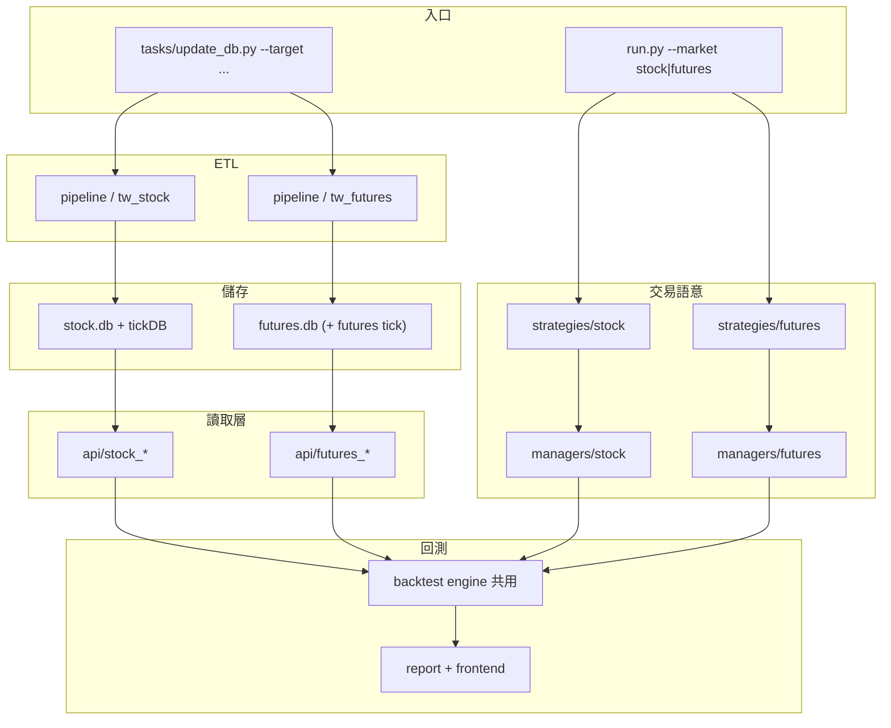

# 台期貨 ETL 與回測架構規劃

本文件目標：

1. 檢視目前 `AlphaEdge`（台股 ETL + 回測）是否需要調整，才能擴充台灣期貨。
2. 提出與現有架構相容、可逐步落地的台期貨 ETL + 回測架構。
3. 與 [美股ETL與回測架構規劃](美股ETL與回測架構規劃.md) 對齊：**平行市場模組、共享核心、不共享市場細節**。

---

## 一、現況評估：需不需要大翻修？

結論：**需要做「增量式調整」，不需要大翻修。**

### 目前可沿用的優點

- `core/pipeline` 已採 `crawlers` / `cleaners` / `loaders` / `updaters` 分層，標準 ETL 可直接複製到期貨。
- `tasks/update_db.py` 已有多 `--target` 入口，適合新增 `futures_price`、`futures_tick` 等。
- `core/backtest`、`core/strategies` 已有策略執行與結果輸出流程，可複用事件迴圈與報表概念。
- Shioaji 已用於股票 tick／帳戶工具，可作為期貨合約與 ticks 的自然資料來源。
- 常數層已有預留鉤子：`Market.FUTURE`、`OrderState.FuturesOrder/Deal`、`InstrumentType.FUTURE`。

### 目前主要缺口

- **沒有**期貨目錄、TAIFEX crawler、期貨表／API、期貨 `PositionManager`。
- 資料模型與成本幾乎全是台股語意（`stock_id`、手續費 + 證交稅、全額持股）。
- `MarketCalendar` 以股票 `price` 表／日盤代理，未涵蓋夜盤與期貨結算日。
- 合約生命週期（近月／遠月、連續合約、換月）尚未建模。
- `BaseStockStrategy` 註解提到 Futures，但仍綁定股票 API／模型——不宜在其上硬接 if-futures。

### 建議原則

- **保留現有台股流程不動**，台期貨採「平行模組」建置，降低回歸風險。
- **共享核心，不共享市場細節**：共用 ETL 抽象、回測事件迴圈、報表與 frontend；保證金、日曆、點值、合約碼分開。
- **不要**在 `Stock*` 類上硬接期貨；應平行建 `Futures*` 分支，由 `run.py` 依 `Market` 分流。

---

## 二、擴充後的整體架構（雙市場）

從「台股研究框架」演進為：

> **台灣市場多商品框架** = 台股 + 台期貨（之後美股可同模式掛上）

### 2.1 現況（單市場：台股）

```text
tasks/update_db.py
        ↓
core/pipeline  (crawler → cleaner → loader → updater)
        ↓
core/database/stock.db (+ DolphinDB tick)
        ↓
core/api  →  adapters  →  StockQuote
        ↓
core/strategies/stock  +  models/managers/stock
        ↓
core/backtest  →  results  →  frontend
```

### 2.2 目標資料流



### 2.3 層級對照

| 層 | 台股（現有） | 台期貨（新增） |
|----|-------------|----------------|
| 來源 | TWSE/TPEX/MOPS/FinMind/Shioaji | TAIFEX + Shioaji `Contracts.Futures` |
| 中繼 | `downloads/price\|chip\|tick` | `downloads/futures/{price,tick,meta}` |
| 儲存 | `stock.db` / DolphinDB | `futures.db`（合約碼含商品 + 到期月） |
| CLI | `--target price\|chip\|tick\|…` | `--target futures_price\|futures_tick\|…` |
| 成本 | 手續費 + 證交稅 | 手續費 + 保證金／點值／結算 |
| 日曆 | 日盤、以 price 表代理 | 日盤 + 夜盤、結算日、換月 |
| 策略載入 | `load_stock_strategies()` | `load_futures_strategies()` |

---

## 三、建議目錄調整

有兩條路徑，效果相同；可先走 A，再收斂到 B。

### 路徑 A：最小摩擦（命名平行，先不搬現有檔）

```text
core/
├── pipeline/
│   ├── crawlers/
│   │   ├── stock_price_crawler.py          # 維持
│   │   ├── futures_price_crawler.py        # 新增
│   │   └── futures_tick_crawler.py         # 新增（可選）
│   ├── cleaners/   # futures_*_cleaner.py
│   ├── loaders/    # futures_*_loader.py
│   ├── updaters/   # futures_*_updater.py
│   └── downloads/futures/{price,tick,meta}/
├── database/
│   ├── stock.db
│   └── futures.db                          # 建議獨立，避免與 stock_id 語意混用
├── api/
│   ├── stock_*_api.py
│   └── futures_price_api.py                # + futures_tick_api（若需要）
├── adapters/
│   ├── stock_quote_adapter.py
│   └── futures_quote_adapter.py
├── models/
│   ├── stock/
│   └── futures/                            # Account / Order / Position / Quote
├── managers/
│   ├── stock/
│   └── futures/                            # 保證金、口數、開平倉
├── strategies/
│   ├── stock/
│   └── futures/                            # BaseFuturesStrategy + 策略
├── backtest/                               # 先複用既有迴圈，再視需要抽 engine
└── utils/
    ├── market_calendar.py                  # 擴充或拆分 futures calendar
    ├── instrument.py                       # FuturesUtils（點值、乘數、近月）
    └── constant.py                         # 已有 Market.FUTURE
```

### 路徑 B：市場維度目錄（與美股規劃一致，長期較乾淨）

```text
core/
├── pipeline/
│   ├── shared/                 # BaseCrawler/Cleaner/Loader/Updater
│   ├── tw_stock/               # 現有台股 ETL（逐步歸位）
│   └── tw_futures/             # 新增台期 ETL
│       ├── crawlers/
│       ├── cleaners/
│       ├── loaders/
│       └── updaters/
├── api/
│   ├── tw_stock/
│   └── tw_futures/
├── backtest/
│   ├── engine/                 # 共用事件迴圈 / 撮合 / portfolio
│   ├── datafeed/
│   │   ├── tw_stock_datafeed.py
│   │   └── tw_futures_datafeed.py
│   ├── calendars/
│   │   ├── tw_stock_calendar.py
│   │   └── tw_futures_calendar.py
│   ├── fee_models/             # 股票證交稅 vs 期貨手續費/結算費
│   └── report/
├── strategies/
│   ├── stock/                  # 或 tw_stock/
│   └── futures/
├── models/
│   ├── stock/
│   └── futures/
└── managers/
    ├── stock/
    └── futures/
```

---

## 四、哪些共用、哪些必須拆開

### 可共用

- ETL 四層抽象（crawler / cleaner / loader / updater）
- 回測事件迴圈骨架（開平倉訊號 → 撮合 → 記帳 → 報表）
- Log、path、config 機制、`frontend` 讀 `backtest/results` 的流程
- Shioaji 連線／多 key 模式（股票 tick updater 已驗證）

### 必須拆開（期貨語意）

1. **合約生命週期**：近月／遠月、連續合約、換月規則  
2. **保證金與槓桿**：初始／維持保證金、追繳（非全額持股）  
3. **點值與乘數**：TX / MTX 等  
4. **交易時段**：夜盤、結算日休市邏輯  
5. **部位模型**：口數、多空、未平倉（非股數 + 證交稅）  

因此應平行建 `BaseFuturesStrategy` + `FuturesPositionManager`，而非在 `BaseStockStrategy` / `StockPositionManager` 上加分支。

---

## 五、台期貨 ETL 設計

### 5.1 資料域切分（建議優先順序）

1. **Universe / Contracts（合約池）**  
   商品代碼（TX、MTX…）、到期月、最後交易日、結算日、乘數、點值、上市狀態。
2. **Prices（行情）**  
   日線 OHLCV、結算價（settlement）；可選連續合約序列。
3. **Ticks（可選）**  
   Shioaji futures ticks → DolphinDB 或獨立 tick store。
4. **Margin / Specs（規格）**  
   初始／維持保證金、手續費參數（可先靜態設定，後再自動化）。

### 5.2 ETL 分層責任（對齊現有慣例）

- `crawler`：對 TAIFEX / Shioaji 拉 raw 資料（retry、rate limit、timeout）。
- `cleaner`：標準化欄位（`contract_id`, `product`, `expiry`, `trade_date`, OHLCV, `settlement`）、去重、型別校正。
- `loader`：寫入 `futures.db`（upsert、唯一鍵約束）。
- `updater`：編排日期範圍、checkpoint、錯誤重試；串起 crawl → clean → load。

### 5.3 建議資料表（SQLite 先行）

- `futures_contract`（合約／商品規格）
- `futures_price_daily`
- `futures_continuous`（可選：連續合約映射或價格）
- `etl_job_runs` / `etl_checkpoints`（可與全專案共用）

建議唯一鍵：

- `futures_price_daily`: `(contract_id, trade_date, source)` 或 `(product, expiry, trade_date, source)`
- `futures_contract`: `(contract_id)` 或 `(product, expiry)`

### 5.4 CLI target 建議

- `futures_contract`（或併入 price updater 的前置步驟）
- `futures_price`
- `futures_tick`（可選）
- `futures_all`（不含 tick）

---

## 六、台期貨回測架構設計

### 6.1 回測核心分層（可與美股規劃共用概念）

1. **DataFeed**：供應合約行情／連續合約／保證金規格。  
2. **Signal / Strategy**：產生開平倉訊號（不直接操作帳本細節）。  
3. **Execution Simulator**：模擬成交（滑價、手續費、最小口數）。  
4. **Portfolio / Risk**：口數、保證金佔用、追繳、曝險限制。  
5. **Performance / Report**：權益曲線、最大回撤、交易明細（可延伸保證金曲線）。

### 6.2 期貨特有設計點

- **交易日曆**：日盤 + 夜盤；結算日／最後交易日邏輯，不可直接沿用股票 calendar。  
- **換月政策**：策略參數決定近月、固定換月日、或連續合約回測。  
- **成本模型**：手續費 +（可選）結算相關費用；**不要**複用證交稅。  
- **保證金模型**：初始／維持保證金、權益低於維持時的處理政策（強制平倉或僅標記）。  
- **點值／乘數**：PnL = 價格變動 × 乘數 × 口數（依商品）。

### 6.3 策略介面（對齊現有股票策略契約）

期貨策略至少實作：

- `setup_account` / `setup_apis`
- `check_open_signal` / `check_close_signal` / `check_stop_loss_signal`
- `calculate_position_size`（改為口數與保證金約束）

載入方式：`StrategyLoader.load_futures_strategies()`；`run.py` 依市場參數分流。

---

## 七、對現有專案的實作順序（建議）

### Phase 1：最小可跑閉環

1. 新增 `futures_price` ETL（日線／結算價）→ `futures.db`。  
2. `FuturesPriceAPI` + `FuturesQuoteAdapter`。  
3. `models/futures` + `managers/futures`（簡化保證金即可）。  
4. `strategies/futures/base.py` + 一支示範策略。  
5. 接上現有 backtest 迴圈（或最小改動的 futures 分支），報表沿用既有 reporter。

### Phase 2：可信度提升

- 期貨日曆（夜盤／結算日）。  
- 換月／連續合約政策。  
- 較完整的保證金與成本模型。  
- 資料品質檢核（缺洞、結算價異常）。

### Phase 3：研究效率與高頻

- `futures_tick`（Shioaji，可參考 `StockTickUpdater` 多 key／執行緒）。  
- frontend 期貨專屬指標（保證金曲線、口數曝險）。  
- 視需要收斂目錄至 `tw_stock` / `tw_futures`，並與美股 `us/` 對齊市場維度。

---

## 八、與美股規劃的關係

| 面向 | 美股規劃 | 台期貨規劃 |
|------|----------|------------|
| 原則 | 平行模組、共享核心 | 相同 |
| 市場細節 | 時區、拆股配息、adjusted close | 保證金、換月、夜盤、點值 |
| 目錄長期形態 | `pipeline/us`、`strategies/us` | `pipeline/tw_futures`、`strategies/futures` |
| 回測抽層 | engine / datafeed / calendars / fee_models | 同一套抽象，掛不同實作 |

兩者都強化「市場維度」；台期貨可先落地路徑 A，之後與美股一起收斂到路徑 B，避免兩次重工。

---

## 九、最後結論

- 現有台股 ETL + 日線／Tick 回測骨架健康，**不用重寫**。  
- 台期貨應以**平行垂直切片**加入：pipeline → DB → API → models/managers → strategies → backtest。  
- 關鍵風險是誤用股票成本與日曆；保證金／換月／結算必須獨立建模。  
- 建議先跑通 Phase 1 最小閉環（日線 + 簡化保證金 + 一支策略），再補日曆與換月，最後才做 tick 與目錄收斂。
