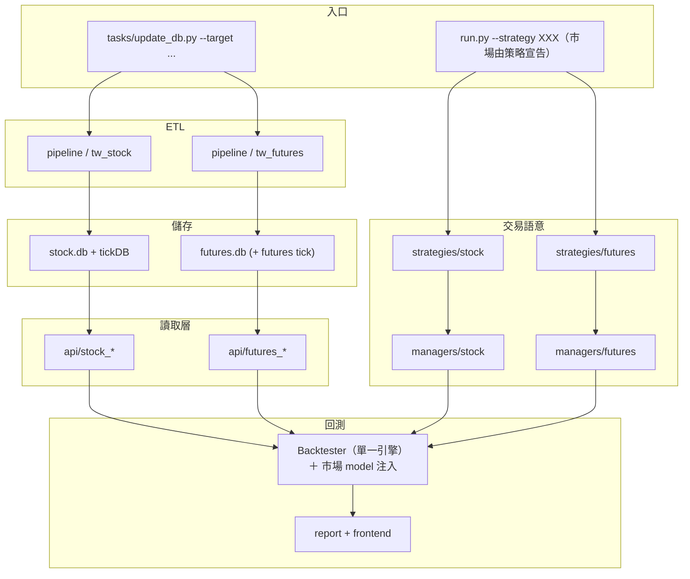

# 台期貨 ETL 與回測架構規劃

## Abstract

- **背景／問題**：專案目前只支援台股。沒有期貨目錄、TAIFEX crawler、期貨表／API 與期貨部位管理；合約生命週期、保證金、點值、夜盤日曆皆未建模。**現在連一筆台指期日線都沒有**（`core/database/` 只有 `stock.db`），所以最大宗的缺口在 ETL，不在回測引擎。
- **目標**：以「平行垂直切片」把台灣期貨（台指期系列 ＋ 股票期貨）加入專案：pipeline → `futures.db` → API → models/managers → strategies → **既有的單一 `Backtester`**（透過 [多市場回測引擎架構](../docs/backtest/multi-market-engine.md) 建立的 model 掛點接入），並與 [美股ETL與回測架構規劃.md](美股ETL與回測架構規劃.md) 共用「平行市場模組、共享核心、不共享市場細節」原則。
- **範圍界線**：**保留現有台股流程不動**，不在 `Stock*` 類上硬接期貨分支；**不新增第二支 backtester**（原規劃的 `FuturesBacktester` 已作廢，理由見 §一）；本規劃**不含**選擇權策略回測（PCR 僅作輔助訊號）、不含實盤下單、不含跨市場組合回測；股票期貨先鎖定流動性前 N 大標的，不一次攤開 250+ 檔。
- **驗收標準**：`--target futures_price` 跑完後可用 `sqlite3 core/database/futures.db` 直接查到資料且重跑冪等；一支期貨示範策略可經 `python run.py --strategy XXX` 跑完並產出報表；台股既有回歸雙線（LONG 915 筆 ＋ SHORT 快照）逐筆不受影響，且**回測引擎本身 0 行改動**。

涵蓋範圍：連續合約構建（換月接續）與展期價差、日盤與夜盤資料整併、三大法人與大額交易人籌碼訊號、保證金制度變動下的槓桿與部位控管、交易成本模型（期交稅、手續費、滑價）、股票期貨標的池管理與流動性分級。

資料來源以台灣期貨交易所（TAIFEX）為主，行情細節資料以 Shioaji（永豐金 API）為輔。

---

## 進度追蹤表

| 編號 | 步驟名稱 | 產出檔案 | 驗證方式 | 狀態 | 備註／中斷點 |
|------|----------|----------|----------|:----:|--------------|
| Phase0-1 | `downloads/` 收斂為市場維度目錄 | `core/config.py`、`core/pipeline/downloads/` | 既有 ETL 全部跑通且落點正確；`tests/` 全綠 | ⬜ | **動任何期貨程式之前先做**。純資料目錄搬遷、零行為改變；成本遠低於程式碼搬遷（決策見 §3.0、結構見 §3.1） |
| Phase1-1 | `core/config.py` 新增期貨 DB 與表名常數 | `core/config.py` | `FUTURES_DB_PATH` 可解析 | ⬜ | 相依 Phase0-1；沿用 `get_static_resolved_path` |
| Phase1-2 | `futures_price` 四層 ETL（TAIFEX 日線／結算價） | `core/pipeline/*/futures_price_*.py` | `--target futures_price` 跑完可查到資料且重跑冪等 | ⬜ | **前置關卡**：DB 沒建起來前不要寫 API／策略／回測（見 §6.3） |
| Phase1-3 | `FuturesPriceAPI` ＋ `FuturesQuoteAdapter` | `core/api/futures_price_api.py`、`core/adapters/futures_quote_adapter.py` | 只從 `futures.db` 讀，不讀中繼檔 | ⬜ | 相依 Phase1-2 |
| Phase1-4 | `models/futures` ＋ `managers/futures`（簡化保證金） | `core/models/futures/`、`core/managers/futures/` | 口數、多空、未平倉語意正確 | ⬜ | 相依 Phase1-3 |
| Phase1-5 | `BaseFuturesStrategy` ＋ 一支示範策略 | `core/strategies/futures/` | 策略可被 `load_futures_strategies()` 載入 | ⬜ | 相依 Phase1-4 |
| Phase1-6 | 實作期貨 model 組（不新增引擎） | `core/backtest/models/`、`core/backtest/datafeed/`、`core/backtest/factory.py` | 台股回歸雙線逐筆相同且引擎 0 行改動；期貨策略可跑完 | ⬜ | 相依 Phase1-5 ＋ [多市場回測引擎架構](../docs/backtest/multi-market-engine.md) 全部完成 |
| Phase1-7 | 連續合約構建（先做一種調整方式） | `core/pipeline/*/futures_continuous_*.py` | 換月接點的 `roll_flag` 正確 | ⬜ | 相依 Phase1-2 |
| Phase2-1 | 期貨成本模型（期交稅、手續費、滑價） | `core/backtest/models/cost_model.py` | **不可複用證交稅**；有單元測試 | ⬜ | 相依 Phase1-6 |
| Phase2-2 | 保證金歷史序列與槓桿／部位控管 | `core/pipeline/*`、`core/managers/futures/` | 保證金調整生效日對齊 | ⬜ | 相依 Phase2-1 |
| Phase2-3 | 期貨交易日曆（日盤 ＋ 夜盤、結算日） | `core/backtest/datafeed/futures_calendar.py` | 不沿用股票 calendar | ⬜ | 相依 Phase1-6 |
| Phase2-4 | 換月規則參數化 | `core/backtest/` | 三種換月規則可切換 | ⬜ | 相依 Phase1-7、Phase2-3 |
| Phase3-1 | 籌碼訊號 ETL（三大法人、大額交易人、PCR） | `core/pipeline/*/futures_chip_*.py` | 前視偏差對齊（T+1 可用） | ⬜ | 相依 Phase1-2 |
| Phase4-1 | 多商品擴充（MTX、TMF、TE、TF） | `core/pipeline/*` | 各商品點值／乘數正確 | ⬜ | 相依 Phase2-2 |
| Phase4-2 | 日盤／夜盤整併 | `core/pipeline/*`、日曆 | 跨盤別跳空被保留 | ⬜ | 相依 Phase2-3 |
| Phase5-1 | 分 K 與 Tick（Shioaji futures ticks） | `core/pipeline/*/futures_tick_*.py` | 日內策略可回測 | ⬜ | 相依 Phase4-1；可參考 `StockTickUpdater` 多 key／執行緒 |
| Phase5-2 | frontend 期貨專屬指標（保證金曲線、口數曝險） | `frontend/` | 指標可顯示 | ⬜ | 相依 Phase2-2 |
| Phase5-3 | **程式碼**目錄收斂至路徑 B（`pipeline/tw_stock` / `tw_futures`） | 全專案 | 台股回歸逐筆相同 | ⏸ | 暫緩：與美股 `us/` 一起收斂，避免兩次重工。**資料目錄已於 Phase0-1 先行收斂**，本步驟只剩程式碼 |
| Phase6-1 | `futures_stock_universe` 標的池 ETL | `core/pipeline/*/futures_stock_universe_*.py` | 掛牌／下市與乘數異動可追蹤 | ⬜ | 相依 Phase1-2 |
| Phase6-2 | 股票期貨行情 ETL 與除權息乘數調整 | `core/pipeline/*` | 與台股除權息處理對照，無雙重調整 | ⬜ | 相依 Phase6-1 |

---

## 一、現況評估：需不需要大翻修？

結論：**需要做「增量式調整」，不需要大翻修。**

### 目前可沿用的優點

- `core/pipeline` 已採 `crawlers` / `cleaners` / `loaders` / `updaters` 分層，標準 ETL 可直接複製到期貨（可參考 `stock_price_crawler.py` → `stock_price_cleaner.py` → `stock_price_loader.py` → `stock_price_updater.py` 的既有慣例）。
- `tasks/update_db.py` 已有多 `--target` 入口，適合新增 `futures_price`、`futures_tick` 等。
- `core/backtest`、`core/strategies` 已有策略執行與結果輸出流程，可複用事件迴圈與報表概念。
- Shioaji 已用於股票 tick／帳戶工具，可作為期貨合約與 ticks 的自然資料來源。
- 常數層已有預留鉤子：`Market.FUTURE`、`OrderState.FuturesOrder` / `FuturesDeal`、`InstrumentType.FUTURE`（見 `core/utils/constant.py`）。
- **程式碼**的命名慣例（`stock_price_crawler.py`、`stock_quote_adapter.py`）已經是「路徑 A：命名平行」的實際做法，期貨直接沿用同一套命名風格即可，不需另外發明新的頂層結構（例如不需要新開 `data/futures/` 這種與現有 `core/pipeline/downloads/` 平行的目錄）。
- **資料**則已經是市場維度：`core/database/` 早就是 `stock.db` ＋（規劃中的）`futures.db`。唯一沒跟上的是 `downloads/`，Phase0-1 把它歸位（決策與理由見 §3.0）。
- `core/models/`、`core/managers/`、`core/strategies/` 已按**商品類別**分目錄（`base/` ＋ `stock/`），期貨新增 `futures/` 是沿用既有慣例，不是新決策。

### 目前主要缺口

- **沒有**期貨目錄、TAIFEX crawler、期貨表／API、期貨 `PositionManager`。
- 資料模型與成本幾乎全是台股語意（`stock_id`、手續費 + 證交稅、全額持股）。
- `core/backtest/backtester.py` 目前是純股票實作：`StockAccount`、`StockPositionManager`、`StockQuoteAdapter`、`BaseStockStrategy`、`StockOrder/Position/TradeRecord` 全部寫死，連 `MarketCalendar.check_stock_market_open()` 都是股票專屬判斷，**無法直接餵期貨資料**。
  - **原規劃是「平行建一支 `FuturesBacktester`」，此做法已作廢**（2026-08-02）。逐段分類後，那 838 行裡約 4 成是市場無關的骨架（日期迴圈、執行順序、方向驗證、訊號執行、報表），複製一份會讓兩邊永久漂移；而看似非分家不可的台股信用交易邏輯，全部都能對應到可插拔的 model 掛點。改採 [多市場回測引擎架構](../docs/backtest/multi-market-engine.md) 的「單一引擎 ＋ 可插拔 model」，對齊 Backtrader `Cerebro`、Zipline、Lean `Engine`、Nautilus `BacktestEngine` 的一致做法。期貨端因此只需寫 model 實作，引擎 0 行改動。
- `MarketCalendar` 以股票 `price` 表／日盤代理，未涵蓋夜盤與期貨結算日。
- 合約生命週期（近月／遠月、連續合約、換月）尚未建模。
- `BaseStockStrategy` 註解提到 Futures，但仍綁定股票 API／模型——不宜在其上硬接 if-futures。

### 建議原則

- **保留現有台股流程不動**，台期貨採「平行模組」建置，降低回歸風險。
- **共享核心，不共享市場細節**：共用 ETL 抽象、回測事件迴圈、報表與 frontend；保證金、日曆、點值、合約碼分開。
- **不要**在 `Stock*` 類上硬接期貨；應平行建 `Futures*` 分支，由 `core/backtest/factory.py` 依 `strategy.market` 分流（全專案唯一一處市場判斷，`run.py` 的 CLI 介面不變、不新增 `--market`）。

---

## 二、擴充後的整體架構（雙市場）

從「台股研究框架」演進為：

> **台灣市場多商品框架** = 台股 + 台期貨（之後美股可同模式掛上）

### 2.1 現況（單市場：台股）

```text
tasks/update_db.py
        ↓
core/pipeline  (crawler → cleaner → loader → updater)
        ↓
core/database/stock.db (+ DolphinDB tick)
        ↓
core/api  →  adapters  →  StockQuote
        ↓
core/strategies/stock  +  models/managers/stock
        ↓
core/backtest  →  results  →  frontend
```

### 2.2 目標資料流



### 2.3 層級對照

| 層 | 台股（現有） | 台期貨（新增） |
|----|-------------|----------------|
| 來源 | TWSE/TPEX/MOPS/FinMind/Shioaji | TAIFEX + Shioaji `Contracts.Futures` |
| 中繼 | `downloads/tw_stock/{price,chip,tick,…}` | `downloads/tw_futures/{price,tick,meta,…}` |
| 儲存 | `stock.db` / DolphinDB | `futures.db`（合約碼含商品 + 到期月） |
| CLI | `--target price\|chip\|tick\|…` | `--target futures_price\|futures_tick\|…` |
| 成本 | 手續費 + 證交稅 | 手續費 + 保證金／點值／結算 |
| 日曆 | 日盤、以 price 表代理 | 日盤 + 夜盤、結算日、換月 |
| 策略載入 | `load_stock_strategies()` | `load_futures_strategies()` |

---

## 三、建議目錄調整

### 3.0 決策（2026-08-22）：資料目錄現在就分，程式碼目錄先不分

**程式碼與資料的搬遷成本差一個量級**，因此兩者採不同做法，不是自相矛盾：

| 對象 | 做法 | 何時 | 搬遷成本 |
|------|------|------|----------|
| `downloads/`（資料） | **市場維度目錄**：`tw_stock/` ／ `tw_futures/` | **Phase0-1，動期貨程式之前** | 改 9 個 config 常數 ＋ `git mv` ＋ 修 1 個測試 |
| `pipeline/` `api/` `adapters/`（程式碼） | **命名平行**：`futures_*_crawler.py` | 收斂延到 Phase5-3 ⏸ | 全專案 import 都要改 |
| `models/` `managers/` `strategies/` | **目錄分家**：新增 `futures/` | 隨 Phase1-4、Phase1-5 | 新增目錄，不動既有 |

專案其實**早就有兩套慣例並存**，而且各有道理——期貨照著既有慣例走即可，不需要發明新結構：

| 層 | 現況分家方式 | 依據 |
|----|--------------|------|
| `models/` `managers/` `strategies/` | 目錄（`base/` ＋ `stock/`） | 依**商品類別**——`Position` 的語意台股與美股相同，期貨才不同 |
| `pipeline/` `api/` `adapters/` | 命名平行（扁平 ＋ `stock_` 前綴） | 有共用基底類別（`crawlers/base.py` 等），搬遷會動全專案 import |
| `database/` | 目錄／檔案分家（`stock.db` ＋ `futures.db`） | 依**市場**——純資料，語意不可混用 |

`downloads/` 目前是唯一的例外：它是純資料，卻還跟著程式碼用扁平命名。Phase0-1 就是把它歸位到與 `database/` 一致的市場維度。

**為什麼不用 `downloads/tw/stock/` 三層**：市場 × 商品不是自由組合的兩軸，只會命名實際支援的組合；多一層只裝兩個項目是純導覽成本。單層 `tw_stock` 也與路徑 B 的 `pipeline/tw_stock/` 同名，將來收斂時不需要再改一次。

**為什麼不能只搬期貨**：若台股留在扁平、期貨進 `tw_futures/`，會得到 `downloads/{price, chip, …, tw_futures/}`——看到 `price/` 無法判斷屬於哪個市場。要嘛全部走目錄、要嘛全部走前綴，混著是最糟的選項。

### 3.1 `downloads/` 目標結構（Phase0-1 落地）

```text
core/pipeline/downloads/
├── tw_stock/                       # 既有台股中繼檔全部搬進來（Phase0-1）
│   ├── price/
│   ├── chip/
│   ├── margin/
│   ├── dividend/
│   ├── tick/
│   ├── finmind/                    # FinMind 是資料源，但供應的是台股資料
│   ├── financial_statement/
│   ├── monthly_revenue_report/
│   └── meta/                       # resume 用的 metadata，同樣按市場分
│       ├── financial_statement/
│       ├── monthly_revenue_report/
│       ├── tick/
│       └── broker_trading/
└── tw_futures/                     # 新增（Phase1-2 起陸續使用）
    ├── price/
    ├── chip/
    ├── continuous/
    ├── universe/                   # 股票期貨標的池（Phase6-1）
    ├── tick/                       # 可選（Phase5-1）
    └── meta/
```

### 3.2 程式碼：路徑 A（命名平行，先不搬現有檔）

```text
core/
├── pipeline/
│   ├── crawlers/
│   │   ├── stock_price_crawler.py            # 維持
│   │   ├── futures_price_crawler.py          # 新增
│   │   ├── futures_chip_crawler.py           # 新增（三大法人／大額交易人／PCR）
│   │   ├── futures_stock_universe_crawler.py # 新增（股票期貨標的清單）
│   │   └── futures_tick_crawler.py           # 新增（可選）
│   ├── cleaners/   # futures_*_cleaner.py
│   ├── loaders/    # futures_*_loader.py
│   ├── updaters/   # futures_*_updater.py
│   └── downloads/  # 見 §3.1（Phase0-1 已改為市場維度）
├── database/
│   ├── stock.db
│   └── futures.db                          # 獨立，避免與 stock_id 語意混用
├── api/
│   ├── stock_*_api.py
│   ├── futures_price_api.py
│   └── futures_chip_api.py                 # + futures_tick_api（若需要）
├── adapters/
│   ├── stock_quote_adapter.py
│   └── futures_quote_adapter.py
├── models/
│   ├── base/
│   ├── stock/
│   └── futures/                            # Account / Order / Position / Quote
├── managers/
│   ├── base/
│   ├── stock/
│   └── futures/                            # 保證金、口數、開平倉
├── strategies/
│   ├── stock/
│   └── futures/                            # BaseFuturesStrategy + 策略
├── backtest/                               # 單一 Backtester；期貨只新增 model 實作
│   ├── backtester.py                       # 市場無關，期貨不動它
│   ├── factory.py                          # 補 Market.FUTURE 分支（唯一改動點）
│   ├── models/                             # TaifexInstrumentSpec / FuturesFillModel /
│   │                                       #   FuturesCostModel / FuturesSettlementModel
│   └── datafeed/futures_datafeed.py        # futures.db ＋ 期貨交易日曆
└── utils/
    └── constant.py                         # 已有 Market.FUTURE 等鉤子
```

### 3.3 程式碼：路徑 B（市場維度目錄，Phase5-3 ⏸）

**只剩程式碼**——`downloads/` 與 `database/` 已在 Phase0-1 之後就是這個形態。

```text
core/
├── pipeline/
│   ├── shared/                 # BaseCrawler/Cleaner/Loader/Updater
│   ├── tw_stock/               # 現有台股 ETL（逐步歸位）
│   │   ├── crawlers/
│   │   ├── cleaners/
│   │   ├── loaders/
│   │   └── updaters/
│   └── tw_futures/             # 台期 ETL（由路徑 A 的 futures_*.py 歸位）
├── api/
│   ├── tw_stock/
│   └── tw_futures/
├── backtest/
│   ├── engine/                 # 共用事件迴圈 / 撮合 / portfolio
│   ├── datafeed/
│   │   ├── tw_stock_datafeed.py
│   │   └── tw_futures_datafeed.py
│   ├── calendars/
│   │   ├── tw_stock_calendar.py
│   │   └── tw_futures_calendar.py
│   ├── fee_models/             # 股票證交稅 vs 期貨手續費／結算費
│   └── report/
├── strategies/
│   ├── stock/                  # 商品類別維度，不隨市場再分
│   └── futures/
├── models/
│   ├── stock/
│   └── futures/
└── managers/
    ├── stock/
    └── futures/
```

> **注意路徑 B 的兩個維度不同**：`pipeline/` `api/` `backtest/datafeed/` 依**市場**（`tw_stock`／`tw_futures`／`us`），
> 而 `models/` `managers/` `strategies/` 依**商品類別**（`stock`／`futures`）——美股上來時共用 `models/stock/`，
> 不會變成 `models/tw_stock/` ＋ `models/us_stock/`。這不是疏漏，是刻意的。

---

## 四、哪些共用、哪些必須拆開

### 可共用

- ETL 四層抽象（crawler / cleaner / loader / updater）
- 回測事件迴圈骨架（開平倉訊號 → 撮合 → 記帳 → 報表）
- Log、path、config 機制、`frontend` 讀 `backtest/results` 的流程
- Shioaji 連線／多 key 模式（股票 tick updater 已驗證）

### 必須拆開（期貨語意）

1. **合約生命週期**：近月／遠月、連續合約、換月規則
2. **保證金與槓桿**：初始／維持保證金、追繳（非全額持股）
3. **點值與乘數**:TX / MTX 等
4. **交易時段**：夜盤、結算日休市邏輯
5. **部位模型**：口數、多空、未平倉（非股數 + 證交稅）

因此應平行建 `BaseFuturesStrategy` + `FuturesPositionManager` + **期貨那一組 model**，而非在 `BaseStockStrategy` / `StockPositionManager` 上加分支。

**注意**：`Backtester` 是唯一例外——它經 [多市場回測引擎架構](../docs/backtest/multi-market-engine.md) 重構後已是市場無關的單一引擎，期貨**共用**它，不另建也不加分支（差異走 model 注入）。

---

## 五、需要爬取的資料

### 5.1 期貨行情資料（核心）

#### 5.1.1 指數期貨（主力回測標的）

| 商品 | 代碼 | 契約乘數 | 說明 |
|------|------|----------|------|
| 台股期貨（大台）| TX | 200 元/點 | 主力回測標的 |
| 小型台指期貨（小台）| MTX | 50 元/點 | 流動性次於大台，槓桿更靈活 |
| 微型台指期貨 | TMF | 10 元/點 | 小資部位測試 |
| 電子期貨 | TE | 4000 元/點 | 類股輪動策略可用 |
| 金融期貨 | TF | 1000 元/點 | 類股輪動策略可用 |

#### 5.1.2 股票期貨（股期，納入規劃）

- 標的：每檔股票期貨對應一檔現股（如台積電期 2330F、鴻海期 2317F 等），TAIFEX 目前掛牌約 250+ 檔，標的與口數會隨掛牌／下市定期異動，需獨立維護標的池（見 §6.4 `futures_stock_universe`）。
- 契約規格：契約乘數固定為 2,000 股／口（等同現股一張），無「大中小」之分，槓桿由保證金成數決定，不同於指數期貨系列各有不同點值。
- 除權息處理：股票期貨無到期結算的除權息調整——標的除權息時，交易所以**調整契約乘數**或**發行新契約**因應，回測時需比照 TAIFEX 官方公告調整，**不可**沿用現股還原股價的邏輯，否則會重複調整或漏調。
- 建議先納入流動性排名前 N 檔（例如依日均成交量取前 30–50 檔），而非一次爬全部 250+ 檔，避免低流動性標的污染回測訊號、拖慢爬取效率；名單本身也需定期更新（見 Phase 6）。
- 需與現股 `stock_id` 建立對照欄位（`underlying_stock_id`），方便未來做期現套利、個股避險或規避借券成本的放空策略。

需爬取的欄位與粒度（指數期貨與股票期貨共通）:

- 各月份合約：近月、次月、季月（各契約需分別保存，供連續合約構建；股票期貨遠月流動性極低，通常只需近月）
- Tick 資料（逐筆成交）、分 K（1 分、5 分）、日 K
- 開高低收量（OHLCV）、成交筆數
- 日盤與夜盤需分別標記時段來源
- 資料時間戳需含日期與時間，並統一時區為台北時間（UTC+8）
- 股票期貨額外欄位：`underlying_stock_id`（對應現股代碼）、契約乘數（可能因除權息調整而變動，需保存歷史序列）

### 5.2 連續合約構建資料

- 每月結算日（到期日）：每月第三個星期三
- 最後結算價（Final Settlement Price）：到期日開盤後一段時間內各成交價之算術平均
- 各契約掛牌日與最後交易日
- 換月時的近月與次月同步報價（供計算展期價差 roll spread）
- 每日各月份契約未平倉量（用於未平倉量交叉換月判斷）

### 5.3 契約規格與保證金

- 各商品原始保證金、維持保證金（歷史序列，非僅當前值）
- 保證金調整公告的生效日與調整幅度（回測槓桿一致性關鍵）
- 契約乘數變動記錄（如有）
- 漲跌幅限制、最小跳動點（Tick Size）

### 5.4 三大法人與籌碼資料

- 三大法人（外資、投信、自營商）期貨買賣超與未平倉口數
- 未平倉多空淨額（Net Open Interest）
- 大額交易人未平倉：前五大、前十大交易人；特定法人與非特定法人拆分
- 依商品別（TX、MTX 等）分別爬取

### 5.5 選擇權籌碼（輔助訊號）

- 台指選擇權 Put/Call Ratio（PCR），含成交量 PCR 與未平倉 PCR
- 最大未平倉量履約價（Max Pain）
- 各履約價未平倉分布（用於支撐壓力訊號）

### 5.6 現貨指數資料

- 加權股價指數（TAIEX）日內與日線
- 分類指數：電子類指數、金融保險類指數（對應 TE、TF）
- 用途：計算期現貨正逆價差（Basis = 期貨價 − 現貨指數）

### 5.7 波動率與風險指標

- 台指選擇權波動率指數（台灣 VIX）
- 歷史波動率（可由現貨或期貨自行計算）

### 5.8 交易日曆與交易時段

- 開休市日曆（含國定假日、颱風假等臨時休市）
- 日盤時段：08:45–13:45
- 夜盤時段：15:00–次日 05:00
- 結算日特殊時段標記

### 5.9 交易成本資料

- 期貨交易稅率：買賣各一次，現行為十萬分之二（0.00002）
- 手續費（依券商而異，以參數化方式設定）
- 滑價假設參數（大台與小台流動性不同，需分別設定）

### 5.10 資料來源清單

| 資料類型 | 建議來源 | 取得方式 | 更新頻率 |
|----------|----------|----------|----------|
| 期貨每日行情 | TAIFEX 官網每日交易行情 | `requests` + `pd.read_html()` / CSV 下載 | 每日 |
| 股票期貨（股期）每日行情 | TAIFEX 官網股票期貨每日行情 | `requests` + `pd.read_html()` / CSV 下載 | 每日 |
| 股票期貨標的清單 | TAIFEX 商品資訊（股票期貨） | 網頁爬取 / CSV | 異動時 |
| Tick / 分 K 歷史 | Shioaji（永豐金 API） | API 呼叫 | 依需求 |
| 三大法人期貨 | TAIFEX 三大法人查詢 | 網頁爬取 / CSV | 每日盤後 |
| 大額交易人未平倉 | TAIFEX 大額交易人專區 | 網頁爬取 | 每日盤後 |
| 選擇權 PCR | TAIFEX Put/Call Ratio | CSV 下載 | 每日盤後 |
| 加權指數 / 分類指數 | 證交所（TWSE） | API / 網頁爬取 | 每日 |
| 台灣 VIX | TAIFEX 波動率指數 | 網頁爬取 | 每日 |
| 契約規格 / 保證金 | TAIFEX 保證金與契約規格公告 | 網頁爬取 | 異動時 |
| 交易日曆 | TAIFEX 行事曆 | 網頁爬取 / 手動維護 | 年度更新 |

---

## 六、台期貨 ETL 設計

### 6.1 資料域切分（建議優先順序）

1. **Universe / Contracts（合約池）**
   商品代碼（TX、MTX…、股票期貨標的）、到期月、最後交易日、結算日、乘數、點值、上市狀態、`product_type`(index / single_stock)。股票期貨標的池需定期（如月度）比對 TAIFEX 最新公告，處理新增掛牌與下市。
2. **Prices（行情）**
   日線 OHLCV、結算價（settlement）；可選連續合約序列。
3. **Chips（籌碼）**
   三大法人、大額交易人、選擇權 PCR。
4. **Ticks（可選）**
   Shioaji futures ticks → DolphinDB 或獨立 tick store。
5. **Margin / Specs（規格）**
   初始／維持保證金、手續費參數（可先靜態設定，後再自動化）。

### 6.2 ETL 分層責任（對齊現有慣例）

- `crawler`：對 TAIFEX / Shioaji 拉 raw 資料（retry、rate limit、timeout）。
- `cleaner`：標準化欄位（`contract_id`, `product`, `expiry`, `trade_date`, OHLCV, `settlement`）、去重、型別校正。
- `loader`：以 `sqlite3` 連線並寫入 `core/database/futures.db`（upsert、唯一鍵約束）。
- `updater`：編排日期範圍、checkpoint、錯誤重試；串起 crawl → clean → load。

### 6.3 資料落地原則：一律先寫入 `futures.db`(SQLite3)

**所有期貨資料在進入 API／回測之前，必須先經 loader 寫入 `core/database/futures.db`（Python 標準庫 `sqlite3`）。**
不可讓 crawler 抓完直接餵給策略或回測，也不可讓回測直接讀 `downloads/` 下的 CSV／Parquet 中繼檔——中繼檔只是 crawler 到 loader 之間的暫存，不是資料真相來源（single source of truth）。

理由：

- 與現有台股流程一致（`StockPriceLoader` 即是 `sqlite3.connect(DB_PATH)` → upsert → `PRICE_TABLE_NAME`），維護心智一致。
- 唯一鍵約束在 DB 層擋掉重複與重跑污染，重跑 ETL 具冪等性。
- 回測可重現：同一份 DB 快照 = 同一份回測輸入。
- API 層（`FuturesPriceAPI` 等）只需面對 SQL，不必處理各來源的檔案格式差異。

實作慣例（沿用台股既有做法）：

- 在 `core/config.py` 新增 `FUTURES_DB_NAME: str = "futures.db"` 與 `FUTURES_DB_PATH`（沿用 `get_static_resolved_path(base_dir=DATABASE_DIR_PATH, ...)`），並比照 `PRICE_TABLE_NAME` 新增 `FUTURES_*_TABLE_NAME` 常數，不要在程式中散落字串。
- 中繼檔目錄同樣走常數：`TW_FUTURES_DOWNLOADS_PATH` 之下再掛 `FUTURES_PRICE_DOWNLOADS_PATH` 等（結構見 §3.1）。**任何地方都不要自行以字串拼 downloads 路徑**——目前全專案 30 個檔案都只透過常數取用，這是 Phase0-1 的搬遷成本能壓到極低的唯一原因，不要破壞它。
- 期貨 loader 繼承 `BaseDataLoader`，在 `setup()` 內 `connect()` → `create_missing_tables()`，與 `StockPriceLoader` 同一套骨架。
- 共用 `core/pipeline/utils/sqlite_utils.py` 的 `SQLiteUtils`（`check_table_exist`、`get_table_latest_value` 等）做增量更新的起訖日判斷，不要另寫一套。
- `futures.db` 與 `stock.db` **分開**存放於 `core/database/`，避免 `stock_id` 與 `contract_id` 語意混用。
- Tick 等高頻資料若量體過大，才另評估 DolphinDB／Parquet；但日線、籌碼、合約規格、保證金這類結構化表格資料一律走 `futures.db`。

驗收標準：`--target futures_price` 跑完後，能直接用 `sqlite3 core/database/futures.db` 查到資料，且重跑一次筆數不變（冪等）。

### 6.4 建議資料表（SQLite 先行）

- `futures_contract`（合約／商品規格，含 `product_type` 區分指數期貨／股票期貨）
- `futures_stock_universe`（股票期貨標的清單：`underlying_stock_id`、掛牌日、下市日、契約乘數異動紀錄）
- `futures_price_daily`
- `futures_continuous`（可選：連續合約映射或價格）
- `futures_institutional_chip`（三大法人／大額交易人）
- `futures_margin_history`（保證金歷史序列）
- `etl_job_runs` / `etl_checkpoints`（可與全專案共用）

建議唯一鍵：

- `futures_price_daily`: `(contract_id, trade_date, source)` 或 `(product, expiry, trade_date, source)`
- `futures_contract`: `(contract_id)` 或 `(product, expiry)`

建議核心資料表欄位（連續合約日 K，供回測直接讀取）：

| 欄位 | 型別 | 說明 |
|------|------|------|
| datetime | timestamp | 台北時間 |
| symbol | string | 商品代碼（如 TX） |
| open / high / low / close | float | OHLC |
| volume | int | 成交量 |
| open_interest | int | 未平倉量 |
| session | string | day / night |
| contract_month | string | 對應實際契約月（換月追蹤用） |
| roll_flag | bool | 是否為換月接點 |

### 6.5 CLI target 建議

- `futures_contract`（或併入 price updater 的前置步驟）
- `futures_stock_universe`（股票期貨標的清單，獨立於指數期貨合約池）
- `futures_price`
- `futures_chip`
- `futures_tick`（可選）
- `futures_all`（不含 tick）

---

## 七、台期貨回測架構設計

### 7.1 回測核心分層（可與美股規劃共用概念）

1. **DataFeed**：供應合約行情／連續合約／保證金規格。
2. **Signal / Strategy**：產生開平倉訊號（不直接操作帳本細節）。
3. **Execution Simulator**：模擬成交（滑價、手續費、最小口數）。
4. **Portfolio / Risk**：口數、保證金佔用、追繳、曝險限制。
5. **Performance / Report**：權益曲線、最大回撤、交易明細（可延伸保證金曲線）。

### 7.2 期貨特有設計點

- **交易日曆**：日盤 + 夜盤；結算日／最後交易日邏輯，不可直接沿用股票 calendar。
- **換月政策**：策略參數決定近月、固定換月日、或連續合約回測。
- **連續合約調整方式**：需明確選擇回測用的接續法，設計為可設定參數，不要寫死。
  - 逆向調整（Back-adjusted）：以價差調整歷史價格，適合絕對點數策略
  - 比例調整（Ratio-adjusted）：以比例調整，適合報酬率型策略
  - 未調整（原始各合約）：策略跨月時自行處理跳空
- **成本模型**：手續費 +（可選）結算相關費用；**不要**複用證交稅。
- **保證金模型**：初始／維持保證金、權益低於維持時的處理政策（強制平倉或僅標記）；帳戶權益（現金 + 未實現損益）決定保證金充足度，浮動獲利可支撐加碼。
- **點值／乘數**:PnL = 價格變動 × 乘數 × 口數（依商品）。
- **結算日跳空**：結算日以最後結算價平倉的部位，與次一契約開盤價之間的跳空需正確計算損益。
- **未平倉與流動性**：大台與小台流動性差異大，回測部位規模須對應實際可成交量，避免過度樂觀。
- **委託與成交假設**：市價單、限價單、成交價位（下一根開盤或當根收盤）需明確定義，避免用不可得的成交價。
- **股票期貨特有陷阱**：標的除權息以調整契約乘數／發新契約因應，不可套用現股還原股價的邏輯；近月以外的月份多半流動性極低，回測應預設只用近月合約，不建議比照指數期貨做多月份連續合約。

### 7.3 策略介面（對齊現有股票策略契約）

期貨策略至少實作：

- `setup_account` / `setup_apis`
- `check_open_signal` / `check_close_signal` / `check_stop_loss_signal`
- `calculate_position_size`（改為口數與保證金約束）

載入方式：`StrategyLoader.load_futures_strategies()`；`run.py` 依市場參數分流。

---

## 八、該考慮的事項

### 資料處理層面

- **前視偏差（Look-ahead Bias）**：法人籌碼、未平倉等資料為盤後公布，回測時須以「隔日可用」對齊，不可用當日尚未公布的資料下單。
- **日盤/夜盤整併**：需決定是否合併為單一連續序列，或分開回測。跨盤別的跳空需保留。
- **時間戳對齊**：期貨、現貨、籌碼三類資料時間基準不同，合併前需統一。

### 資料品質層面

- **缺漏值處理**：臨時休市、資料中斷需標記而非直接補值。
- **現貨除權息**：計算價差時，現貨指數本身已還原，但個股層面若涉及需另行處理。
- **資料來源一致性**:TAIFEX 官方下載與 Shioaji API 的欄位定義、結算價認定可能不同，需以官方為準並交叉驗證。
- **標的池規模與爬取效率**：股票期貨標的數量遠大於指數期貨（約 250+ 檔 vs 5 檔），爬取頻率、去重與儲存都要另外評估，建議先鎖定流動性前 N 大標的分階段擴充。

---

## 九、實作步驟詳述

### Phase 0：目錄前置

#### Phase0-1. `downloads/` 收斂為市場維度目錄 ⬜

- **目的**：`core/database/` 早就是市場維度（`stock.db` ＋ `futures.db`），`downloads/` 卻還跟著程式碼用扁平命名。**在放進任何期貨中繼檔之前先歸位**，否則之後只會有兩個壞選項：混合樹（`downloads/{price, chip, …, tw_futures/}`，看到 `price/` 不知道屬於誰），或事後連同程式碼一起搬（成本高一個量級）。決策理由見 §3.0。
- **做法**（純資料目錄搬遷，**零行為改變**）：
  1. `core/config.py` 新增兩個中介常數：

     ```python
     TW_STOCK_DOWNLOADS_PATH: Path = get_static_resolved_path(
         base_dir=PIPELINE_DOWNLOADS_PATH, dir_name="tw_stock"
     )
     TW_FUTURES_DOWNLOADS_PATH: Path = get_static_resolved_path(
         base_dir=PIPELINE_DOWNLOADS_PATH, dir_name="tw_futures"
     )
     ```

  2. 既有 9 個 `*_DOWNLOADS_PATH`（`FINANCIAL_STATEMENT`／`MONTHLY_REVENUE_REPORT`／`PRICE`／`CHIP`／`MARGIN`／`DIVIDEND`／`TICK`／`FINMIND`）與 `DOWNLOADS_METADATA_DIR_PATH` 的 `base_dir` 由 `PIPELINE_DOWNLOADS_PATH` 改為 `TW_STOCK_DOWNLOADS_PATH`。**常數名稱一律不動**——改名會擴散到 30 個檔案，而搬目錄不需要。
  3. `git mv` 既有目錄到 `downloads/tw_stock/` 之下（版控中只有 `meta/` 的 14 個 JSON，CSV 暫存區為空）。
  4. 修掉唯一一處自行重組路徑的測試：`tests/test_finmind_updater.py:81`（`project_root / "core" / "pipeline" / "downloads" / "finmind"`）。
  5. 修 3 處提到舊路徑的註解：`monthly_revenue_report_crawler.py:184`、`financial_statement_crawler.py:386`、`tasks/load_broker_trading_to_db.py:19`。
- **成本實查（2026-08-22）**：全專案 30 個檔案取用 downloads 路徑，**全部走 config 常數，無一硬寫字串**；因此改動集中在 `core/config.py`，其餘只有 1 個測試 ＋ 3 行註解。這是全專案搬遷成本最低的一塊。
- **產出**：`core/config.py`、`core/pipeline/downloads/`（目錄搬遷）、`tests/test_finmind_updater.py`。
- **驗證方式**：
  1. `.venv/bin/python -m pytest tests -q` 全綠。
  2. 任取一個既有 target（例如 `--target dividend`）跑一次日更，中繼檔落在 `downloads/tw_stock/dividend/`，且入庫筆數與搬遷前一致。
  3. `grep -rn "downloads/" --include='*.py' core tasks tests` 無殘留的舊路徑字串。
- **相依**：無。**本步驟阻塞 Phase1-2 之後所有會寫中繼檔的步驟。**

### Phase 1：單商品日 K 最小可跑閉環

#### Phase1-1. `core/config.py` 新增期貨 DB 與表名常數 ⬜

- **目的**：先把路徑與表名收斂成常數，避免後續在程式中散落字串。
- **做法**：新增 `FUTURES_DB_NAME: str = "futures.db"` 與 `FUTURES_DB_PATH`（沿用 `get_static_resolved_path(base_dir=DATABASE_DIR_PATH, ...)`），並比照 `PRICE_TABLE_NAME` 新增 `FUTURES_*_TABLE_NAME` 常數；中繼檔常數則掛在 Phase0-1 建立的 `TW_FUTURES_DOWNLOADS_PATH` 之下（`FUTURES_PRICE_DOWNLOADS_PATH` 等，結構見 §3.1）。
- **產出**：`core/config.py`。
- **驗證方式**：`FUTURES_DB_PATH` 可正確解析為 `core/database/futures.db`；`FUTURES_PRICE_DOWNLOADS_PATH` 解析為 `core/pipeline/downloads/tw_futures/price`。
- **相依**：Phase0-1。

#### Phase1-2. `futures_price` 四層 ETL ⬜

- **目的**：以大台（TX）為起點建立資料真相來源。**這是後續所有工作的前置關卡：DB 沒建起來之前，不要開始寫 API、策略或回測**（理由見 §6.3）。
- **做法**：`FuturesPriceCrawler`（TAIFEX 日線／結算價）→ `FuturesPriceCleaner` → `FuturesPriceLoader`（`sqlite3` upsert，繼承 `BaseDataLoader`，`setup()` 內 `connect()` → `create_missing_tables()`）→ `FuturesPriceUpdater`；`tasks/update_db.py` 加 `--target futures_price`。增量更新的起訖日判斷共用既有 `SQLiteUtils`，不要另寫一套。
- **產出**：`core/pipeline/{crawlers,cleaners,loaders,updaters}/futures_price_*.py`、`tasks/update_db.py`。
- **驗證方式**：跑完能用 `sqlite3 core/database/futures.db` 直接查到資料，且**重跑一次筆數不變（冪等）**。
- **相依**：Phase1-1。

#### Phase1-3. `FuturesPriceAPI` ＋ `FuturesQuoteAdapter` ⬜

- **目的**：提供回測的統一讀取層。
- **做法**：**只從 `futures.db` 讀，不讀 `downloads/` 下的中繼檔**。
- **產出**：`core/api/futures_price_api.py`、`core/adapters/futures_quote_adapter.py`。
- **驗證方式**：查詢結果與 DB 內容一致；程式碼中無任何讀取 CSV／Parquet 的路徑。
- **相依**：Phase1-2。

#### Phase1-4. `models/futures` ＋ `managers/futures` ⬜

- **目的**：建立期貨語意的帳戶、訂單、部位模型（口數、多空、未平倉），而非股數 ＋ 證交稅。
- **做法**：平行新增 `FuturesAccount` / `FuturesOrder` / `FuturesPosition` / `FuturesQuote` 與 `FuturesPositionManager`；保證金先做簡化版即可（完整版在 Phase2-2）。**不要**在 `Stock*` 類上加分支。
- **產出**：`core/models/futures/`、`core/managers/futures/`。
- **驗證方式**：開平倉記帳的 PnL = 價格變動 × 乘數 × 口數，有單元測試。
- **相依**：Phase1-3。

#### Phase1-5. `BaseFuturesStrategy` ＋ 一支示範策略 ⬜

- **目的**：定義期貨策略契約，對齊既有股票策略介面。
- **做法**：至少實作 `setup_account` / `setup_apis` / `check_open_signal` / `check_close_signal` / `check_stop_loss_signal` / `calculate_position_size`（改為口數與保證金約束）；載入方式為 `StrategyLoader.load_futures_strategies()`，`run.py` 依 `Market` 分流。
- **產出**：`core/strategies/futures/base.py` ＋ 一支示範策略。
- **驗證方式**：策略可被 `load_futures_strategies()` 載入並產生訂單。
- **相依**：Phase1-4。

#### Phase1-6. 實作期貨 model 組（不新增引擎） ⬜

- **目的**：讓期貨資料能餵進**既有的單一 `Backtester`**，不新增第二支引擎。
- **做法**：
  - **前提**：[多市場回測引擎架構](../docs/backtest/multi-market-engine.md) 已完成，`Backtester` 已改為注入式（`InstrumentSpec` / `FillModel` / `CostModel` / `SettlementModel` / `DataFeed` 五個掛點）。
  - 實作期貨那一組 model：

    | Model | 期貨要做的事 |
    |-------|--------------|
    | `TaifexInstrumentSpec` | 契約乘數（TX 200、MTX 50）、跳動點 1 點、無 ±10% 漲跌停（動態價格穩定措施） |
    | `FuturesFillModel` | 成交價須落在 bar range；跳動點對齊 |
    | `FuturesCostModel` | 期交稅 ＋ 手續費 per 口（見 Phase2-1，**不可複用證交稅**） |
    | `FuturesSettlementModel` | 每日結算、保證金追繳、到期換月（見 Phase2-2、Phase2-4） |
    | `FuturesDataFeed` | `futures.db` 讀取 ＋ 期貨交易日曆（見 Phase2-3） |

  - `core/backtest/factory.py` 的 `build_backtester()` 補上 `Market.FUTURE` 分支——**這是本步驟唯一需要改動的既有檔案**。
  - **關鍵設計點**：期貨的損益實現語意與股票不同——股票是「開倉→持有→平倉才實現」，期貨是**每日結算**（未實現損益每天變成保證金專戶的實際現金流動，隔日成本基礎重設為結算價）。此差異由 `BasePositionManager.settle_daily()` 掛點承接（該掛點由多市場抽象的 Phase4-2 建立，股票實作為 no-op），**不得改動 FIFO 主幹**。
- **產出**：`core/backtest/models/`（期貨 4 個 model）、`core/backtest/datafeed/futures_datafeed.py`、`core/managers/futures/position_manager.py`；修改 `core/backtest/factory.py`。
- **驗證方式**：台股既有回歸雙線（LONG 915 筆 ＋ SHORT 快照）逐筆相同——**期貨的加入不得使既有引擎改動任何一行**；期貨示範策略可跑完並產出報表。
- **相依**：Phase1-5、[多市場回測引擎架構](../docs/backtest/multi-market-engine.md) 全部完成。

#### Phase1-7. 連續合約構建 ⬜

- **目的**：讓回測有一條可跨月的連續價格序列。
- **做法**：原始各月份契約下載 → 連續合約構建，**先做一種調整方式即可**（逆向調整／比例調整／未調整三擇一），但「調整方式」與「換月規則」須設計為可設定參數，不要寫死。
- **產出**：`core/pipeline/*/futures_continuous_*.py`、`futures_continuous` 表。
- **驗證方式**：換月接點的 `roll_flag` 與 `contract_month` 標記正確；展期價差可被還原檢查。
- **相依**：Phase1-2。

### Phase 2：成本模型、保證金與期貨日曆

#### Phase2-1. 期貨成本模型 ⬜

- **目的**：期貨成本結構與股票完全不同，**不可複用證交稅**。
- **做法**：加入期交稅（買賣各一次，現行十萬分之二）、手續費（依券商參數化）、滑價（大台與小台流動性不同，需分別設定）。
- **產出**：`core/backtest/models/cost_model.py`（`FuturesCostModel`）。
- **驗證方式**：各項費用有單元測試；稅率以參數化設定，不寫死。
- **相依**：Phase1-6。

#### Phase2-2. 保證金歷史序列與槓桿／部位控管 ⬜

- **目的**：保證金調整會直接改變回測槓桿，用當前值回測歷史會失真。
- **做法**：引入原始／維持保證金歷史序列（含調整公告生效日）；帳戶權益（現金 ＋ 未實現損益）決定保證金充足度，浮動獲利可支撐加碼；權益低於維持保證金時的處理政策（強制平倉或僅標記）須可設定。
- **產出**：`core/pipeline/*/futures_margin_*.py`、`core/managers/futures/`。
- **驗證方式**：保證金調整生效日前後的可開口數不同，且與公告一致。
- **相依**：Phase2-1。

#### Phase2-3. 期貨交易日曆 ⬜

- **目的**：股票 calendar 不涵蓋夜盤與結算日，直接沿用會算錯持倉天數與可交易時段。
- **做法**：建立期貨日曆——日盤 08:45–13:45、夜盤 15:00–次日 05:00、結算日（每月第三個星期三）與最後交易日邏輯、臨時休市。
- **產出**：`core/backtest/datafeed/futures_calendar.py`（多市場抽象的 Phase4-1 已把 `market_calendar.py` 移入 `core/backtest/datafeed/`，期貨日曆與其並列，不沿用股票 calendar）。
- **驗證方式**：抽樣比對 TAIFEX 行事曆；結算日與夜盤標記正確。
- **相依**：Phase1-6。

#### Phase2-4. 換月規則參數化 ⬜

- **目的**：不同策略適用的換月時點不同，寫死會限制研究空間。
- **做法**：支援三種規則——結算日換月／提前 N 日換月／未平倉量交叉換月。
- **產出**：`core/backtest/`。
- **驗證方式**：三種規則可切換，且換月接點與 `roll_flag` 一致。
- **相依**：Phase1-7、Phase2-3。

### Phase 3：籌碼訊號

#### Phase3-1. 籌碼 ETL 與前視偏差對齊 ⬜

- **目的**：法人籌碼、未平倉為盤後公布，用當日資料下單即為前視偏差。
- **做法**：接入三大法人、大額交易人（前五大／前十大、特定法人拆分）、選擇權 PCR；**回測時一律以「隔日可用」對齊**。
- **產出**：`core/pipeline/*/futures_chip_*.py`、`futures_institutional_chip` 表。
- **驗證方式**：查詢指定日期只回傳該日之前已公布的籌碼資料。
- **相依**：Phase1-2。

### Phase 4：多商品與夜盤整併

#### Phase4-1. 多商品擴充 ⬜

- **目的**：從大台擴充到小台（MTX）、微台（TMF）與類股期貨（TE／TF）。
- **做法**：各商品點值／乘數以設定表管理（TX 200、MTX 50、TMF 10、TE 4000、TF 1000 元／點）。
- **產出**：`core/pipeline/*`、`futures_contract` 表。
- **驗證方式**：各商品的 PnL 計算使用正確乘數；流動性差異反映在滑價設定上。
- **相依**：Phase2-2。

#### Phase4-2. 日盤／夜盤整併 ⬜

- **目的**：決定是否合併為單一連續序列或分開回測，並保留跨盤別跳空。
- **做法**：以 `session` 欄位標記 day／night；整併策略設為可設定參數。
- **產出**：`core/pipeline/*`、期貨日曆。
- **驗證方式**：跨盤別跳空未被平滑掉；整併前後的日 K OHLC 可對帳。
- **相依**：Phase2-3。

### Phase 5：分 K 與 Tick、前端指標

#### Phase5-1. 分 K 與 Tick ⬜

- **目的**：支援日內策略回測。
- **做法**：引入 Shioaji futures tick（可參考 `StockTickUpdater` 的多 key／執行緒做法）；tick／連續合約快取可用 Parquet 存於 `core/pipeline/downloads/tw_futures/tick/`，但結構化表格資料一律走 `futures.db`。
- **產出**：`core/pipeline/*/futures_tick_*.py`。
- **驗證方式**：日內策略可完成一次回測；tick 時間戳為台北時間且 timezone-aware。
- **相依**：Phase4-1。

#### Phase5-2. frontend 期貨專屬指標 ⬜

- **目的**：期貨的風險視角與股票不同，需要保證金與口數曝險的呈現。
- **做法**：frontend 新增保證金曲線與口數曝險指標。
- **產出**：`frontend/`。
- **驗證方式**：指標可從回測結果讀取並顯示。
- **相依**：Phase2-2。

#### Phase5-3. 程式碼目錄收斂至路徑 B ⏸

- **目的**：把路徑 A（命名平行）收斂為路徑 B（市場維度目錄），與美股 `us/` 對齊。
- **範圍已縮小（2026-08-22）**：`downloads/` 已於 **Phase0-1** 先行收斂、`core/database/` 本來就是市場維度，故本步驟**只剩程式碼**——`pipeline/`、`api/`、`adapters/`、`backtest/datafeed/`。
- **做法**：收斂至 `pipeline/{shared,tw_stock,tw_futures}/`、`api/{tw_stock,tw_futures}/`（見 §3.3）。**`models/` `managers/` `strategies/` 不在範圍內**：它們依商品類別分而非市場分，美股上來時共用 `stock/`（見 §3.3 的注意事項）。
- **產出**：`core/pipeline/`、`core/api/`、`core/adapters/`、`core/backtest/datafeed/` 的目錄調整。
- **驗證方式**：台股回歸雙線（LONG 915 筆 ＋ SHORT 快照）逐筆相同；全專案無殘留的舊 import 路徑。
- **相依**：Phase1-1~Phase5-2。
- **暫緩原因與解除條件**：影響面大且會動到台股既有路徑的每一個 import；應與 [美股ETL與回測架構規劃.md](美股ETL與回測架構規劃.md) 的 Phase3-3 一起收斂，避免兩次重工。待兩邊的最小閉環都驗證完成後解除。**注意該解除條件目前不成立**：美股卡在「尚未選定 provider、`.env.example` 無任何美股憑證」，因此路徑 A 會維持相當長一段時間，命名前綴要保持一致，不要當成過渡期就隨意命名。

### Phase 6：股票期貨（股期）擴充

#### Phase6-1. `futures_stock_universe` 標的池 ETL ⬜

- **目的**：股票期貨標的約 250+ 檔且會隨掛牌／下市異動，需獨立維護標的池。
- **做法**：爬取 TAIFEX 股票期貨商品資訊，記錄 `underlying_stock_id`、掛牌日、下市日、契約乘數異動紀錄；**篩選流動性排名前 N 檔**（例如依日均成交量取前 30–50 檔），不要一次爬全部。標的池需獨立排程更新。
- **產出**：`core/pipeline/*/futures_stock_universe_*.py`、`futures_stock_universe` 表。
- **驗證方式**：掛牌／下市與乘數異動可被追蹤；`underlying_stock_id` 與現股 `stock_id` 對得上。
- **相依**：Phase1-2。

#### Phase6-2. 股票期貨行情 ETL 與除權息乘數調整 ⬜

- **目的**：股期的除權息處理與現股完全不同，**不可套用現股還原股價的邏輯**，否則會重複調整或漏調。
- **做法**：比照指數期貨走完整 ETL 垂直切片（universe → price → 可選 chip → backtest）；標的除權息時，交易所以**調整契約乘數**或**發行新契約**因應，回測需比照 TAIFEX 官方公告調整並保存乘數歷史序列。回測預設**只用近月合約**，不建議比照指數期貨做多月份連續合約（遠月流動性極低）。
- **產出**：`core/pipeline/*/futures_stock_price_*.py`。
- **驗證方式**：除權息調整邏輯與台股既有除權息處理對照驗證，確認無雙重調整或遺漏。
- **相依**：Phase6-1。

---

## 十、給 Claude Code 的實作提示

- 爬蟲以 `requests` + `BeautifulSoup` / `pd.read_html()` 為主，對 TAIFEX 網頁抓取需加入合理延遲與重試機制，避免被擋。
- 所有時間欄位統一轉為台北時間並以 timezone-aware timestamp 儲存。
- 連續合約構建需將「調整方式」與「換月規則」設計為可設定參數，不要寫死。
- 原始資料與衍生資料分層存放，原始層唯讀，衍生層可重建，確保回測可重現。
- **落地順序不可跳過**:crawl → clean → **`sqlite3` 寫入 `core/database/futures.db`** → API → 回測。`downloads/tw_futures/` 下的 CSV／Parquet 只是 crawler 與 loader 之間的中繼暫存，任何下游（API、策略、回測、frontend）都不得直接讀取（詳見 §6.3）。
- 儲存格式：結構化表格資料走 `futures.db`（SQLite，對齊現有 `stock.db` 慣例，使用 Python 標準庫 `sqlite3` 與既有 `SQLiteUtils`）；tick／連續合約快取可用 Parquet 存於 `core/pipeline/downloads/tw_futures/` 下。
- 保證金、契約規格、交易日曆屬低頻但關鍵資料，建議獨立維護並版本控管。

---

## 十一、與美股規劃的關係

| 面向 | 美股規劃 | 台期貨規劃 |
|------|----------|------------|
| 原則 | 平行模組、共享核心 | 相同 |
| 市場細節 | 時區、拆股配息、adjusted close | 保證金、換月、夜盤、點值 |
| 目錄長期形態 | `pipeline/us`、`strategies/stock` | `pipeline/tw_futures`、`strategies/futures` |
| 資料目錄 | `downloads/us_stock/` | `downloads/tw_futures/`（Phase0-1 已定案） |
| 回測抽層 | engine / datafeed / calendars / fee_models | 同一套抽象，掛不同實作 |

兩者都強化「市場維度」；台期貨可先落地路徑 A，之後與美股一起收斂到路徑 B，避免兩次重工。

**美股接上來時要沿用同一組規則**（見 §3.0）：`downloads/us_stock/` 直接新增即可；程式碼走 `futures_*` 同款的命名平行（或等 Phase5-3 一起收斂）；`models/` `managers/` `strategies/` 則**共用既有的 `stock/`**，不要開 `us_stock/`——美股的 `Position` 與台股同語意，差異在成本模型與日曆，那些走 model 注入。

---

## 十二、最後結論

- 現有台股 ETL + 日線／Tick 回測骨架健康，**不用重寫**。`core/backtest/backtester.py` 現況雖是純股票實作，但經 [多市場回測引擎架構](../docs/backtest/multi-market-engine.md) 重構為「單一引擎 ＋ 可插拔 model」後，期貨可直接沿用，只需寫 model 實作——**原規劃的平行 `FuturesBacktester` 已作廢**。
- 台期貨應以**平行垂直切片**加入：pipeline → DB → API → models/managers → strategies → backtest；其中「DB」這一關不可省略，所有資料一律先用 `sqlite3` 落地到 `core/database/futures.db`，再往下游走（見 §6.3）。
- 關鍵風險是誤用股票成本與日曆；保證金／換月／結算必須獨立建模。
- 個股期貨（股期）已納入規劃，但因標的數量大（250+ 檔）、多數流動性偏低，建議分階段以流動性排名篩選後再擴充（見 Phase 6），避免一開始就攤開全部標的拖慢核心指數期貨閉環。
- **目錄策略採「資料先分、程式碼後分」**（§3.0）：`downloads/` 於 Phase0-1 就收斂為 `tw_stock/` ／ `tw_futures/`（成本僅 9 個 config 常數 ＋ `git mv`），程式碼則維持命名平行到 Phase5-3。兩者做法不同是因為搬遷成本差一個量級，不是自相矛盾。
- 建議先跑通 Phase 0（目錄歸位）與 Phase 1 最小閉環（日線 + 簡化保證金 + 一支策略），再補日曆與換月，接著籌碼訊號，最後才做多商品、tick 與程式碼目錄收斂。

---

_本文件為規劃草案，實際欄位名稱與來源網址請於實作時對照 TAIFEX 官方最新頁面確認。_
